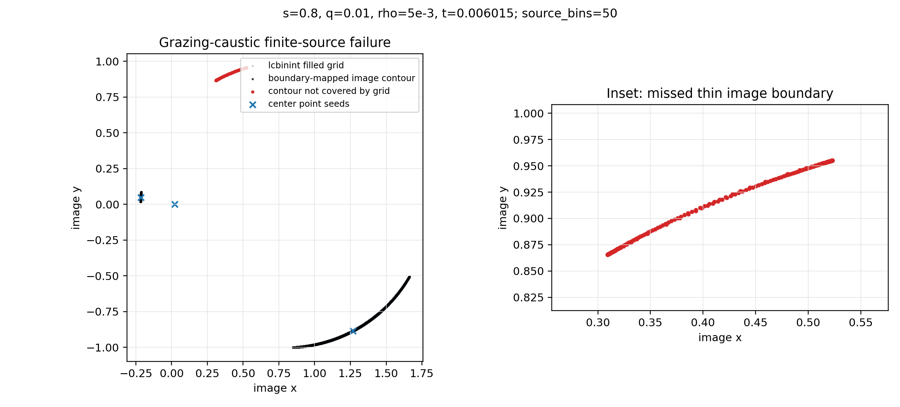

# Grazing-caustic imagearea4 failure

This note records a finite-source failure found on 2026-06-22.  It should be
treated as a real numerical bug, not as a tolerance or `source_bins` tuning
issue.

## Reproducer

Python light-curve parameters:

```python
Case(
    name="wide caustic finite source",
    separation=0.8,
    mass_ratio=0.01,
    t0=0.0,
    tE=1.0,
    u0=-0.01,
    alpha=0.3,
    rho=5.0e-3,
    t_min=-0.8,
    t_max=0.8,
    n_points=400,
)
```

Worst point:

```text
t = 0.006015037593984918
source = (0.00870158696360948, -0.00777579973840591)
rho = 0.005
```

At this point VBBL and direct source-plane point-source averaging agree that
the magnification is about `54.67`, while lcbinint's cartesian `imagearea4`
returns about `52.56`.

Observed convergence check:

```text
source_bins  lcbinint mag  rel error vs VBBL
50           52.56544     3.85e-2
100          52.56643     3.85e-2
200          52.56644     3.85e-2
400          52.56611     3.85e-2
800          52.56626     3.85e-2
```

Lowering `reltol` does not fix the point.  The value is locked to the wrong
branch of the calculation rather than converging with grid resolution.

## When It Happens

This case is a grazing caustic configuration:

- the source center is in a 3-image region;
- the source disk just touches/crosses a caustic near the limb;
- the nearest sampled caustic point is at about `0.9834 * rho` from the center;
- the missing contribution is a thin, high-magnification image boundary far
  from the center point seeds.

The `imagearea4` diagnostics at the failing point are characteristic:

```text
seed_count = 3
processed_images = 3
fold_seed_count = 0
gap_repairs ~ 2397 at source_bins=50
max_jump_cells ~ 4.0e3 at source_bins=50
```

The large `gap_repairs` and `max_jump_cells` are not ordinary discretization
noise here.  They are symptoms that the row-scan is trying to bridge a highly
stretched image component from too few seeds.

## What Fails

The old cartesian inverse-ray implementation is built around seed-based
flood-fill in the image plane.  For ordinary caustic crossings, extra fold seeds
are added and `imagearea4` can scan each image island.  In this grazing case the
source center supplies only three point-source seeds, and the caustic-born
contribution is not represented as an independent well-seeded island.

Several local fixes were tested and rejected:

- adding a full caustic-branch fallback search for seeds;
- adding more caustic probe seeds;
- allowing 3-image caustic probes to seed the scan;
- merging multiple seeds into the existing row-scan scratch;
- replacing overlap skipping with a visited-cell union raster;
- source-plane quadrature as a conditional fallback.

These either did not move the wrong value, became too slow, or introduced
another accuracy problem.  That is a strong indication that the failure is not
just a missed duplicate seed.  The row/raster inverse-ray design is a poor fit
for this thin grazing-caustic image component.

## Diagnostic Figure

The figure below was generated from the same failing point:



Black points are the image-plane contour obtained by mapping the source limb
through the binary-lens polynomial.  Blue crosses are the center point-source
seeds.  Pale blue points are the grid cells reached by a lcbinint-style
center-seed flood fill.  Red points mark boundary-contour samples that are not
covered by the filled grid.  The inset shows the thin missed image boundary.

Regenerate with:

```bash
python .note/plot_grazing_caustic_failure.py
```

The plotting script is diagnostic-only and intentionally not part of the test
suite.  It performs many polynomial root solves and is too slow for normal CI.

## 2026-06-22 Targeted Seed Fix

The first successful fix was not a generic fallback and not a full contour
backend.  The root cause was that `append_caustic_probe_image_seeds()` only
probed along the source-center-to-caustic direction.  For this grazing geometry
that direction can miss the 5-image side of the caustic even though the source
disk intersects it.

The implemented fix keeps the normal path unchanged, but when a caustic point
is found inside the source disk and the original two-sided probe still leaves
only the three center-source images, it samples a small set of directions around
that caustic point.  Only probes that actually return more than three
point-source images are accepted, so this adds seeds only for a real
caustic-born image configuration.

This is not a broad fallback:

- it runs only after a caustic/source-disk intersection has already been found;
- it only performs a small bounded set of extra point-source solves;
- ordinary non-grazing cases still use the existing fast path;
- the new seeds are still handled by the existing `imagearea4` kernel.

After the fix, the reproducer changes from a non-convergent 3.85% error to:

```text
source_bins  lcbinint mag  rel error vs VBBL
50           54.66361     1.55e-4
100          54.66969     4.42e-5
200          54.67180     5.66e-6
```

On the 400-point light curve, fixed `source_bins=50` now has max relative error
about `1.36e-3`, and `Options(reltol=1e-3, source_bins=50)` refines once and
brings the max relative error to about `3.95e-4`.

The diagnostic figure above remains useful as a picture of the pre-fix failure:
the red contour is the caustic-born limb image that the old two-direction probe
failed to seed.

## Longer-term Direction

The targeted seed fix repairs this specific `imagearea4` failure mode, but it
does not remove the longer-term need for a contour-integral finite-source
backend.  The existing cartesian inverse-ray kernel can remain useful for legacy
mode and some broad-source cases, but it should not be the only backend for
caustic/grazing high-magnification cases.

Until the contour backend exists, the adaptive estimator should at least avoid
silently accepting this pattern as converged.  A guard based on the combination
of:

```text
seed_count <= 3
caustic_distance / rho near 1
large gap_repairs
large max_jump_cells
```

can mark such points as unconverged, but that guard is only a diagnostic safety
net.  It does not fix the magnification.
