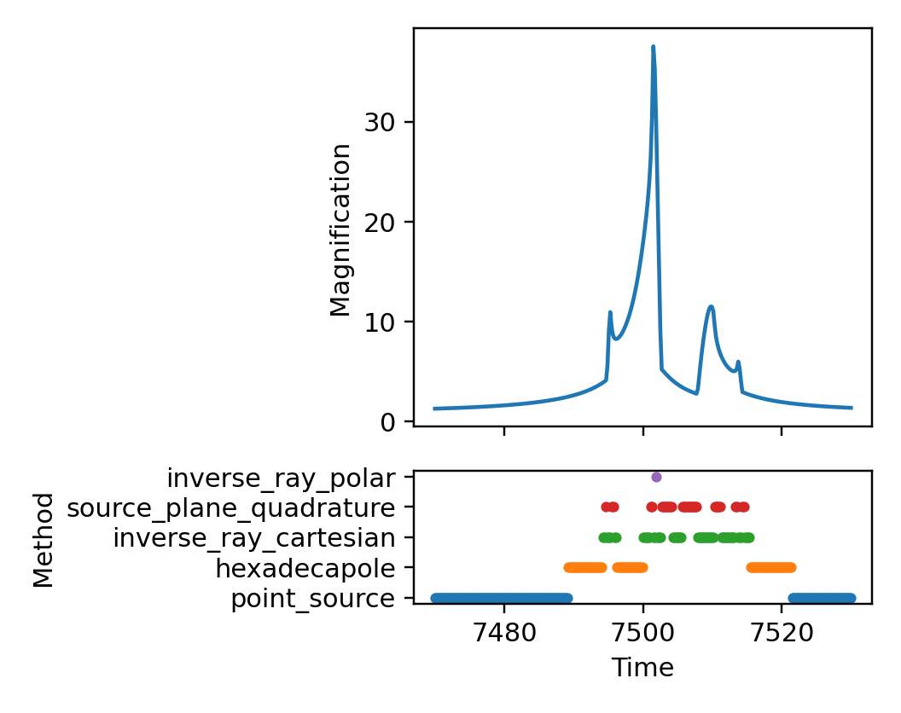

[Previous: Limb darkening](LimbDarkening.md) · [Documentation home](readme.md) · [Next: Coordinates and conventions](Coordinates.md)

# Accuracy control

> VBMicrolensing correspondence: [AccuracyControl.md](https://github.com/valboz/VBMicrolensing/blob/main/docs/python/AccuracyControl.md). The `s=0.8`, `q=0.1`, source-position, source-radius, and tolerance examples are retained.

Use the same lens and source values while changing only the requested absolute
accuracy:

```python
import lcbinint

s, q, y1, y2, rho = 0.8, 0.1, 0.01, 0.01, 0.01

mag_1e3 = lcbinint.binary_ray_shooting(
    y1, y2, s=s, q=q, rho=rho,
    options=lcbinint.Options(tol=1e-3),
)
print("Magnification (accuracy at 1.e-3) =", mag_1e3)

mag_1e4 = lcbinint.binary_ray_shooting(
    y1, y2, s=s, q=q, rho=rho,
    options=lcbinint.Options(tol=1e-4),
)
print("Magnification (accuracy at 1.e-4) =", mag_1e4)
```

## Precision control

```python
mag_rel_1e1 = lcbinint.binary_ray_shooting(
    y1, y2, s=s, q=q, rho=rho,
    options=lcbinint.Options(reltol=1e-1),
)
print("Magnification (relative precision at 1.e-1) =", mag_rel_1e1)
```

## How the tolerance is applied

`lcbinint` uses one budget at each epoch:

```text
tol + reltol * max(abs(magnification), 1)
```

`tol` is the absolute term and `reltol` is the relative term. If either term is
set explicitly, the other term is zero unless it is also supplied. If both are
left at zero, the calibrated default is equivalent to `1e-4 + 1e-3 *
max(abs(magnification), 1)`.

The returned value is not made accurate merely by requesting a tolerance.
Inspect `finite_source_converged` and `finite_source_error_estimates` when the
result matters scientifically.

## Evaluation modes

A finite-source light curve can move between several methods from epoch to
epoch:

| Reported method | Meaning |
| --- | --- |
| `point_source` | Source size is safely negligible at this position. |
| `hexadecapole` | A fourth-order finite-source expansion is locally safe. |
| `source_plane_quadrature` | The source disk is integrated in the source plane. |
| `inverse_ray_cartesian` | A Cartesian inverse-ray grid resolves the finite images. |
| `inverse_ray_polar` | A polar inverse-ray grid is selected for suitable high-magnification geometry. |

`inverse_ray_grid` controls the full inverse-ray backend; it does not disable
the safe point-source or hexadecapole fast paths.

```python
automatic = lcbinint.Options(
    nbin="auto",
    inverse_ray_grid="auto",
    tol=1e-4,
    reltol=1e-3,
)

fixed_cartesian = lcbinint.Options(
    nbin=800,
    inverse_ray_grid="cartesian",
    tol=1e-4,
    reltol=1e-3,
)

fixed_polar = lcbinint.Options(
    nbin=800,
    polar_nbin=800,
    inverse_ray_grid="polar",
    tol=1e-4,
    reltol=1e-3,
)
```

`nbin="auto"` predicts a resolution for each epoch and may retry at a larger
bucket when its error estimate misses the budget. A fixed integer is useful
for reproducibility experiments but never retries. `max_source_bins` limits
automatic refinement.

## Option summary

| Option | Purpose | Normal choice |
| --- | --- | --- |
| `tol`, `reltol` | Absolute and relative finite-source error budget. | Set both for a scientific accuracy target. |
| `nbin` | Automatic or fixed source-grid resolution. | `"auto"` |
| `max_source_bins` | Ceiling for automatic refinement. | Leave at the calibrated default unless diagnostics require more. |
| `inverse_ray_grid` | `"auto"`, `"cartesian"`, or `"polar"`. | `"auto"` |
| `polar_nbin` | Optional independent polar resolution. | `None` |
| `caustic_bins` | Sampling used only for caustic/critical-curve visualization. | Increase for denser scatter plots. |
| `hex_tol` | Fourth-order self-consistency threshold. | Leave at the default unless validating method selection. |
| `point_source_threshold` | Geometric point-source safety margin. | Advanced validation only. |

## Inspect the selected method

```python
import numpy as np
import matplotlib.pyplot as plt

params = {
    "s": 0.9, "q": 0.1, "u0": 0.0, "alpha": 1.0,
    "rho": 0.01, "tE": 30.0, "t0": 7500,
}
t = np.linspace(7470, 7530, 300)
curve = lcbinint.LightCurve(options=automatic)
info = curve.info(t, params)

method_names = list(dict.fromkeys(info.finite_source_method_names))
method_index = {name: index for index, name in enumerate(method_names)}
selected = [method_index[name] for name in info.finite_source_method_names]

fig, (mag_ax, method_ax) = plt.subplots(2, 1, sharex=True, figsize=(4.8, 3.8))
mag_ax.plot(t, info.magnifications)
mag_ax.set_ylabel("Magnification")
method_ax.scatter(t, selected, s=10)
method_ax.set_yticks(range(len(method_names)), method_names)
method_ax.set(xlabel="Time", ylabel="Method")
fig.tight_layout()
plt.show()
```



For the calibration evidence and the exact retry rules, continue to
[Numerical methods](../numerical-methods.md).

[Previous: Limb darkening](LimbDarkening.md) · [Documentation home](readme.md) · [Next: Coordinates and conventions](Coordinates.md)
