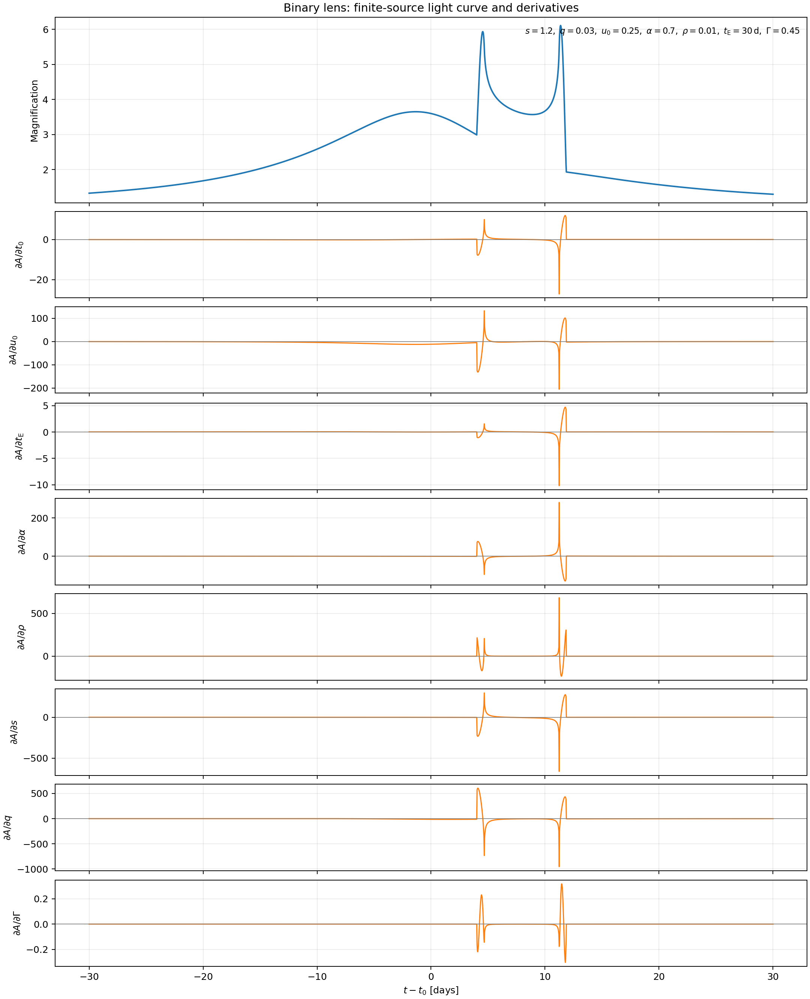
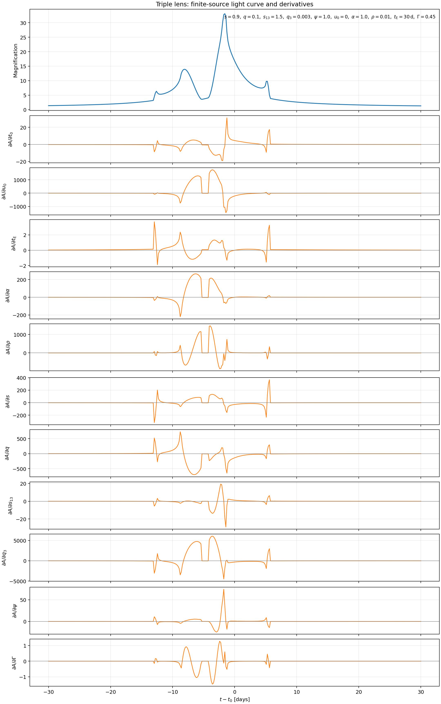

# Automatic differentiation with JAX

`lcbinint` can evaluate binary- and triple-lens light curves through a
differentiable CPU backend. The public model API is unchanged: select JAX in
`Options`, pass JAX arrays and tracers, and differentiate the returned
magnification with ordinary JAX transformations.

## Installation and precision

Install the JAX extra for differentiation, or the inference extra when using
NumPyro:

```bash
python -m pip install -e ".[jax]"
# or
python -m pip install -e ".[inference]"
```

Enable 64-bit JAX before constructing or compiling a light curve. The lens
polynomials, critical images, and caustic gradients are not supported in
32-bit mode.

```python
import jax
import jax.numpy as jnp
import lcbinint

jax.config.update("jax_enable_x64", True)
```

## Value and gradient

The parameter dictionary may contain JAX tracers. This example differentiates
a finite-source binary light curve with respect to the impact parameter:

```python
times = jnp.linspace(-0.5, 0.5, 200)
params = {
    "t0": 0.0,
    "tE": 1.0,
    "u0": 0.2,
    "alpha": 0.3,
    "s": 1.2,
    "q": 0.1,
    "rho": 0.01,
    "limb_darkening_c": 0.4,
}

curve = lcbinint.LightCurve(
    options=lcbinint.Options(
        jax=True,
        coordinates="center_of_mass",
        tol=1.0e-4,
        reltol=1.0e-4,
    )
)

def loss(u0):
    active = dict(params)
    active["u0"] = u0
    return jnp.sum(curve(times, active))

magnification = jax.jit(curve)(times, params)
value, derivative = jax.jit(jax.value_and_grad(loss))(params["u0"])
```

The first call includes JAX compilation. Reuse the compiled function with the
same time-array shape and model structure when measuring or fitting.

## Differentiating several physical parameters

Positive parameters are usually easier to optimize in logarithmic
coordinates. A compact vector also makes the parameter scales explicit:

```python
reference = jnp.asarray([
    params["t0"],
    params["u0"],
    jnp.log(params["tE"]),
    params["alpha"],
    jnp.log(params["s"]),
    jnp.log(params["q"]),
    jnp.log(params["rho"]),
])

def unpack(theta):
    return {
        **params,
        "t0": theta[0],
        "u0": theta[1],
        "tE": jnp.exp(theta[2]),
        "alpha": theta[3],
        "s": jnp.exp(theta[4]),
        "q": jnp.exp(theta[5]),
        "rho": jnp.exp(theta[6]),
    }

def objective(theta):
    model = curve(times, unpack(theta))
    return jnp.sum(model)

value, gradient = jax.jit(jax.value_and_grad(objective))(reference)
```

For a triple lens, construct `LightCurve(lens="triple", ...)` and add `q2`,
`sep2`, and `ang` to the parameterization. The same `jit`, `grad`, `jvp`, and
`value_and_grad` interfaces apply.

The complete example renderer is
`tests/diagnostics/jax_ir/render_lens_gradient_figures.py`. It produces the
finite-source light curves and all parameter derivatives shown below:





The matching [binary](../assets/binary_caustics_trajectory.png) and
[triple](../assets/triple_caustics_trajectory.png) caustic/trajectory diagrams
use the same coordinate convention and physical parameters.

## Supported physical models

The differentiable public path supports:

- binary and triple lenses;
- point, uniform, linear, square-root, and two-coefficient finite sources;
- static single and binary sources;
- annual, terrestrial, and space-site parallax;
- circular and Kepler orbital motion for a binary lens;
- all single-source and binary-source xallarap modes;
- simultaneous composition of the supported higher-order effects.

Higher-order trajectories currently require VBM-compatible coordinates.
Triple-lens orbital motion is not part of the native physical model and is
therefore not exposed by the JAX backend.

## What is differentiated

The physical magnification is differentiated, but discrete numerical choices
are not. In particular:

- point-source and multipole image roots use implicit derivatives of the
  original lens equation;
- Cartesian and polar finite-source paths differentiate the continuous
  image-plane boundary and limb-darkening moments;
- source-plane quadrature differentiates its point-source evaluations;
- root discovery, image ordering, support masks, method selection, resolution
  buckets, and fallback decisions are stopped-gradient.

Stopping those discrete choices avoids differentiating iterative root-solver
history or a changing array topology. It does not freeze the motion of the
physical image boundary inside the selected support.

## Caustics and gradient checks

A finite source remains differentiable when its centre crosses a fold or
cusp: the integration includes the appearing or disappearing image area.
There is one physical exception. When the source limb is exactly tangent to a
caustic, the two one-sided derivatives generally differ, so no unique
gradient exists at that exact parameter value.

When checking a gradient with finite differences:

1. compare against a tighter independent calculation;
2. choose a step large enough to exceed the integration error;
3. check more than one step size;
4. avoid using an exact source-limb contact as the reference point.

An excessively small finite-difference step measures numerical quadrature
noise and stopped support changes rather than the physical derivative. Use
[Accuracy control](AccuracyControl.md) to set the primal error budget.

## NumPyro and HMC

The public callable can be used directly inside a NumPyro model:

```python
import numpyro
import numpyro.distributions as dist

observed_flux = jnp.ones(times.shape)
flux_error = 0.02

def model():
    standardized_u0 = numpyro.sample("standardized_u0", dist.Normal(0.0, 1.0))
    active = dict(params)
    active["u0"] = params["u0"] + 1.0e-3 * standardized_u0
    numpyro.sample(
        "flux",
        dist.Normal(curve(times, active), flux_error),
        obs=observed_flux,
    )
```

Standardize parameters or use an appropriate dense mass matrix. Near a fold,
posterior curvature normal to the caustic can be much larger than curvature
along it. For triple lenses, initialize the trajectory parameters before
releasing all lens-geometry parameters; an uninitialized fully coupled
ten-dimensional NUTS run can be poorly conditioned even when every gradient
is accurate.

The regression suite checks reverse-mode likelihood gradients, leapfrog
reversibility, and direct execution inside NumPyro NUTS. Longer diagnostic
runs are available in:

- `tests/diagnostics/jax_ir/benchmark_hmc.py`
- `tests/diagnostics/jax_ir/benchmark_hmc_multidim.py`

## Performance measurement

Separate compilation from steady-state execution and block until the result
is ready:

```python
compiled = jax.jit(jax.value_and_grad(objective))
compiled(reference)[0].block_until_ready()  # compile

value, gradient = compiled(reference)
value.block_until_ready()                    # timed steady-state call
```

The CPU backend uses fused C++ FFI kernels for the expensive root, discovery,
Cartesian, polar, multipole, source-plane, and trajectory operations. JAX
retains model composition and applies the chain rule to physical parameters.

## Troubleshooting

- A 32-bit error means `jax_enable_x64` was not set early enough.
- Recompilation usually means that an input shape or static model choice
  changed.
- A non-finite low-level result with `support_valid=False` is an explicit
  capacity or root-discovery failure, not a partial magnification.
- A noisy finite-difference comparison usually needs a tighter reference or a
  larger difference step.
- Higher-order effects in non-VBM coordinates deliberately raise
  `NotImplementedError`.

[Previous: Combining higher-order effects](CombinedEffects.md) ·
[Documentation home](readme.md) ·
[Next: Accuracy control](AccuracyControl.md)
