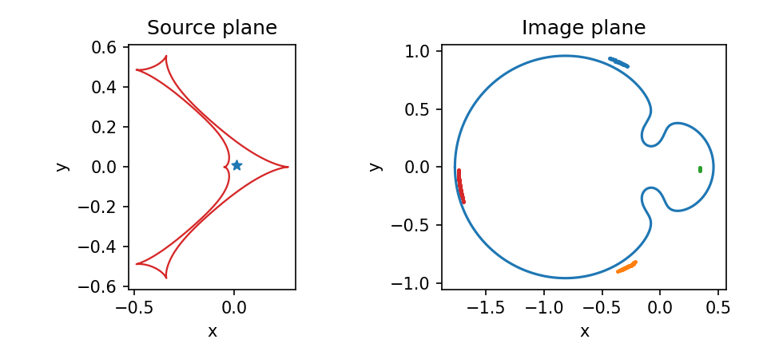

[Documentation home](readme.md) · [Next: Light curve functions](LightCurves.md)

# Binary lenses

> VBMicrolensing correspondence: [BinaryLenses.md](https://github.com/valboz/VBMicrolensing/blob/main/docs/python/BinaryLenses.md). Parameter values are kept the same; only the Python API calls are translated to `lcbinint`.

## Binary lensing with point sources

```python
import lcbinint

s = 0.8
q = 0.1
y1 = 0.01
y2 = 0.01

image_plane = lcbinint.image.ImagePlane(
    q=q, s=s, x=y1, y=y2, coordinates="lcbinint"
)
images = image_plane.image_table()
magnification = images["magnification"].sum()
print("Magnification of a point source =", magnification)
```

## Binary lensing with extended sources

```python
rho = 0.01

magnification = lcbinint.binary_ray_shooting(
    y1,
    y2,
    s=s,
    q=q,
    rho=rho,
    options=lcbinint.Options(tol=1e-3),
)
print("Binary-lens magnification =", magnification)
```

The direct calculation is useful for fitting, while separate source- and
image-plane panels show what produced that number. Caustics are points in the
source plane; critical curves and finite images belong to the image plane.

```python
import matplotlib.pyplot as plt
from matplotlib.patches import Circle

image_plane = lcbinint.image.ImagePlane(
    q=q, s=s, x=y1, y=y2, rho=rho, coordinates="lcbinint"
)
caustics = image_plane.caustics()
critical_curves = image_plane.critical_curves()
image_regions = image_plane.ray_shooting_images(resolution=300)

fig, (source_ax, image_ax) = plt.subplots(1, 2, figsize=(6.4, 3.0))

for x, y in zip(caustics.x, caustics.y):
    source_ax.plot(x, y, color="tab:red", lw=1.1)
source_ax.scatter([y1], [y2], marker="*", color="tab:blue")
source_ax.add_patch(Circle((y1, y2), rho, fill=False, color="tab:blue"))
source_ax.set(title="Source plane", xlabel="x", ylabel="y", aspect="equal")

for x, y in zip(critical_curves.x, critical_curves.y):
    image_ax.plot(x, y, color="tab:blue")
for region in image_regions:
    if len(region.points):
        image_ax.scatter(region.points[:, 0], region.points[:, 1], s=2)
image_ax.set(title="Image plane", xlabel="x", ylabel="y", aspect="equal")

fig.tight_layout()
plt.show()
```



The current `lcbinint` finite-source result exposes magnification diagnostics but not a
finite-source astrometric centroid, so the astrometry example is not replaced
with a point-source approximation.

[Documentation home](readme.md) · [Next: Light curve functions](LightCurves.md)
