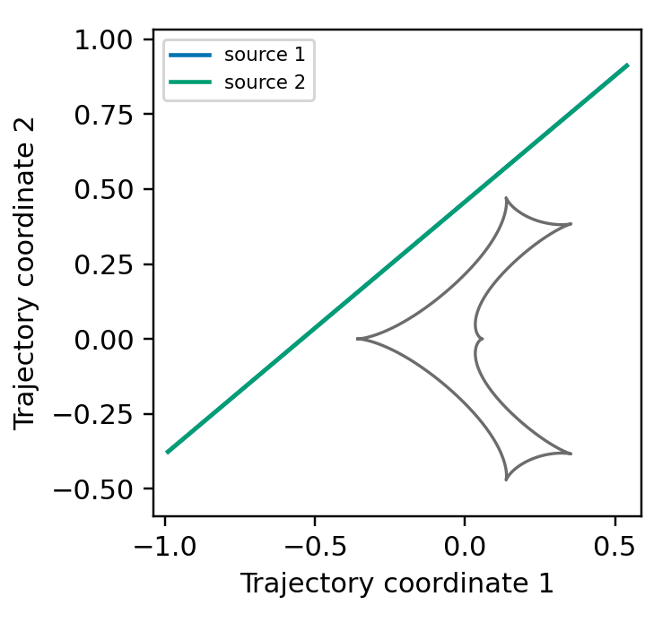

[Previous: Xallarap](Xallarap.md) · [Documentation home](readme.md) · [Next: Combining higher-order effects](CombinedEffects.md)

# Binary source + xallarap

For a binary source, choose how the two source trajectories are specified.
Every form uses `rho1`, `rho2`, `flux_ratio`, and `source_mass_ratio`; the
last parameter determines the orbital state of source 2 from source 1.

| Form | Circular | Kepler |
| --- | --- | --- |
| Elements | `xallarap="circular_elements"` with `xi_1`, `xi_2`, `period_xa`, `inc_xa` | `xallarap="orbital_elements"` with `ecc_xa`, `peri_xa` added |
| Direct xallarap coordinates | `xallarap="circular_velocity"`, `source_orbit_coordinates="xallarap"`; CoM `t0`, `u0` and source-1 state `xi_1`, `xi_2`, `w1`, `w2`, `w3` | `xallarap="kepler_velocity"` with `xa_szs`, `xa_ar` added |
| Trajectory-offset coordinates | `xallarap="circular_velocity"`, `source_orbit_coordinates="trajectory_offset"`; tracks `t0`, `u0`, `t0_2`, `u0_2` and `w1`, `w2`, `w3` | `xallarap="kepler_velocity"` with `xa_szs`, `xa_ar` added |

## Circular elements

The elements-mode source 1 is the same state used in the standalone
[circular-elements example](Xallarap.md#circular-elements).

```python
import numpy as np
import matplotlib.pyplot as plt
import lcbinint

times = np.linspace(7470.0, 7530.0, 1200)
parameters = {
    "s": 0.9, "q": 0.1, "alpha": 0.7, "tE": 30.0,
    "t0": 7500.0, "u0": 0.20,
    "rho1": 0.004, "rho2": 0.002, "flux_ratio": 0.4,
    "source_mass_ratio": 0.7,
    "xi_1": 0.02, "xi_2": -0.01,
    "period_xa": 90.0, "inc_xa": 0.6,
}
binary_curve = lcbinint.LightCurve(
    source="binary", xallarap="circular_elements", t_ref=7500.0,
)
components = binary_curve.binary_source_components(times, parameters)
```

```python
plt.figure(figsize=(4.2, 2.7))
plt.plot(times, components.source1.magnification, color="#0173B2", alpha=0.45, lw=1.0, label="source 1")
plt.plot(times, components.source2.magnification, color="#029E73", alpha=0.45, lw=1.0, label="source 2")
plt.plot(times, components.total, color="black", lw=1.5, label="total")
plt.xlabel("Time")
plt.ylabel("Magnification")
plt.legend(loc="upper left", fontsize=8)
plt.show()
```


```python
caustics = binary_curve.caustics(parameters)

plt.figure(figsize=(3.4, 3.2))
for x, y in zip(caustics.x, caustics.y):
    plt.plot(x, y, color="#6C6C6C", lw=1.1)
plt.plot(components.source1.trajectory.x, components.source1.trajectory.y, color="#0173B2", label="source 1")
plt.plot(components.source2.trajectory.x, components.source2.trajectory.y, color="#029E73", label="source 2")
plt.xlabel("Trajectory coordinate 1")
plt.ylabel("Trajectory coordinate 2")
plt.axis("equal")
plt.legend(fontsize=7)
plt.show()
```



### Keplerian elements

`orbital_elements` extends the circular-elements state with eccentricity and
periapsis. The call returns the total binary-source magnification.

```python
kepler_parameters = dict(parameters, ecc_xa=0.2, peri_xa=0.4)
kepler_curve = lcbinint.LightCurve(
    source="binary", xallarap="orbital_elements", t_ref=7500.0,
)
kepler_magnification = kepler_curve(times, kepler_parameters)
```

## Direct xallarap coordinates

With `source_orbit_coordinates="xallarap"`, `t0` and `u0` specify the CoM
track and `xi_1`, `xi_2` specify source 1 relative to that track.

```python
import numpy as np
import matplotlib.pyplot as plt
import lcbinint

times = np.linspace(7470.0, 7530.0, 300)
parameters = {
    "s": 0.9, "q": 0.1, "alpha": 0.7, "tE": 30.0,
    "t0": 7500.0, "u0": 0.20,
    "rho1": 0.004, "rho2": 0.002, "flux_ratio": 0.4,
    "source_mass_ratio": 0.7,
    "xi_1": 0.02, "xi_2": -0.01,
    "w1": 0.004, "w2": 0.35, "w3": 0.08,
}
binary_curve = lcbinint.LightCurve(
    source="binary", xallarap="circular_velocity",
    source_orbit_coordinates="xallarap", t_ref=7500.0,
)
components = binary_curve.binary_source_components(times, parameters)
```

```python
plt.figure(figsize=(4.2, 2.7))
plt.plot(times, components.source1.magnification, color="#0173B2", alpha=0.45, lw=1.0, label="source 1")
plt.plot(times, components.source2.magnification, color="#029E73", alpha=0.45, lw=1.0, label="source 2")
plt.plot(times, components.total, color="black", lw=1.5, label="total")
plt.xlabel("Time")
plt.ylabel("Magnification")
plt.legend(loc="upper left", fontsize=8)
plt.show()
```


```python
caustics = binary_curve.caustics(parameters)

plt.figure(figsize=(3.4, 3.2))
for x, y in zip(caustics.x, caustics.y):
    plt.plot(x, y, color="#6C6C6C", lw=1.1)
plt.plot(components.source1.trajectory.x, components.source1.trajectory.y, color="#0173B2", label="source 1")
plt.plot(components.source2.trajectory.x, components.source2.trajectory.y, color="#029E73", label="source 2")
plt.xlabel("Trajectory coordinate 1")
plt.ylabel("Trajectory coordinate 2")
plt.axis("equal")
plt.legend(fontsize=7)
plt.show()
```


### Kepler velocity

`kepler_velocity` keeps the direct source-1 coordinates and adds the
line-of-sight state `xa_szs` and `xa_ar`.

```python
kepler_parameters = dict(parameters, xa_szs=0.2, xa_ar=1.4)
kepler_curve = lcbinint.LightCurve(
    source="binary", xallarap="kepler_velocity",
    source_orbit_coordinates="xallarap", t_ref=7500.0,
)
kepler_magnification = kepler_curve(times, kepler_parameters)
```

## Trajectory-offset coordinates

`source_orbit_coordinates="trajectory_offset"` accepts the two tangent tracks
at `t_ref`: `t0`, `u0`, `t0_2`, and `u0_2`. Use the same binary-source inputs
above. The values below represent the same CoM state and source-1 offset as
the direct example at `t_ref`.

```python
offset_parameters = dict(parameters)
offset_parameters.pop("xi_1")
offset_parameters.pop("xi_2")
offset_parameters.update({
    "t0": 7499.4, "u0": 0.19,
    "t0_2": 7500.857142857, "u0_2": 0.214285714,
})
binary_curve = lcbinint.LightCurve(
    source="binary", xallarap="circular_velocity",
    source_orbit_coordinates="trajectory_offset", t_ref=7500.0,
)
components = binary_curve.binary_source_components(times, offset_parameters)
```

```python
plt.figure(figsize=(4.2, 2.7))
plt.plot(times, components.source1.magnification, color="#0173B2", alpha=0.45, lw=1.0, label="source 1")
plt.plot(times, components.source2.magnification, color="#029E73", alpha=0.45, lw=1.0, label="source 2")
plt.plot(times, components.total, color="black", lw=1.5, label="total")
plt.xlabel("Time")
plt.ylabel("Magnification")
plt.legend(loc="upper left", fontsize=8)
plt.show()
```


```python
caustics = binary_curve.caustics(offset_parameters)

plt.figure(figsize=(3.4, 3.2))
for x, y in zip(caustics.x, caustics.y):
    plt.plot(x, y, color="#6C6C6C", lw=1.1)
plt.plot(components.source1.trajectory.x, components.source1.trajectory.y, color="#0173B2", label="source 1")
plt.plot(components.source2.trajectory.x, components.source2.trajectory.y, color="#029E73", label="source 2")
plt.xlabel("Trajectory coordinate 1")
plt.ylabel("Trajectory coordinate 2")
plt.axis("equal")
plt.legend(fontsize=7)
plt.show()
```

The source trajectories and caustics are the same as the direct-coordinate
example above; this is the same physical state expressed with different inputs.


### Kepler velocity

```python
kepler_parameters = dict(offset_parameters, xa_szs=0.2, xa_ar=1.4)
kepler_curve = lcbinint.LightCurve(
    source="binary", xallarap="kepler_velocity",
    source_orbit_coordinates="trajectory_offset", t_ref=7500.0,
)
kepler_magnification = kepler_curve(times, kepler_parameters)
```

[Previous: Xallarap](Xallarap.md) · [Documentation home](readme.md) · [Next: Combining higher-order effects](CombinedEffects.md)
