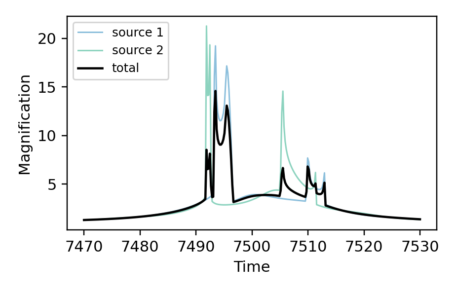
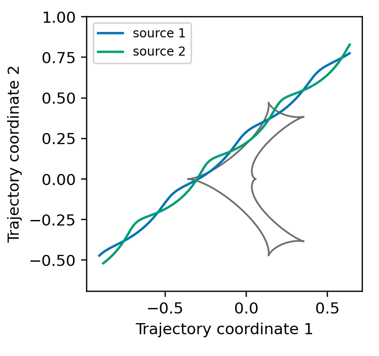
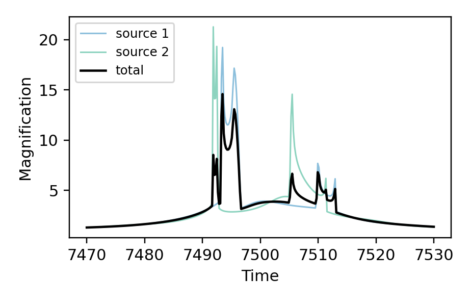

[Previous: Xallarap](Xallarap.md) · [Documentation home](readme.md) · [Next: Combining higher-order effects](CombinedEffects.md)

# Binary source + xallarap

This page combines `source="binary"` with xallarap. `flux_ratio` weights the
two light curves; `source_mass_ratio = M2 / M1` fixes the second orbital state
from the first one: `r2 = -r1 / source_mass_ratio`.

All integrated models require `rho1`, `rho2`, `flux_ratio`, and
`source_mass_ratio`.

| Xallarap mode | Additional inputs |
| --- | --- |
| `"circular_elements"` | `xi_1`, `xi_2`, `period_xa`, `inc_xa` |
| `"orbital_elements"` | `xi_1`, `xi_2`, `period_xa`, `ecc_xa`, `peri_xa`, `inc_xa` |
| `"circular_velocity"` | `xi_1`, `xi_2`, `w1`, `w2`, `w3` |
| `"kepler_velocity"` | `xi_1`, `xi_2`, `w1`, `w2`, `w3`, `xa_szs`, `xa_ar` |

## Direct xallarap coordinates

With `source_orbit_coordinates="xallarap"`, `t0` and `u0` specify the CoM
track and `xi_1`, `xi_2` specify source 1 relative to that track.

```python
import numpy as np
import matplotlib.pyplot as plt
import lcbinint

times = np.linspace(7470.0, 7530.0, 300)
parameters = {
    "s": 0.9, "q": 0.1, "alpha": 0.7, "tE": 30.0,
    "t0": 7500.0, "u0": 0.20,
    "rho1": 0.004, "rho2": 0.002, "flux_ratio": 0.4,
    "source_mass_ratio": 0.7,
    "xi_1": 0.02, "xi_2": -0.01,
    "w1": 0.004, "w2": 0.35, "w3": 0.08,
}
binary_curve = lcbinint.LightCurve(
    source="binary", xallarap="circular_velocity",
    source_orbit_coordinates="xallarap", t_ref=7500.0,
)
components = binary_curve.binary_source_components(times, parameters)
```

```python
plt.figure(figsize=(4.2, 2.7))
plt.plot(times, components.source1.magnification, color="#0173B2", alpha=0.45, lw=1.0, label="source 1")
plt.plot(times, components.source2.magnification, color="#029E73", alpha=0.45, lw=1.0, label="source 2")
plt.plot(times, components.total, color="black", lw=1.5, label="total")
plt.xlabel("Time")
plt.ylabel("Magnification")
plt.legend(loc="upper left", fontsize=8)
plt.show()
```



```python
caustics = binary_curve.caustics(parameters)

plt.figure(figsize=(3.4, 3.2))
for x, y in zip(caustics.x, caustics.y):
    plt.plot(x, y, color="#6C6C6C", lw=1.1)
plt.plot(components.source1.trajectory.x, components.source1.trajectory.y, color="#0173B2", label="source 1")
plt.plot(components.source2.trajectory.x, components.source2.trajectory.y, color="#029E73", label="source 2")
plt.xlabel("Trajectory coordinate 1")
plt.ylabel("Trajectory coordinate 2")
plt.axis("equal")
plt.legend(fontsize=7)
plt.show()
```



## Trajectory-offset coordinates

`source_orbit_coordinates="trajectory_offset"` accepts the two tangent tracks
at `t_ref`: `t0`, `u0`, `t0_2`, and `u0_2`. Use the same binary-source inputs
above. The values below represent the same CoM state and source-1 offset as
the direct example at `t_ref`.

```python
offset_parameters = dict(parameters)
offset_parameters.pop("xi_1")
offset_parameters.pop("xi_2")
offset_parameters.update({
    "t0": 7499.4, "u0": 0.19,
    "t0_2": 7500.857142857, "u0_2": 0.214285714,
})
binary_curve = lcbinint.LightCurve(
    source="binary", xallarap="circular_velocity",
    source_orbit_coordinates="trajectory_offset", t_ref=7500.0,
)
components = binary_curve.binary_source_components(times, offset_parameters)
```

```python
plt.figure(figsize=(4.2, 2.7))
plt.plot(times, components.source1.magnification, color="#0173B2", alpha=0.45, lw=1.0, label="source 1")
plt.plot(times, components.source2.magnification, color="#029E73", alpha=0.45, lw=1.0, label="source 2")
plt.plot(times, components.total, color="black", lw=1.5, label="total")
plt.xlabel("Time")
plt.ylabel("Magnification")
plt.legend(loc="upper left", fontsize=8)
plt.show()
```



```python
caustics = binary_curve.caustics(offset_parameters)

plt.figure(figsize=(3.4, 3.2))
for x, y in zip(caustics.x, caustics.y):
    plt.plot(x, y, color="#6C6C6C", lw=1.1)
plt.plot(components.source1.trajectory.x, components.source1.trajectory.y, color="#0173B2", label="source 1")
plt.plot(components.source2.trajectory.x, components.source2.trajectory.y, color="#029E73", label="source 2")
plt.xlabel("Trajectory coordinate 1")
plt.ylabel("Trajectory coordinate 2")
plt.axis("equal")
plt.legend(fontsize=7)
plt.show()
```

The source trajectories and caustics are the same as the direct-coordinate
example above; this is the same physical state expressed with different inputs.


[Previous: Xallarap](Xallarap.md) · [Documentation home](readme.md) · [Next: Combining higher-order effects](CombinedEffects.md)
