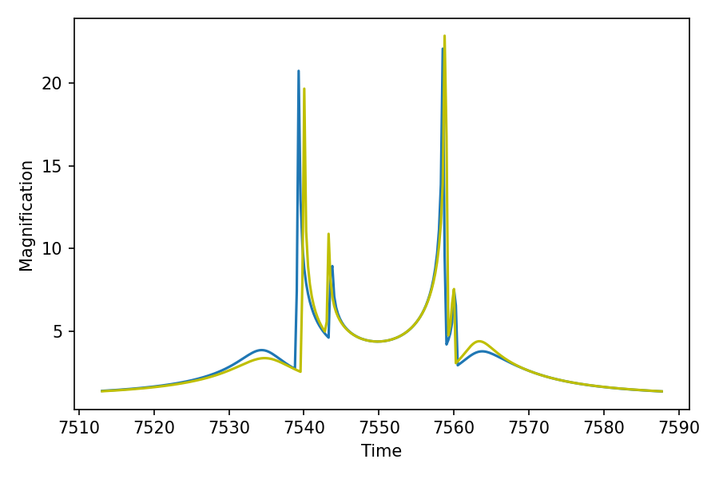
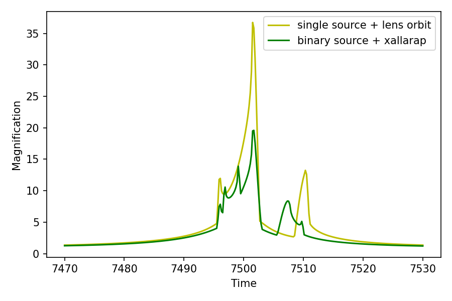

[Back to Orbital Motion](OrbitalMotion.md)

# Binary sources

> VBMicrolensing correspondence: [BinarySources.md](https://github.com/valboz/VBMicrolensing/blob/main/docs/python/BinarySources.md). Flux ratios, epochs, source radii, parallax, and xallarap velocity components retain the published example values.

`lcbinint` exposes binary sources together with a binary lens. The single-lens
binary-source-only functions are therefore not replaced by a different model.

## Xallarap

```python
import numpy as np
import matplotlib.pyplot as plt
import lcbinint

tE = 37.3
FR = 0.4
u01 = 0.1
u02 = 0.05
t01 = 7550.4
t02 = 7555.8
rho = 0.004
piEN = 0.03
piEE = -0.02
w1 = 0.021
w2 = -0.02
w3 = 0.03

params = {
    "s": 1.0, "q": 1.0, "alpha": 0.0,
    "tE": tE, "q_source": FR,
    "u0": u01, "u0_2": u02,
    "t0": t01, "t0_2": t02,
    "rho": rho,
    "piEN": piEN, "piEE": piEE,
    "w1": w1, "w2": w2, "w3": w3,
}
t = np.linspace(t01 - tE, t01 + tE, 300)

options = lcbinint.Options(tol=1e-3, reltol=1e-3)
static_curve = lcbinint.LightCurve(
    model=lcbinint.Model(lens="binary", source="binary"),
    options=options,
)
xallarap_curve = lcbinint.LightCurve(
    model=lcbinint.Model(
        lens="binary",
        source="binary",
        xallarap="circular_velocity",
    ),
    options=options,
)

magnifications_static = static_curve(t, params)
magnifications_xallarap = xallarap_curve(t, params)
```

Plot the two light curves in their own block:

```python
plt.figure()
plt.plot(t, magnifications_static)
plt.plot(t, magnifications_xallarap, "y")
plt.xlabel("Time")
plt.ylabel("Magnification")
plt.show()
```



## Binary sources and Binary lenses

```python
s = 0.9
q = 0.1
u0 = 0.0
alpha = 1.0
rho = 0.01
tE = 30.0
t0 = 7500
piEN = 0.3
piEE = -0.2
gamma1 = 0.011
gamma2 = -0.005
gamma3 = 0.005
u02 = u0 + 0.2
t02 = t0 + 0.0
FR = 1.0
ws1 = 0.01
ws2 = 0.02
ws3 = -0.015

params = {
    "s": s, "q": q, "u0": u0, "alpha": alpha,
    "rho": rho, "tE": tE, "t0": t0,
    "piEN": piEN, "piEE": piEE,
    "g1": gamma1, "g2": gamma2, "g3": gamma3,
    "u0_2": u02, "t0_2": t02, "q_source": FR,
    "w1": ws1, "w2": ws2, "w3": ws3,
}
t = np.linspace(t0 - tE, t0 + tE, 300)
sky = lcbinint.obs.SkyCoord("17:59:02.3", "-29:04:15.2")
combined_options = lcbinint.Options(
    coordinates="vbm", tol=1e-3, reltol=1e-3
)

# Corresponds to VBM.BinaryLightCurveOrbital(pr, t).
single_source_model = lcbinint.Model(
    parallax=True,
    orbital_motion="circular",
    sky=sky,
    t_ref=t0,
)
single_source_curve = lcbinint.LightCurve(
    model=single_source_model,
    options=combined_options,
)
magnifications_single_source = single_source_curve(t, params)

# Corresponds to VBM.BinSourceBinLensLightCurve(pr, t). This compatibility
# calculation jointly reconstructs the lens orbit, source barycenter, source
# mass ratio, and relative source orbit used by that function.
magnifications_binary_source = lcbinint.vbm_binary_source_binary_lens(
    t,
    params,
    sky=sky,
    options=combined_options,
    t_ref=t0,
)
```

The figure makes the extra binary-source and xallarap terms visible instead of
leaving the combined calculation as a single printed array:

```python
plt.figure()
plt.plot(t, magnifications_single_source, "y", label="single source + lens orbit")
plt.plot(t, magnifications_binary_source, "g", label="binary source + xallarap")
plt.xlabel("Time")
plt.ylabel("Magnification")
plt.legend()
plt.show()
```



[Back to documentation](readme.md)
