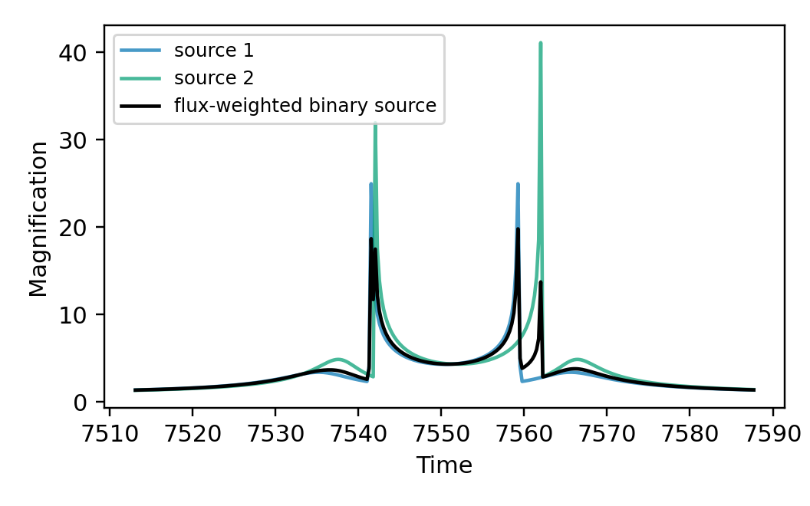
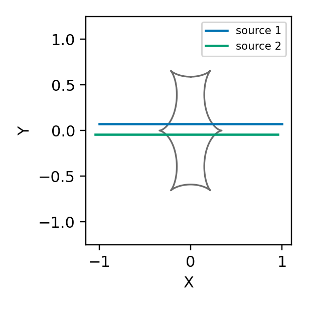
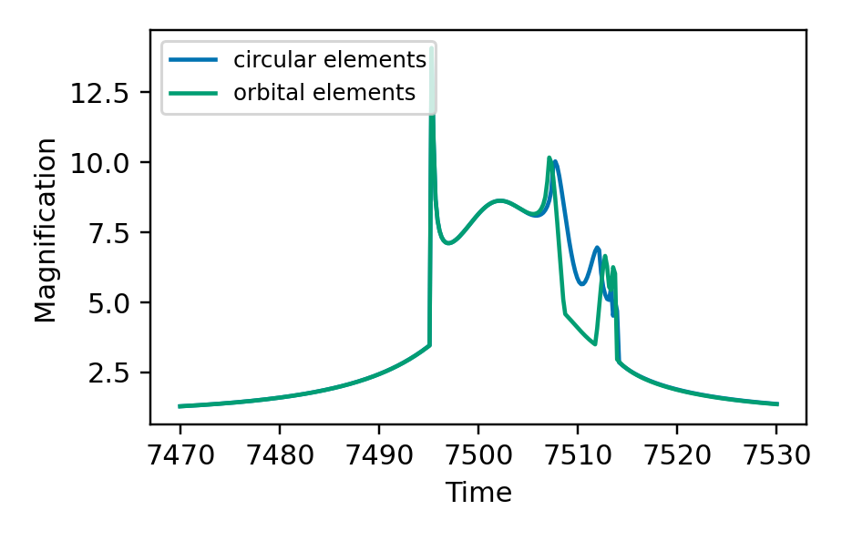

[Previous: Orbital motion](OrbitalMotion.md) · [Documentation home](readme.md) · [Next: Combining higher-order effects](CombinedEffects.md)

# Binary sources

`source="binary"` describes two luminous source stars magnified by the same
lens.  It changes the source trajectory and flux model only; it is independent
of whether the configured lens is binary or triple.

The observed magnification is the flux-weighted sum
`A(t) = (A1(t) + flux_ratio * A2(t)) / (1 + flux_ratio)`, where
`flux_ratio = F2 / F1`.

`flux_ratio` is a photometric quantity.  It must not be used as a proxy for a
source mass ratio: stars of the same mass need not have the same brightness,
and vice versa.

## Static binary sources

Without xallarap, each source follows its own rectilinear trajectory.  They
share the lens parameters, `tE`, `alpha`, parallax, lens orbital motion, and
limb-darkening coefficients, but have separate closest-approach parameters and
source sizes.

| Parameter | Meaning |
| --- | --- |
| `t0`, `u0`, `rho1` | Closest-approach epoch, impact parameter, and normalized radius of source 1. |
| `t0_2`, `u0_2`, `rho2` | The corresponding quantities for source 2. |
| `tE`, `alpha` | Shared Einstein timescale and trajectory angle. |
| `flux_ratio` | Source flux ratio, `F2 / F1`. |

Both `rho1` and `rho2` are required.  Set either to zero for a point source.

```python
import numpy as np
import matplotlib.pyplot as plt
import lcbinint

options = lcbinint.Options(tol=1e-3, reltol=1e-3)
binary_curve = lcbinint.LightCurve(source="binary", options=options)
single_source_curve = lcbinint.LightCurve(options=options)
parameters = {
    "s": 0.9, "q": 0.1, "alpha": 1.0, "tE": 30.0,
    "t0": 7500.0, "u0": 0.10, "rho1": 0.004,
    "t0_2": 7501.2, "u0_2": -0.06, "rho2": 0.002,
    "flux_ratio": 0.4,
}
times = np.linspace(7470.0, 7530.0, 300)

# The two single-source calls expose the components of the binary-source sum.
source1_params = dict(parameters, rho=parameters["rho1"])
source2_params = dict(
    parameters,
    t0=parameters["t0_2"], u0=parameters["u0_2"], rho=parameters["rho2"],
)
for key in ("rho1", "t0_2", "u0_2", "rho2", "flux_ratio"):
    source1_params.pop(key)
    source2_params.pop(key)

source1_magnification = single_source_curve(times, source1_params)
source2_magnification = single_source_curve(times, source2_params)
binary_magnification = binary_curve(times, parameters)
```

Plot the component curves and their flux-weighted binary-source result:

```python
plt.figure(figsize=(4.8, 3.0))
plt.plot(times, source1_magnification, color="#0173B2", alpha=0.72, label="source 1")
plt.plot(times, source2_magnification, color="#029E73", alpha=0.72, label="source 2")
plt.plot(
    times, binary_magnification, color="black", lw=1.5,
    label="flux-weighted binary source",
)
plt.xlabel("Time")
plt.ylabel("Magnification")
plt.legend(loc="upper left", fontsize=8)
plt.show()
```



The same two trajectories can be inspected against the caustics:

```python
source1_trajectory = single_source_curve.source_trajectory(times, source1_params)
source2_trajectory = single_source_curve.source_trajectory(times, source2_params)
caustics = single_source_curve.caustics(source1_params)

plt.figure(figsize=(2.8, 2.8))
for x, y in zip(caustics.x, caustics.y):
    plt.plot(-np.asarray(x), -np.asarray(y), color="#6C6C6C", lw=1.1)
plt.plot(-np.asarray(source1_trajectory.x), -np.asarray(source1_trajectory.y),
         color="#0173B2", label="source 1")
plt.plot(-np.asarray(source2_trajectory.x), -np.asarray(source2_trajectory.y),
         color="#029E73", label="source 2")
plt.xlabel("X")
plt.ylabel("Y")
plt.axis("equal")
plt.legend(fontsize=7)
plt.show()
```



## Source orbital motion (xallarap)

With xallarap, the two source positions are constrained by the source-binary
centre of mass: `M1 * r1 + M2 * r2 = 0`. Set
`source_mass_ratio = M2 / M1`; source 2 is then derived as
`r2 = -r1 / source_mass_ratio`.

All binary-source xallarap models require these source parameters:

```python
"rho1": 0.004,
"rho2": 0.002,
"flux_ratio": 0.4,
"source_mass_ratio": 0.7,  # M2 / M1, not a flux ratio
```

`source_mass_ratio` controls the orbital geometry. `flux_ratio` controls the
photometric weighting and is independent of the mass ratio.

### Orbital-elements modes

`xallarap="circular_elements"` and `xallarap="orbital_elements"` use the
existing xallarap element parameterizations.  Supply the source-1 orbit state
through `xi_1`, `xi_2` and the relevant orbital parameters.  The second
source's state is generated using the CoM relation above.

| Mode | Required orbital parameters |
| --- | --- |
| `"circular_elements"` | `xi_1`, `xi_2`, `period_xa`, `inc_xa` |
| `"orbital_elements"` | `xi_1`, `xi_2`, `period_xa`, `ecc_xa`, `peri_xa`, `inc_xa` |

There is no `source_orbit_coordinates` switch for elements modes, and do not
provide `t0_2` or `u0_2`: positions are specified by the orbit itself.

```python
times = np.linspace(7470.0, 7530.0, 300)
parameters = {
    "s": 0.9, "q": 0.1, "alpha": 1.0, "tE": 30.0,
    "t0": 7500.0, "u0": 0.10,
    "rho1": 0.004, "rho2": 0.002, "flux_ratio": 0.4,
    "source_mass_ratio": 0.7,
    "xi_1": 0.04, "xi_2": -0.02,
}

circular_elements = lcbinint.LightCurve(
    source="binary", xallarap="circular_elements", t_ref=7500.0,
)
circular_elements_magnification = circular_elements(
    times, dict(parameters, period_xa=120.0, inc_xa=0.8),
)

orbital_elements = lcbinint.LightCurve(
    source="binary", xallarap="orbital_elements", t_ref=7500.0,
)
orbital_elements_magnification = orbital_elements(
    times,
    dict(
        parameters,
        period_xa=120.0, ecc_xa=0.2, peri_xa=0.4, inc_xa=0.8,
    ),
)
```

Plot both element-based modes:

```python
plt.figure(figsize=(4.2, 2.7))
plt.plot(
    times, circular_elements_magnification,
    color="#0173B2", label="circular elements",
)
plt.plot(
    times, orbital_elements_magnification,
    color="#029E73", label="orbital elements",
)
plt.xlabel("Time")
plt.ylabel("Magnification")
plt.legend(loc="upper left", fontsize=8)
plt.show()
```



### Position--velocity modes

`xallarap="circular_velocity"` and `xallarap="kepler_velocity"` propagate
an orbit from a projected position and velocity at `t_ref`.  For a binary
source, select how that initial position is supplied with
`source_orbit_coordinates`.

| Value | Position inputs | Use case |
| --- | --- | --- |
| `"xallarap"` | `t0`, `u0` specify the CoM trajectory; `xi_1`, `xi_2` specify source 1 relative to the CoM. | Direct state-vector sampling. |
| `"trajectory_offset"` | `t0`, `u0`, `t0_2`, `u0_2` specify the two source trajectories at the reference epoch. | Fits that conventionally sample two source tracks. |

Both choices require `t_ref`, `source_mass_ratio`, and the velocity parameters
`w1`, `w2`, `w3`.  `kepler_velocity` additionally requires `xa_szs` and
`xa_ar`.  These are the source-orbit state parameters of the existing velocity
xallarap API: `w1`, `w2`, and `w3` specify the instantaneous projected and
line-of-sight velocity state, while `xa_szs` and `xa_ar` complete the Kepler
geometry.

#### `source_orbit_coordinates="xallarap"`

This is the direct state-vector convention.  `t0` and `u0` belong to the CoM;
`xi_1` and `xi_2` are source 1's projected position relative to it at `t_ref`.
The second state follows from the mass ratio.

```python
circular_velocity = lcbinint.LightCurve(
    source="binary",
    xallarap="circular_velocity",
    source_orbit_coordinates="xallarap",
    t_ref=7500.0,
)
parameters = {
    "s": 0.9, "q": 0.1, "alpha": 1.0, "tE": 30.0,
    "t0": 7500.0, "u0": 0.10,
    "rho1": 0.004, "rho2": 0.002, "flux_ratio": 0.4,
    "source_mass_ratio": 0.7,
    "xi_1": 0.04, "xi_2": -0.02,
    "w1": 0.01, "w2": 0.8, "w3": 0.2,
}
times = np.linspace(7470.0, 7530.0, 300)
circular_velocity_magnification = circular_velocity(times, parameters)

kepler_velocity = lcbinint.LightCurve(
    source="binary",
    xallarap="kepler_velocity",
    source_orbit_coordinates="xallarap",
    t_ref=7500.0,
)
kepler_velocity_magnification = kepler_velocity(
    times,
    dict(parameters, xa_szs=0.2, xa_ar=1.4),
)
```

Plot both velocity-based modes:

```python
plt.figure(figsize=(4.2, 2.7))
plt.plot(
    times, circular_velocity_magnification,
    color="#0173B2", label="circular velocity",
)
plt.plot(
    times, kepler_velocity_magnification,
    color="#029E73", label="Kepler velocity",
)
plt.xlabel("Time")
plt.ylabel("Magnification")
plt.legend(loc="upper left", fontsize=8)
plt.show()
```


Plot both source trajectories with the static lens caustics. `source_trajectory`
returns one source track, so the two CoM-consistent states are evaluated
explicitly for this geometry plot:

```python
trajectory_curve = lcbinint.LightCurve(
    xallarap="circular_velocity",
    t_ref=7500.0,
)
centre_curve = lcbinint.LightCurve()
trajectory_params = dict(parameters, rho=0.0)
for key in ("rho1", "rho2", "flux_ratio", "source_mass_ratio"):
    trajectory_params.pop(key)
source2_params = dict(
    trajectory_params,
    xi_1=-trajectory_params["xi_1"] / parameters["source_mass_ratio"],
    xi_2=-trajectory_params["xi_2"] / parameters["source_mass_ratio"],
)
source1_trajectory = trajectory_curve.source_trajectory(times, trajectory_params)
source2_trajectory = trajectory_curve.source_trajectory(times, source2_params)
centre_trajectory = centre_curve.source_trajectory(times, trajectory_params)
caustics = centre_curve.caustics(trajectory_params)

plt.figure(figsize=(3.4, 3.2))
for x, y in zip(caustics.x, caustics.y):
    plt.plot(x, y, color="#6C6C6C", lw=1.1)
plt.plot(centre_trajectory.x, centre_trajectory.y, color="0.55", ls="--", label="CoM")
plt.plot(source1_trajectory.x, source1_trajectory.y, color="#0173B2", label="source 1")
plt.plot(source2_trajectory.x, source2_trajectory.y, color="#029E73", label="source 2")
plt.xlabel("Trajectory coordinate 1")
plt.ylabel("Trajectory coordinate 2")
plt.axis("equal")
plt.legend(fontsize=7)
plt.show()
```

The filled markers are the positions at `t_ref`; their different distances
from the CoM reflect `source_mass_ratio`, not `flux_ratio`.


#### `source_orbit_coordinates="trajectory_offset"`

This convention retains the familiar two-track inputs.  At `t_ref`, the
physical positions of source 1 and source 2 are exactly the positions obtained
from their respective rectilinear trajectories:

`tau_i(t_ref) = (t_ref - t0_i) / tE` and `beta_i(t_ref) = u0_i`.

Internally, `lcbinint` converts them to a CoM trajectory and an orbital
relative state. For `q_s = M2 / M1`, the conversion is:

```text
t0_com = (t0_1 + q_s * t0_2) / (1 + q_s)
u0_com = (u0_1 + q_s * u0_2) / (1 + q_s)
```

with the source-1 relative position chosen so that both positions above are
preserved at `t_ref`.  Consequently, the supplied `t0`, `u0`, `t0_2`, and
`u0_2` are not silently reinterpreted at the reference epoch.  Once orbital
motion is present, they are tangent-track parameters rather than exact
closest-approach times of the curved trajectories away from `t_ref`.

```python
curve = lcbinint.LightCurve(
    source="binary",
    xallarap="circular_velocity",
    source_orbit_coordinates="trajectory_offset",
    t_ref=7500.0,
)
parameters = {
    "s": 0.9, "q": 0.1, "alpha": 1.0, "tE": 30.0,
    "t0": 7500.0, "u0": 0.10,
    "t0_2": 7501.2, "u0_2": -0.06,
    "rho1": 0.004, "rho2": 0.002, "flux_ratio": 0.4,
    "source_mass_ratio": 0.7,
    "w1": 0.01, "w2": 0.8, "w3": 0.2,
}
```

Choose `t_ref` near the event centre or the centre of the data span.  This
makes the stated positional anchor useful and usually reduces parameter
correlations.

[Previous: Orbital motion](OrbitalMotion.md) · [Documentation home](readme.md) · [Next: Combining higher-order effects](CombinedEffects.md)
