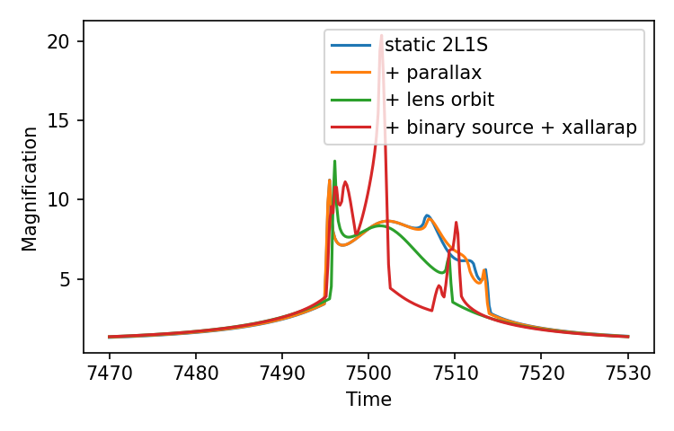
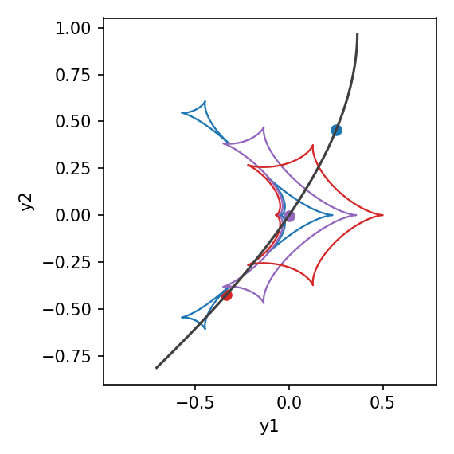

[Previous: Binary sources](BinarySources.md) · [Documentation home](readme.md)

# Combining physical effects

> VBMicrolensing correspondence: this example combines the parameter sets documented separately in [Parallax.md](https://github.com/valboz/VBMicrolensing/blob/main/docs/python/Parallax.md), [OrbitalMotion.md](https://github.com/valboz/VBMicrolensing/blob/main/docs/python/OrbitalMotion.md), and [BinarySources.md](https://github.com/valboz/VBMicrolensing/blob/main/docs/python/BinarySources.md).

`Model` terms are composable. A binary lens may use parallax, circular lens
orbital motion, a binary source, and circular-velocity xallarap in the same
calculation. Numerical controls remain on `Options`.

The binary source uses the barycentric state-vector convention defined in
[Binary sources](BinarySources.md); it does not reuse a function-specific
packed parameter vector.

| Effect | `Model` switch | Parameters used here |
| --- | --- | --- |
| Annual parallax | `parallax=True` | `piEN`, `piEE`, `sky`, `t_ref` |
| Lens orbital motion | `orbital_motion="circular"` | `g1`, `g2`, `g3` |
| Binary source | `source="binary"` | `q_mass`, `q_source`, `xi_1`, `xi_2` |
| Xallarap | `xallarap="circular_velocity"` | `w1`, `w2`, `w3` |

The values below are the combined binary-source/binary-lens example values:

```python
import numpy as np
import matplotlib.pyplot as plt
import lcbinint

s = 0.9
q = 0.1
u0 = 0.1
alpha = 1.0
rho = 0.01
tE = 30.0
t0 = 7500
piEN = 0.3
piEE = -0.2
gamma1 = 0.011
gamma2 = -0.005
gamma3 = 0.005
FR = 1.0
q_mass = 1.0
xi_1 = 0.0
xi_2 = -0.1
source_w1 = 0.01
source_w2 = 0.02
source_w3 = 0.015

params = {
    "s": s, "q": q, "u0": u0, "alpha": alpha,
    "rho": rho, "tE": tE, "t0": t0,
    "piEN": piEN, "piEE": piEE,
    "g1": gamma1, "g2": gamma2, "g3": gamma3,
    "q_source": FR, "q_mass": q_mass,
    "xi_1": xi_1, "xi_2": xi_2,
    "w1": source_w1, "w2": source_w2, "w3": source_w3,
}
t = np.linspace(t0 - tE, t0 + tE, 300)
sky = lcbinint.obs.SkyCoord("17:59:02.3", "-29:04:15.2")
options = lcbinint.Options(
    coordinates="vbm", nbin="auto", tol=1e-4, reltol=1e-3
)

static = lcbinint.LightCurve(options=options)
parallax = lcbinint.LightCurve(
    model=lcbinint.Model(parallax=True, sky=sky, t_ref=t0),
    options=options,
)
parallax_orbit = lcbinint.LightCurve(
    model=lcbinint.Model(
        parallax=True, orbital_motion="circular", sky=sky, t_ref=t0
    ),
    options=options,
)
combined = lcbinint.LightCurve(
    model=lcbinint.Model(
        lens="binary",
        source="binary",
        parallax=True,
        orbital_motion="circular",
        xallarap="circular_velocity",
        sky=sky,
        t_ref=t0,
    ),
    options=options,
)

single_source_params = {
    key: value for key, value in params.items()
    if key not in {"q_source", "q_mass", "xi_1", "xi_2", "w1", "w2", "w3"}
}
static_mag = static(t, single_source_params)
parallax_mag = parallax(t, single_source_params)
orbit_mag = parallax_orbit(t, single_source_params)
combined_mag = combined(t, params)
```

Plot the cumulative effect on the light curve:

```python
plt.figure(figsize=(5, 3.2))
plt.plot(t, static_mag, label="static 2L1S")
plt.plot(t, parallax_mag, label="+ parallax")
plt.plot(t, orbit_mag, label="+ lens orbit")
plt.plot(t, combined_mag, label="+ binary source + xallarap")
plt.xlabel("Time")
plt.ylabel("Magnification")
plt.legend()
plt.show()
```



Plot the time-dependent caustics and primary source trajectory separately:

```python
trajectory = combined.source_trajectory(t, params)
display_x = -np.asarray(trajectory.x)
display_y = -np.asarray(trajectory.y)
indices = [75, 150, 225]
colors = ["tab:blue", "tab:purple", "tab:red"]

plt.figure(figsize=(3.8, 3.8))
for index, color in zip(indices, colors):
    caustics = combined.caustics(float(t[index]), params)
    for x, y in zip(caustics.x, caustics.y):
        plt.plot(-np.asarray(x), -np.asarray(y), color=color, lw=1.1)
    plt.scatter([display_x[index]], [display_y[index]], color=color)
plt.plot(display_x, display_y, color="0.25")
plt.xlabel("y1")
plt.ylabel("y2")
plt.axis("equal")
plt.show()
```



`LightCurve.info(t, params)` remains available for the combined model, so
finite-source convergence should be checked in exactly the same way as for a
static event.

[Previous: Binary sources](BinarySources.md) · [Documentation home](readme.md)
