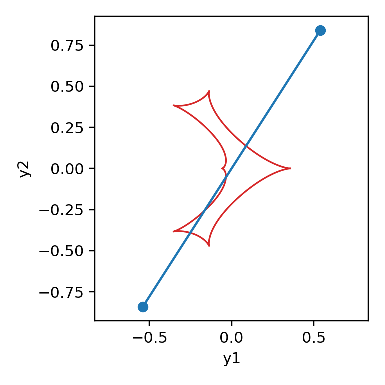

[Previous: Accuracy control](AccuracyControl.md) · [Documentation home](readme.md) · [Next: Parallax](Parallax.md)

# Coordinates and conventions

> VBMicrolensing correspondence: the source-trajectory convention comes from [LightCurves.md](https://github.com/valboz/VBMicrolensing/blob/main/docs/python/LightCurves.md), the binary lens frame from [BinaryLenses.md](https://github.com/valboz/VBMicrolensing/blob/main/docs/python/BinaryLenses.md), and the north/east sky convention from [Parallax.md](https://github.com/valboz/VBMicrolensing/blob/main/docs/python/Parallax.md).

## Source trajectory

For the examples in this guide,

```text
tau = (t - t0) / tE
y1  = u0 * sin(alpha) - tau * cos(alpha)
y2  = -u0 * cos(alpha) - tau * sin(alpha)
```

`alpha` is in radians and is measured from the binary axis. `u0` and `rho` are
in Einstein-radius units; `t0` and `tE` use the same time unit as the supplied
epoch array.

```python
import numpy as np
import matplotlib.pyplot as plt
import lcbinint

params = {
    "s": 0.9, "q": 0.1, "u0": 0.0, "alpha": 1.0,
    "rho": 0.01, "tE": 30.0, "t0": 7500,
}
t = np.linspace(7470, 7530, 300)
curve = lcbinint.LightCurve(
    options=lcbinint.Options(coordinates="vbm", caustic_bins=600)
)
trajectory = curve.source_trajectory(t, params)
caustics = curve.caustics(params)

# Both methods return coordinates in this curve's lens-plane frame.
# Plot them directly; do not negate either axis.
display_x = np.asarray(trajectory.x)
display_y = np.asarray(trajectory.y)

plt.figure(figsize=(2.8, 2.8))
for x, y in zip(caustics.x, caustics.y):
    plt.plot(x, y, color="tab:red", lw=1.1)
plt.plot(display_x, display_y, color="tab:blue")
plt.xlabel("y1")
plt.ylabel("y2")
plt.axis("equal")
plt.show()
```



`source_trajectory()` and `caustics()` use the same lens-plane frame. No
additional display rotation is required.

## `coordinates` option

| Value | Intended use |
| --- | --- |
| `"vbm"` | Default for the worked examples and VBMicrolensing-compatible parameter semantics. |
| `"lcbinint"` | Original low-level `lcbinint` lens-frame convention. Useful with direct source coordinates and `ImagePlane`. |
| `"center_of_mass"` | Original trajectory convention with an explicit binary center-of-mass reference. |
| `"vbm_center_of_mass"` | VBMicrolensing parameter semantics with the explicit center-of-mass reference. |

Do not mix source coordinates calculated in one convention with caustics from
another. Set the option once on the reusable `LightCurve` and obtain both
trajectory and geometry from that object.

## Sky coordinates and observatory coordinates

```python
sky = lcbinint.obs.SkyCoord("17:59:02.3", "-29:04:15.2")
ground = lcbinint.obs.Site("ground", -29.0, -70.7)
```

Right ascension and declination define the J2000 target direction. `piEN` and
`piEE` are the north and east components of the parallax vector. Ground-site
latitude and longitude are degrees, with east-positive longitude. Space-site
tables use `(JD, RA_deg, Dec_deg, distance_AU)`.

[Previous: Accuracy control](AccuracyControl.md) · [Documentation home](readme.md) · [Next: Parallax](Parallax.md)
