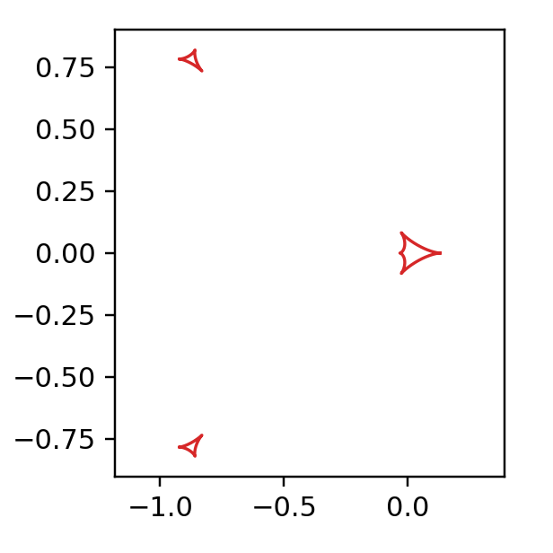
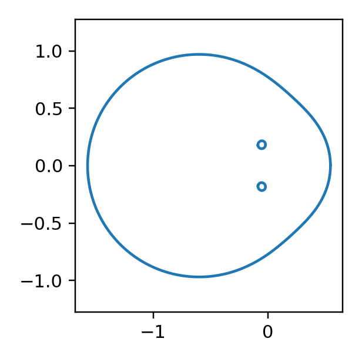

[Previous: Light curve functions](LightCurves.md) · [Documentation home](readme.md) · [Next: Limb darkening](LimbDarkening.md)

# Critical curves and caustics

> VBMicrolensing correspondence: [CriticalCurvesAndCaustics.md](https://github.com/valboz/VBMicrolensing/blob/main/docs/python/CriticalCurvesAndCaustics.md). The binary example retains `s=0.6` and `q=0.1`.

The two geometries are deliberately calculated and plotted in different code
blocks. Each element of `caustics.x/y` or `critical_curves.x/y` is one complete
physical closed curve. `lcbinint` follows the polynomial roots through a full
phase sweep and joins their monodromy cycles, matching the ordering performed
by VBMicrolensing rather than exposing one array per root.

## Binary Lens

Calculate and plot the caustics:

```python
import numpy as np
from matplotlib import pyplot as plt
import lcbinint

s = 0.6
q = 0.1
params = {"s": s, "q": q}

curve = lcbinint.LightCurve(options=lcbinint.Options(caustic_bins=200))
caustics = curve.caustics(params)

fig = plt.figure(figsize=(2.8, 2.8))
for x, y in zip(caustics.x, caustics.y):
    plt.plot(-np.asarray(x), -np.asarray(y), color="tab:red", lw=1.1)
plt.axis("equal")
plt.show()
```



Calculate and plot the critical curves in a new block:

```python
critical_curves = curve.critical_curves(params)

fig = plt.figure(figsize=(2.8, 2.8))
for x, y in zip(critical_curves.x, critical_curves.y):
    plt.plot(-np.asarray(x), -np.asarray(y), color="tab:blue")
plt.axis("equal")
plt.show()
```



The arbitrary four-lens geometry example is not included because the current
`lcbinint` model selector supports binary and triple lenses only.

[Previous: Light curve functions](LightCurves.md) · [Documentation home](readme.md) · [Next: Limb darkening](LimbDarkening.md)
