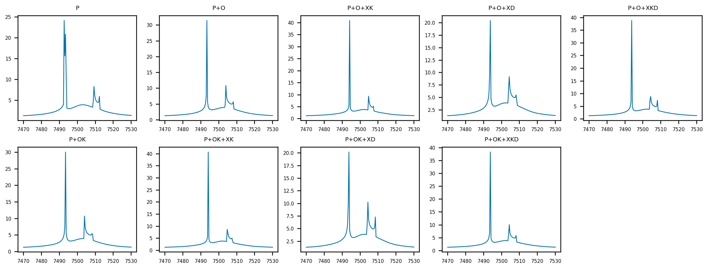
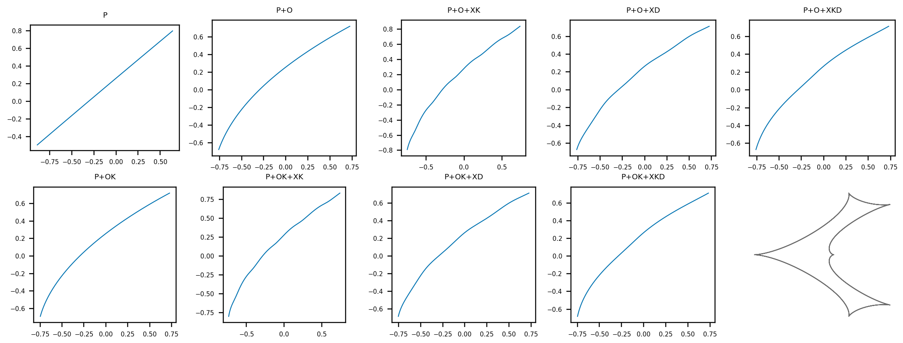
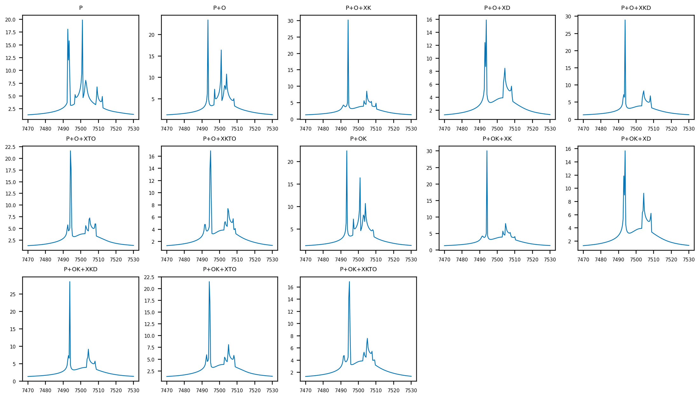
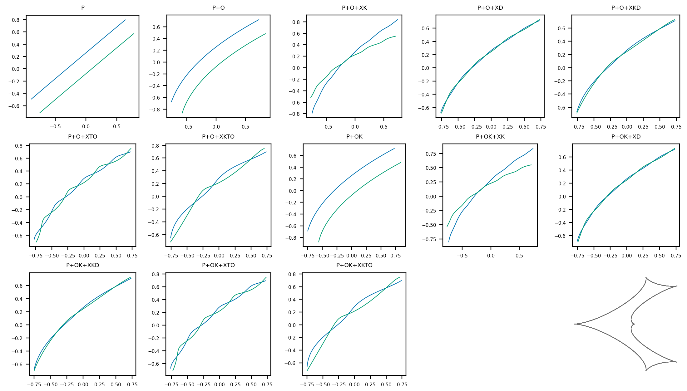
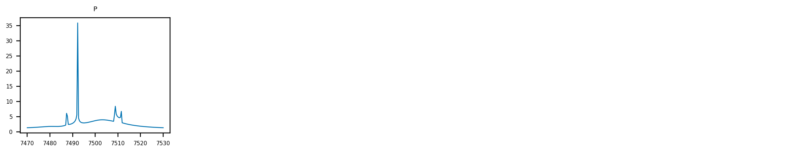
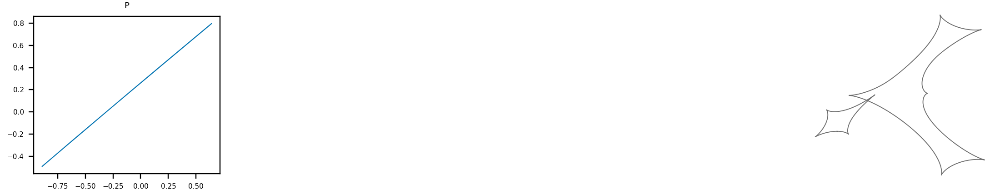
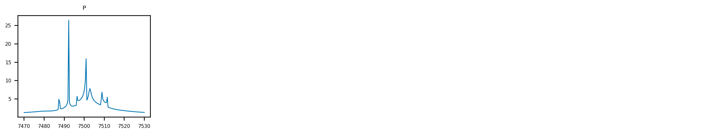
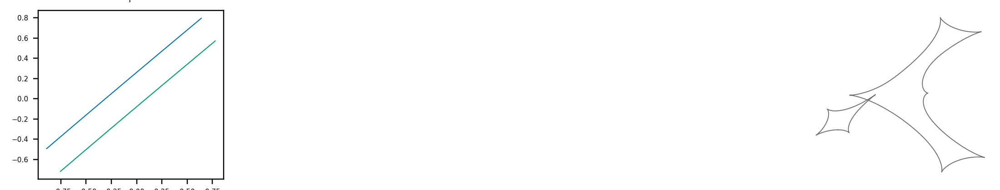

[Previous: Combining higher-order effects](CombinedEffects.md) · [Documentation home](readme.md)

# Hierarchical higher-order catalogue

Every cell below includes annual parallax (`P`). `O` and `OK` add circular and
Kepler lens orbit. `XE`, `XK`, `XD`, and `XKD` are circular-elements,
Kepler-elements, circular-direct, and Kepler-direct xallarap. Binary-source
rows additionally include `XTO` and `XKTO`, the two trajectory-offset modes.

```python
curve = lcbinint.LightCurve(options=options, model=lcbinint.Model(
    lens="binary", source="single", parallax=True,
    orbital_motion="kepler", xallarap="kepler_velocity",
    sky=sky, t_ref=7500.0,
))
```

Each light-curve cell has its matching caustic and source-trajectory cell in
the figure immediately below it.

## Binary lens, single source




## Binary lens, binary source




## Triple lens, single source

Triple lenses support the static-lens parallax and xallarap rows. Lens orbital
motion is not supported for triple lenses.




## Triple lens, binary source




[Previous: Combining higher-order effects](CombinedEffects.md) · [Documentation home](readme.md)
