[Previous: Combining higher-order effects](CombinedEffects.md) · [Documentation home](readme.md)

# Higher-order combination catalogue

Each entry is a complete, hierarchy-valid model: finite source first, then annual parallax, followed by lens orbital motion and/or xallarap. Lens orbit is therefore never shown without parallax, and triple lenses are limited to their supported static-lens geometry.

```python
import numpy as np
import matplotlib.pyplot as plt
import lcbinint

times = np.linspace(7470.0, 7530.0, 160)
sky = lcbinint.obs.SkyCoord("17:59:02.3", "-29:04:15.2")
options = lcbinint.Options(coordinates="vbm", tol=1e-3, reltol=1e-3)
```

## Finite source only

```python
parameters = {"s": 0.9, "q": 0.1, "t0": 7500.0, "u0": 0.20,
    "tE": 30.0, "alpha": 0.7, "rho": 0.004}
curve = lcbinint.LightCurve(options=options)
magnification = curve(times, parameters)
trajectory = curve.source_trajectory(times, parameters)
caustics = curve.caustics(parameters)
```

```python
plt.figure(figsize=(3.8, 2.4))
plt.plot(times, magnification, color="#0173B2")
plt.xlabel("Time"); plt.ylabel("Magnification")
plt.show()

plt.figure(figsize=(2.8, 2.7))
for x, y in zip(caustics.x, caustics.y):
    plt.plot(x, y, color="#6C6C6C", lw=1.1)
plt.plot(trajectory.x, trajectory.y, color="#0173B2")
plt.xlabel("Trajectory coordinate 1"); plt.ylabel("Trajectory coordinate 2")
plt.axis("equal"); plt.show()
```

<p>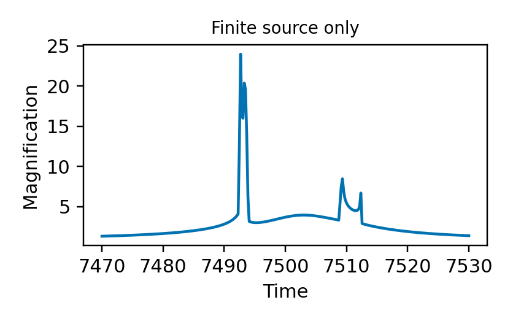 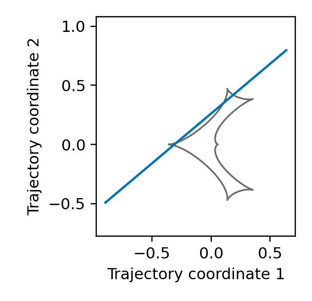</p>

## Binary lens, single source

### Parallax

```python
parameters = {'s': 0.9, 'q': 0.1, 't0': 7500.0, 'u0': 0.2, 'tE': 30.0, 'alpha': 0.7, 'piEN': 0.03, 'piEE': -0.02, 'g1': 0.011, 'g2': -0.005, 'g3': 0.005, 'lom_szs': 0.2, 'lom_ar': 1.4, 'rho': 0.004}
curve = lcbinint.LightCurve(options=options, model=lcbinint.Model(lens='binary', source='single', parallax=True, sky=sky, t_ref=7500.0))
magnification = curve(times, parameters)
trajectory = curve.source_trajectory(times, parameters)
caustics = curve.caustics(parameters)
```

```python
plt.figure(figsize=(3.8, 2.4))
plt.plot(times, magnification, color="#0173B2")
plt.xlabel("Time"); plt.ylabel("Magnification")
plt.show()
```

```python
plt.figure(figsize=(2.8, 2.7))
for x, y in zip(caustics.x, caustics.y):
    plt.plot(x, y, color="#6C6C6C", lw=1.1)
plt.plot(trajectory.x, trajectory.y, color="#0173B2")
plt.xlabel("Trajectory coordinate 1"); plt.ylabel("Trajectory coordinate 2")
plt.axis("equal"); plt.show()
```

<p> 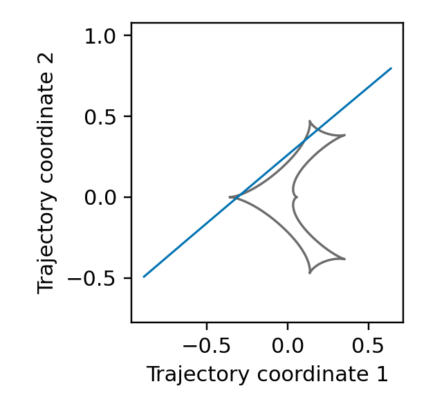</p>

### Parallax + circular-elements xallarap

```python
parameters = {'s': 0.9, 'q': 0.1, 't0': 7500.0, 'u0': 0.2, 'tE': 30.0, 'alpha': 0.7, 'piEN': 0.03, 'piEE': -0.02, 'g1': 0.011, 'g2': -0.005, 'g3': 0.005, 'lom_szs': 0.2, 'lom_ar': 1.4, 'xi_1': 0.006, 'xi_2': -0.003, 'period_xa': 12.0, 'inc_xa': 0.6, 'rho': 0.004}
curve = lcbinint.LightCurve(options=options, model=lcbinint.Model(lens='binary', source='single', parallax=True, sky=sky, t_ref=7500.0, xallarap='circular_elements'))
magnification = curve(times, parameters)
trajectory = curve.source_trajectory(times, parameters)
caustics = curve.caustics(parameters)
```

```python
plt.figure(figsize=(3.8, 2.4))
plt.plot(times, magnification, color="#0173B2")
plt.xlabel("Time"); plt.ylabel("Magnification")
plt.show()
```

```python
plt.figure(figsize=(2.8, 2.7))
for x, y in zip(caustics.x, caustics.y):
    plt.plot(x, y, color="#6C6C6C", lw=1.1)
plt.plot(trajectory.x, trajectory.y, color="#0173B2")
plt.xlabel("Trajectory coordinate 1"); plt.ylabel("Trajectory coordinate 2")
plt.axis("equal"); plt.show()
```

<p>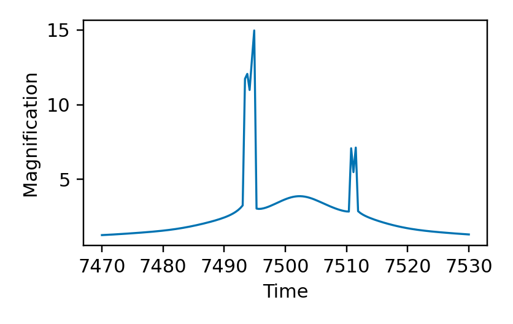 </p>

### Parallax + Kepler-elements xallarap

```python
parameters = {'s': 0.9, 'q': 0.1, 't0': 7500.0, 'u0': 0.2, 'tE': 30.0, 'alpha': 0.7, 'piEN': 0.03, 'piEE': -0.02, 'g1': 0.011, 'g2': -0.005, 'g3': 0.005, 'lom_szs': 0.2, 'lom_ar': 1.4, 'xi_1': 0.006, 'xi_2': -0.003, 'period_xa': 12.0, 'inc_xa': 0.6, 'ecc_xa': 0.2, 'peri_xa': 0.4, 'rho': 0.004}
curve = lcbinint.LightCurve(options=options, model=lcbinint.Model(lens='binary', source='single', parallax=True, sky=sky, t_ref=7500.0, xallarap='orbital_elements'))
magnification = curve(times, parameters)
trajectory = curve.source_trajectory(times, parameters)
caustics = curve.caustics(parameters)
```

```python
plt.figure(figsize=(3.8, 2.4))
plt.plot(times, magnification, color="#0173B2")
plt.xlabel("Time"); plt.ylabel("Magnification")
plt.show()
```

```python
plt.figure(figsize=(2.8, 2.7))
for x, y in zip(caustics.x, caustics.y):
    plt.plot(x, y, color="#6C6C6C", lw=1.1)
plt.plot(trajectory.x, trajectory.y, color="#0173B2")
plt.xlabel("Trajectory coordinate 1"); plt.ylabel("Trajectory coordinate 2")
plt.axis("equal"); plt.show()
```

<p> </p>

### Parallax + direct circular-velocity xallarap

```python
parameters = {'s': 0.9, 'q': 0.1, 't0': 7500.0, 'u0': 0.2, 'tE': 30.0, 'alpha': 0.7, 'piEN': 0.03, 'piEE': -0.02, 'g1': 0.011, 'g2': -0.005, 'g3': 0.005, 'lom_szs': 0.2, 'lom_ar': 1.4, 'xi_1': 0.006, 'xi_2': -0.003, 'w1': 0.004, 'w2': 0.35, 'w3': 0.08, 'rho': 0.004}
curve = lcbinint.LightCurve(options=options, model=lcbinint.Model(lens='binary', source='single', parallax=True, sky=sky, t_ref=7500.0, xallarap='circular_velocity'))
magnification = curve(times, parameters)
trajectory = curve.source_trajectory(times, parameters)
caustics = curve.caustics(parameters)
```

```python
plt.figure(figsize=(3.8, 2.4))
plt.plot(times, magnification, color="#0173B2")
plt.xlabel("Time"); plt.ylabel("Magnification")
plt.show()
```

```python
plt.figure(figsize=(2.8, 2.7))
for x, y in zip(caustics.x, caustics.y):
    plt.plot(x, y, color="#6C6C6C", lw=1.1)
plt.plot(trajectory.x, trajectory.y, color="#0173B2")
plt.xlabel("Trajectory coordinate 1"); plt.ylabel("Trajectory coordinate 2")
plt.axis("equal"); plt.show()
```

<p>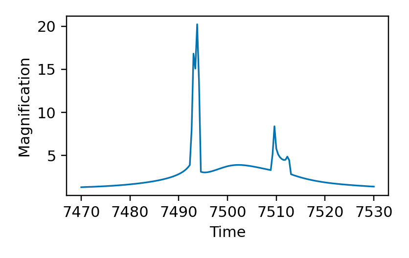 </p>

### Parallax + direct Kepler-velocity xallarap

```python
parameters = {'s': 0.9, 'q': 0.1, 't0': 7500.0, 'u0': 0.2, 'tE': 30.0, 'alpha': 0.7, 'piEN': 0.03, 'piEE': -0.02, 'g1': 0.011, 'g2': -0.005, 'g3': 0.005, 'lom_szs': 0.2, 'lom_ar': 1.4, 'xi_1': 0.006, 'xi_2': -0.003, 'w1': 0.004, 'w2': 0.35, 'w3': 0.08, 'xa_szs': 0.2, 'xa_ar': 1.4, 'rho': 0.004}
curve = lcbinint.LightCurve(options=options, model=lcbinint.Model(lens='binary', source='single', parallax=True, sky=sky, t_ref=7500.0, xallarap='kepler_velocity'))
magnification = curve(times, parameters)
trajectory = curve.source_trajectory(times, parameters)
caustics = curve.caustics(parameters)
```

```python
plt.figure(figsize=(3.8, 2.4))
plt.plot(times, magnification, color="#0173B2")
plt.xlabel("Time"); plt.ylabel("Magnification")
plt.show()
```

```python
plt.figure(figsize=(2.8, 2.7))
for x, y in zip(caustics.x, caustics.y):
    plt.plot(x, y, color="#6C6C6C", lw=1.1)
plt.plot(trajectory.x, trajectory.y, color="#0173B2")
plt.xlabel("Trajectory coordinate 1"); plt.ylabel("Trajectory coordinate 2")
plt.axis("equal"); plt.show()
```

<p>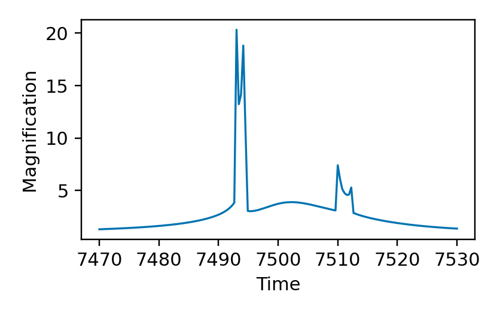 </p>

### Parallax + circular lens orbit

```python
parameters = {'s': 0.9, 'q': 0.1, 't0': 7500.0, 'u0': 0.2, 'tE': 30.0, 'alpha': 0.7, 'piEN': 0.03, 'piEE': -0.02, 'g1': 0.011, 'g2': -0.005, 'g3': 0.005, 'lom_szs': 0.2, 'lom_ar': 1.4, 'rho': 0.004}
curve = lcbinint.LightCurve(options=options, model=lcbinint.Model(lens='binary', source='single', parallax=True, sky=sky, t_ref=7500.0, orbital_motion='circular'))
magnification = curve(times, parameters)
trajectory = curve.source_trajectory(times, parameters)
caustics = curve.caustics(7500.0, parameters)
```

```python
plt.figure(figsize=(3.8, 2.4))
plt.plot(times, magnification, color="#0173B2")
plt.xlabel("Time"); plt.ylabel("Magnification")
plt.show()
```

```python
plt.figure(figsize=(2.8, 2.7))
for x, y in zip(caustics.x, caustics.y):
    plt.plot(x, y, color="#6C6C6C", lw=1.1)
plt.plot(trajectory.x, trajectory.y, color="#0173B2")
plt.xlabel("Trajectory coordinate 1"); plt.ylabel("Trajectory coordinate 2")
plt.axis("equal"); plt.show()
```

<p>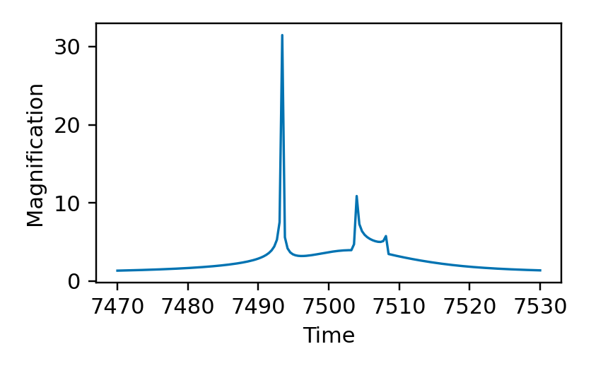 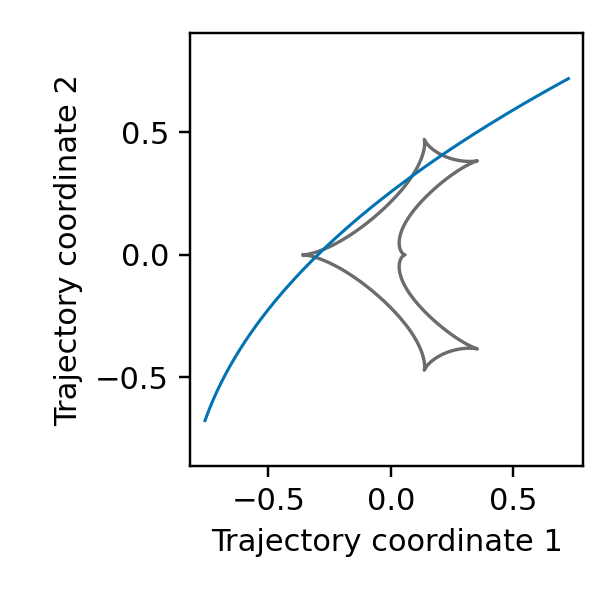</p>

### Parallax + circular lens orbit + circular-elements xallarap

```python
parameters = {'s': 0.9, 'q': 0.1, 't0': 7500.0, 'u0': 0.2, 'tE': 30.0, 'alpha': 0.7, 'piEN': 0.03, 'piEE': -0.02, 'g1': 0.011, 'g2': -0.005, 'g3': 0.005, 'lom_szs': 0.2, 'lom_ar': 1.4, 'xi_1': 0.006, 'xi_2': -0.003, 'period_xa': 12.0, 'inc_xa': 0.6, 'rho': 0.004}
curve = lcbinint.LightCurve(options=options, model=lcbinint.Model(lens='binary', source='single', parallax=True, sky=sky, t_ref=7500.0, orbital_motion='circular', xallarap='circular_elements'))
magnification = curve(times, parameters)
trajectory = curve.source_trajectory(times, parameters)
caustics = curve.caustics(7500.0, parameters)
```

```python
plt.figure(figsize=(3.8, 2.4))
plt.plot(times, magnification, color="#0173B2")
plt.xlabel("Time"); plt.ylabel("Magnification")
plt.show()
```

```python
plt.figure(figsize=(2.8, 2.7))
for x, y in zip(caustics.x, caustics.y):
    plt.plot(x, y, color="#6C6C6C", lw=1.1)
plt.plot(trajectory.x, trajectory.y, color="#0173B2")
plt.xlabel("Trajectory coordinate 1"); plt.ylabel("Trajectory coordinate 2")
plt.axis("equal"); plt.show()
```

<p>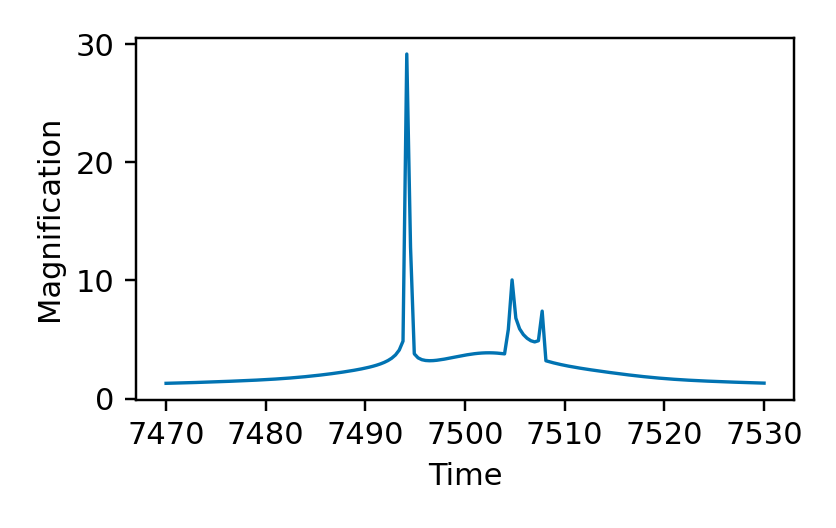 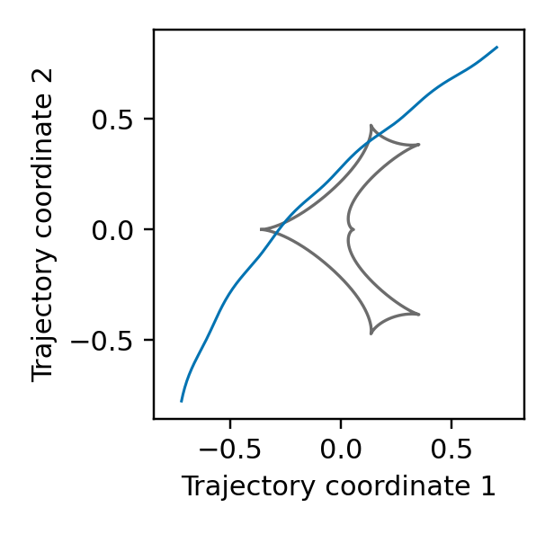</p>

### Parallax + circular lens orbit + Kepler-elements xallarap

```python
parameters = {'s': 0.9, 'q': 0.1, 't0': 7500.0, 'u0': 0.2, 'tE': 30.0, 'alpha': 0.7, 'piEN': 0.03, 'piEE': -0.02, 'g1': 0.011, 'g2': -0.005, 'g3': 0.005, 'lom_szs': 0.2, 'lom_ar': 1.4, 'xi_1': 0.006, 'xi_2': -0.003, 'period_xa': 12.0, 'inc_xa': 0.6, 'ecc_xa': 0.2, 'peri_xa': 0.4, 'rho': 0.004}
curve = lcbinint.LightCurve(options=options, model=lcbinint.Model(lens='binary', source='single', parallax=True, sky=sky, t_ref=7500.0, orbital_motion='circular', xallarap='orbital_elements'))
magnification = curve(times, parameters)
trajectory = curve.source_trajectory(times, parameters)
caustics = curve.caustics(7500.0, parameters)
```

```python
plt.figure(figsize=(3.8, 2.4))
plt.plot(times, magnification, color="#0173B2")
plt.xlabel("Time"); plt.ylabel("Magnification")
plt.show()
```

```python
plt.figure(figsize=(2.8, 2.7))
for x, y in zip(caustics.x, caustics.y):
    plt.plot(x, y, color="#6C6C6C", lw=1.1)
plt.plot(trajectory.x, trajectory.y, color="#0173B2")
plt.xlabel("Trajectory coordinate 1"); plt.ylabel("Trajectory coordinate 2")
plt.axis("equal"); plt.show()
```

<p> 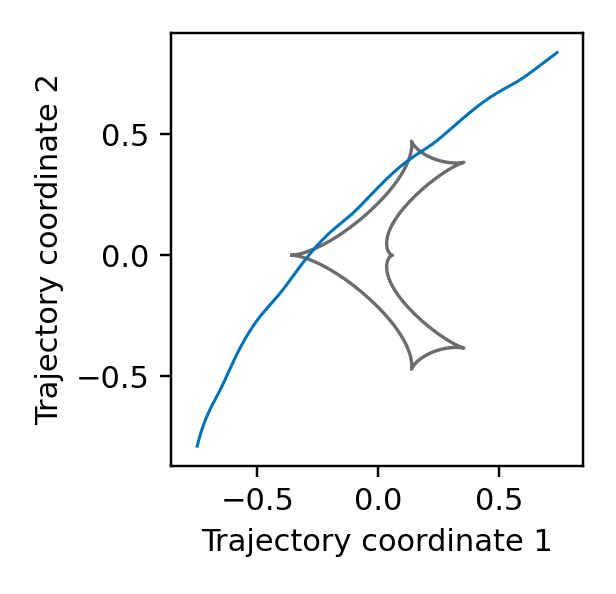</p>

### Parallax + circular lens orbit + direct circular-velocity xallarap

```python
parameters = {'s': 0.9, 'q': 0.1, 't0': 7500.0, 'u0': 0.2, 'tE': 30.0, 'alpha': 0.7, 'piEN': 0.03, 'piEE': -0.02, 'g1': 0.011, 'g2': -0.005, 'g3': 0.005, 'lom_szs': 0.2, 'lom_ar': 1.4, 'xi_1': 0.006, 'xi_2': -0.003, 'w1': 0.004, 'w2': 0.35, 'w3': 0.08, 'rho': 0.004}
curve = lcbinint.LightCurve(options=options, model=lcbinint.Model(lens='binary', source='single', parallax=True, sky=sky, t_ref=7500.0, orbital_motion='circular', xallarap='circular_velocity'))
magnification = curve(times, parameters)
trajectory = curve.source_trajectory(times, parameters)
caustics = curve.caustics(7500.0, parameters)
```

```python
plt.figure(figsize=(3.8, 2.4))
plt.plot(times, magnification, color="#0173B2")
plt.xlabel("Time"); plt.ylabel("Magnification")
plt.show()
```

```python
plt.figure(figsize=(2.8, 2.7))
for x, y in zip(caustics.x, caustics.y):
    plt.plot(x, y, color="#6C6C6C", lw=1.1)
plt.plot(trajectory.x, trajectory.y, color="#0173B2")
plt.xlabel("Trajectory coordinate 1"); plt.ylabel("Trajectory coordinate 2")
plt.axis("equal"); plt.show()
```

<p>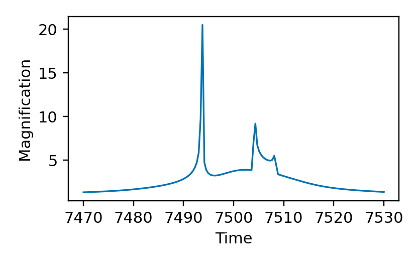 </p>

### Parallax + circular lens orbit + direct Kepler-velocity xallarap

```python
parameters = {'s': 0.9, 'q': 0.1, 't0': 7500.0, 'u0': 0.2, 'tE': 30.0, 'alpha': 0.7, 'piEN': 0.03, 'piEE': -0.02, 'g1': 0.011, 'g2': -0.005, 'g3': 0.005, 'lom_szs': 0.2, 'lom_ar': 1.4, 'xi_1': 0.006, 'xi_2': -0.003, 'w1': 0.004, 'w2': 0.35, 'w3': 0.08, 'xa_szs': 0.2, 'xa_ar': 1.4, 'rho': 0.004}
curve = lcbinint.LightCurve(options=options, model=lcbinint.Model(lens='binary', source='single', parallax=True, sky=sky, t_ref=7500.0, orbital_motion='circular', xallarap='kepler_velocity'))
magnification = curve(times, parameters)
trajectory = curve.source_trajectory(times, parameters)
caustics = curve.caustics(7500.0, parameters)
```

```python
plt.figure(figsize=(3.8, 2.4))
plt.plot(times, magnification, color="#0173B2")
plt.xlabel("Time"); plt.ylabel("Magnification")
plt.show()
```

```python
plt.figure(figsize=(2.8, 2.7))
for x, y in zip(caustics.x, caustics.y):
    plt.plot(x, y, color="#6C6C6C", lw=1.1)
plt.plot(trajectory.x, trajectory.y, color="#0173B2")
plt.xlabel("Trajectory coordinate 1"); plt.ylabel("Trajectory coordinate 2")
plt.axis("equal"); plt.show()
```

<p>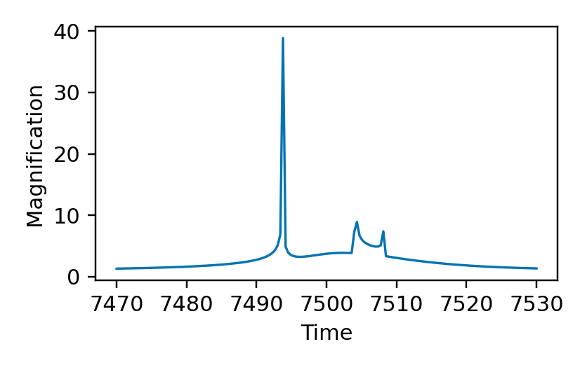 </p>

### Parallax + Kepler lens orbit

```python
parameters = {'s': 0.9, 'q': 0.1, 't0': 7500.0, 'u0': 0.2, 'tE': 30.0, 'alpha': 0.7, 'piEN': 0.03, 'piEE': -0.02, 'g1': 0.011, 'g2': -0.005, 'g3': 0.005, 'lom_szs': 0.2, 'lom_ar': 1.4, 'rho': 0.004}
curve = lcbinint.LightCurve(options=options, model=lcbinint.Model(lens='binary', source='single', parallax=True, sky=sky, t_ref=7500.0, orbital_motion='kepler'))
magnification = curve(times, parameters)
trajectory = curve.source_trajectory(times, parameters)
caustics = curve.caustics(7500.0, parameters)
```

```python
plt.figure(figsize=(3.8, 2.4))
plt.plot(times, magnification, color="#0173B2")
plt.xlabel("Time"); plt.ylabel("Magnification")
plt.show()
```

```python
plt.figure(figsize=(2.8, 2.7))
for x, y in zip(caustics.x, caustics.y):
    plt.plot(x, y, color="#6C6C6C", lw=1.1)
plt.plot(trajectory.x, trajectory.y, color="#0173B2")
plt.xlabel("Trajectory coordinate 1"); plt.ylabel("Trajectory coordinate 2")
plt.axis("equal"); plt.show()
```

<p>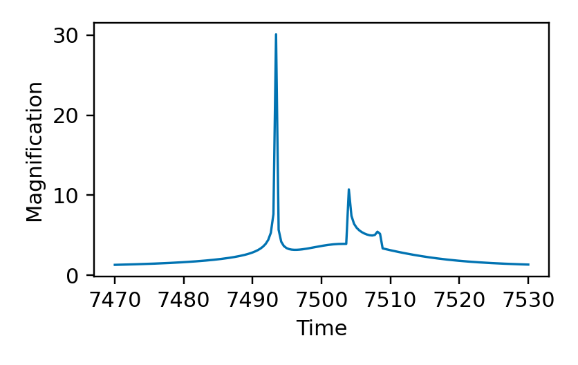 </p>

### Parallax + Kepler lens orbit + circular-elements xallarap

```python
parameters = {'s': 0.9, 'q': 0.1, 't0': 7500.0, 'u0': 0.2, 'tE': 30.0, 'alpha': 0.7, 'piEN': 0.03, 'piEE': -0.02, 'g1': 0.011, 'g2': -0.005, 'g3': 0.005, 'lom_szs': 0.2, 'lom_ar': 1.4, 'xi_1': 0.006, 'xi_2': -0.003, 'period_xa': 12.0, 'inc_xa': 0.6, 'rho': 0.004}
curve = lcbinint.LightCurve(options=options, model=lcbinint.Model(lens='binary', source='single', parallax=True, sky=sky, t_ref=7500.0, orbital_motion='kepler', xallarap='circular_elements'))
magnification = curve(times, parameters)
trajectory = curve.source_trajectory(times, parameters)
caustics = curve.caustics(7500.0, parameters)
```

```python
plt.figure(figsize=(3.8, 2.4))
plt.plot(times, magnification, color="#0173B2")
plt.xlabel("Time"); plt.ylabel("Magnification")
plt.show()
```

```python
plt.figure(figsize=(2.8, 2.7))
for x, y in zip(caustics.x, caustics.y):
    plt.plot(x, y, color="#6C6C6C", lw=1.1)
plt.plot(trajectory.x, trajectory.y, color="#0173B2")
plt.xlabel("Trajectory coordinate 1"); plt.ylabel("Trajectory coordinate 2")
plt.axis("equal"); plt.show()
```

<p> 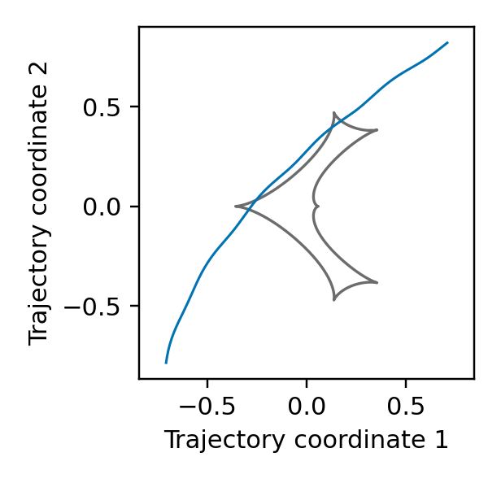</p>

### Parallax + Kepler lens orbit + Kepler-elements xallarap

```python
parameters = {'s': 0.9, 'q': 0.1, 't0': 7500.0, 'u0': 0.2, 'tE': 30.0, 'alpha': 0.7, 'piEN': 0.03, 'piEE': -0.02, 'g1': 0.011, 'g2': -0.005, 'g3': 0.005, 'lom_szs': 0.2, 'lom_ar': 1.4, 'xi_1': 0.006, 'xi_2': -0.003, 'period_xa': 12.0, 'inc_xa': 0.6, 'ecc_xa': 0.2, 'peri_xa': 0.4, 'rho': 0.004}
curve = lcbinint.LightCurve(options=options, model=lcbinint.Model(lens='binary', source='single', parallax=True, sky=sky, t_ref=7500.0, orbital_motion='kepler', xallarap='orbital_elements'))
magnification = curve(times, parameters)
trajectory = curve.source_trajectory(times, parameters)
caustics = curve.caustics(7500.0, parameters)
```

```python
plt.figure(figsize=(3.8, 2.4))
plt.plot(times, magnification, color="#0173B2")
plt.xlabel("Time"); plt.ylabel("Magnification")
plt.show()
```

```python
plt.figure(figsize=(2.8, 2.7))
for x, y in zip(caustics.x, caustics.y):
    plt.plot(x, y, color="#6C6C6C", lw=1.1)
plt.plot(trajectory.x, trajectory.y, color="#0173B2")
plt.xlabel("Trajectory coordinate 1"); plt.ylabel("Trajectory coordinate 2")
plt.axis("equal"); plt.show()
```

<p>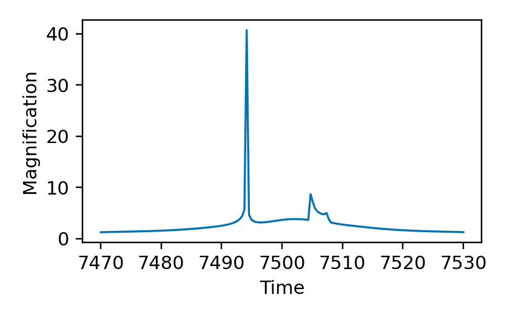 </p>

### Parallax + Kepler lens orbit + direct circular-velocity xallarap

```python
parameters = {'s': 0.9, 'q': 0.1, 't0': 7500.0, 'u0': 0.2, 'tE': 30.0, 'alpha': 0.7, 'piEN': 0.03, 'piEE': -0.02, 'g1': 0.011, 'g2': -0.005, 'g3': 0.005, 'lom_szs': 0.2, 'lom_ar': 1.4, 'xi_1': 0.006, 'xi_2': -0.003, 'w1': 0.004, 'w2': 0.35, 'w3': 0.08, 'rho': 0.004}
curve = lcbinint.LightCurve(options=options, model=lcbinint.Model(lens='binary', source='single', parallax=True, sky=sky, t_ref=7500.0, orbital_motion='kepler', xallarap='circular_velocity'))
magnification = curve(times, parameters)
trajectory = curve.source_trajectory(times, parameters)
caustics = curve.caustics(7500.0, parameters)
```

```python
plt.figure(figsize=(3.8, 2.4))
plt.plot(times, magnification, color="#0173B2")
plt.xlabel("Time"); plt.ylabel("Magnification")
plt.show()
```

```python
plt.figure(figsize=(2.8, 2.7))
for x, y in zip(caustics.x, caustics.y):
    plt.plot(x, y, color="#6C6C6C", lw=1.1)
plt.plot(trajectory.x, trajectory.y, color="#0173B2")
plt.xlabel("Trajectory coordinate 1"); plt.ylabel("Trajectory coordinate 2")
plt.axis("equal"); plt.show()
```

<p> </p>

### Parallax + Kepler lens orbit + direct Kepler-velocity xallarap

```python
parameters = {'s': 0.9, 'q': 0.1, 't0': 7500.0, 'u0': 0.2, 'tE': 30.0, 'alpha': 0.7, 'piEN': 0.03, 'piEE': -0.02, 'g1': 0.011, 'g2': -0.005, 'g3': 0.005, 'lom_szs': 0.2, 'lom_ar': 1.4, 'xi_1': 0.006, 'xi_2': -0.003, 'w1': 0.004, 'w2': 0.35, 'w3': 0.08, 'xa_szs': 0.2, 'xa_ar': 1.4, 'rho': 0.004}
curve = lcbinint.LightCurve(options=options, model=lcbinint.Model(lens='binary', source='single', parallax=True, sky=sky, t_ref=7500.0, orbital_motion='kepler', xallarap='kepler_velocity'))
magnification = curve(times, parameters)
trajectory = curve.source_trajectory(times, parameters)
caustics = curve.caustics(7500.0, parameters)
```

```python
plt.figure(figsize=(3.8, 2.4))
plt.plot(times, magnification, color="#0173B2")
plt.xlabel("Time"); plt.ylabel("Magnification")
plt.show()
```

```python
plt.figure(figsize=(2.8, 2.7))
for x, y in zip(caustics.x, caustics.y):
    plt.plot(x, y, color="#6C6C6C", lw=1.1)
plt.plot(trajectory.x, trajectory.y, color="#0173B2")
plt.xlabel("Trajectory coordinate 1"); plt.ylabel("Trajectory coordinate 2")
plt.axis("equal"); plt.show()
```

<p> </p>

## Binary lens, binary source

### Parallax

```python
parameters = {'s': 0.9, 'q': 0.1, 't0': 7500.0, 'u0': 0.2, 'tE': 30.0, 'alpha': 0.7, 'piEN': 0.03, 'piEE': -0.02, 'g1': 0.011, 'g2': -0.005, 'g3': 0.005, 'lom_szs': 0.2, 'lom_ar': 1.4, 'rho1': 0.004, 'rho2': 0.003, 'flux_ratio': 0.4, 't0_2': 7501.2, 'u0_2': -0.06}
curve = lcbinint.LightCurve(options=options, model=lcbinint.Model(lens='binary', source='binary', parallax=True, sky=sky, t_ref=7500.0))
components = curve.binary_source_components(times, parameters)
magnification = components.total
trajectory1 = components.source1.trajectory
trajectory2 = components.source2.trajectory
caustics = curve.caustics(parameters)
```

```python
plt.figure(figsize=(3.8, 2.4))
plt.plot(times, components.source1.magnification, color="#0173B2", alpha=0.45, label="source 1")
plt.plot(times, components.source2.magnification, color="#029E73", alpha=0.45, label="source 2")
plt.plot(times, magnification, color="black", label="total")
plt.legend(loc="upper left", fontsize=7)
plt.xlabel("Time"); plt.ylabel("Magnification")
plt.show()
```

```python
plt.figure(figsize=(2.8, 2.7))
for x, y in zip(caustics.x, caustics.y):
    plt.plot(x, y, color="#6C6C6C", lw=1.1)
plt.plot(trajectory1.x, trajectory1.y, color="#0173B2", label="source 1")
plt.plot(trajectory2.x, trajectory2.y, color="#029E73", label="source 2")
plt.legend(fontsize=7)
plt.xlabel("Trajectory coordinate 1"); plt.ylabel("Trajectory coordinate 2")
plt.axis("equal"); plt.show()
```

<p> </p>

### Parallax + circular-elements xallarap

```python
parameters = {'s': 0.9, 'q': 0.1, 't0': 7500.0, 'u0': 0.2, 'tE': 30.0, 'alpha': 0.7, 'piEN': 0.03, 'piEE': -0.02, 'g1': 0.011, 'g2': -0.005, 'g3': 0.005, 'lom_szs': 0.2, 'lom_ar': 1.4, 'xi_1': 0.006, 'xi_2': -0.003, 'period_xa': 12.0, 'inc_xa': 0.6, 'rho1': 0.004, 'rho2': 0.003, 'flux_ratio': 0.4, 'source_mass_ratio': 0.7}
curve = lcbinint.LightCurve(options=options, model=lcbinint.Model(lens='binary', source='binary', parallax=True, sky=sky, t_ref=7500.0, xallarap='circular_elements'))
components = curve.binary_source_components(times, parameters)
magnification = components.total
trajectory1 = components.source1.trajectory
trajectory2 = components.source2.trajectory
caustics = curve.caustics(parameters)
```

```python
plt.figure(figsize=(3.8, 2.4))
plt.plot(times, components.source1.magnification, color="#0173B2", alpha=0.45, label="source 1")
plt.plot(times, components.source2.magnification, color="#029E73", alpha=0.45, label="source 2")
plt.plot(times, magnification, color="black", label="total")
plt.legend(loc="upper left", fontsize=7)
plt.xlabel("Time"); plt.ylabel("Magnification")
plt.show()
```

```python
plt.figure(figsize=(2.8, 2.7))
for x, y in zip(caustics.x, caustics.y):
    plt.plot(x, y, color="#6C6C6C", lw=1.1)
plt.plot(trajectory1.x, trajectory1.y, color="#0173B2", label="source 1")
plt.plot(trajectory2.x, trajectory2.y, color="#029E73", label="source 2")
plt.legend(fontsize=7)
plt.xlabel("Trajectory coordinate 1"); plt.ylabel("Trajectory coordinate 2")
plt.axis("equal"); plt.show()
```

<p>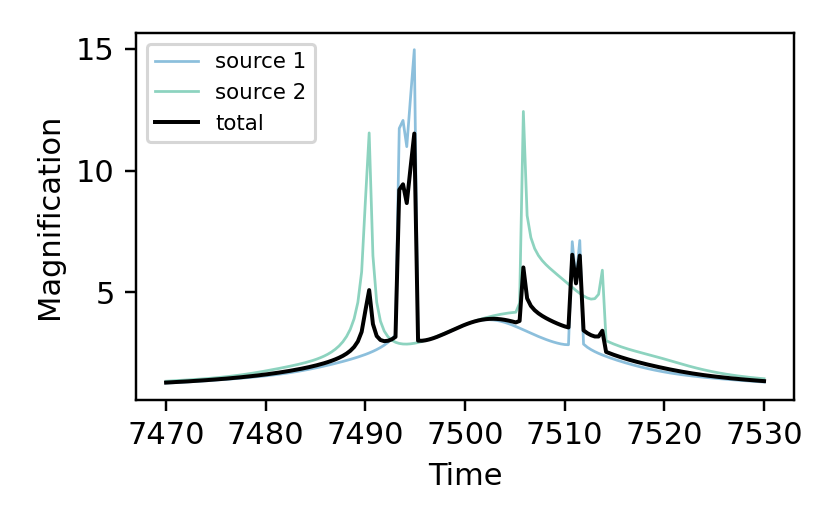 </p>

### Parallax + Kepler-elements xallarap

```python
parameters = {'s': 0.9, 'q': 0.1, 't0': 7500.0, 'u0': 0.2, 'tE': 30.0, 'alpha': 0.7, 'piEN': 0.03, 'piEE': -0.02, 'g1': 0.011, 'g2': -0.005, 'g3': 0.005, 'lom_szs': 0.2, 'lom_ar': 1.4, 'xi_1': 0.006, 'xi_2': -0.003, 'period_xa': 12.0, 'inc_xa': 0.6, 'ecc_xa': 0.2, 'peri_xa': 0.4, 'rho1': 0.004, 'rho2': 0.003, 'flux_ratio': 0.4, 'source_mass_ratio': 0.7}
curve = lcbinint.LightCurve(options=options, model=lcbinint.Model(lens='binary', source='binary', parallax=True, sky=sky, t_ref=7500.0, xallarap='orbital_elements'))
components = curve.binary_source_components(times, parameters)
magnification = components.total
trajectory1 = components.source1.trajectory
trajectory2 = components.source2.trajectory
caustics = curve.caustics(parameters)
```

```python
plt.figure(figsize=(3.8, 2.4))
plt.plot(times, components.source1.magnification, color="#0173B2", alpha=0.45, label="source 1")
plt.plot(times, components.source2.magnification, color="#029E73", alpha=0.45, label="source 2")
plt.plot(times, magnification, color="black", label="total")
plt.legend(loc="upper left", fontsize=7)
plt.xlabel("Time"); plt.ylabel("Magnification")
plt.show()
```

```python
plt.figure(figsize=(2.8, 2.7))
for x, y in zip(caustics.x, caustics.y):
    plt.plot(x, y, color="#6C6C6C", lw=1.1)
plt.plot(trajectory1.x, trajectory1.y, color="#0173B2", label="source 1")
plt.plot(trajectory2.x, trajectory2.y, color="#029E73", label="source 2")
plt.legend(fontsize=7)
plt.xlabel("Trajectory coordinate 1"); plt.ylabel("Trajectory coordinate 2")
plt.axis("equal"); plt.show()
```

<p> </p>

### Parallax + direct circular-velocity xallarap

```python
parameters = {'s': 0.9, 'q': 0.1, 't0': 7500.0, 'u0': 0.2, 'tE': 30.0, 'alpha': 0.7, 'piEN': 0.03, 'piEE': -0.02, 'g1': 0.011, 'g2': -0.005, 'g3': 0.005, 'lom_szs': 0.2, 'lom_ar': 1.4, 'xi_1': 0.006, 'xi_2': -0.003, 'w1': 0.004, 'w2': 0.35, 'w3': 0.08, 'rho1': 0.004, 'rho2': 0.003, 'flux_ratio': 0.4, 'source_mass_ratio': 0.7}
curve = lcbinint.LightCurve(options=options, model=lcbinint.Model(lens='binary', source='binary', parallax=True, sky=sky, t_ref=7500.0, xallarap='circular_velocity', source_orbit_coordinates='xallarap'))
components = curve.binary_source_components(times, parameters)
magnification = components.total
trajectory1 = components.source1.trajectory
trajectory2 = components.source2.trajectory
caustics = curve.caustics(parameters)
```

```python
plt.figure(figsize=(3.8, 2.4))
plt.plot(times, components.source1.magnification, color="#0173B2", alpha=0.45, label="source 1")
plt.plot(times, components.source2.magnification, color="#029E73", alpha=0.45, label="source 2")
plt.plot(times, magnification, color="black", label="total")
plt.legend(loc="upper left", fontsize=7)
plt.xlabel("Time"); plt.ylabel("Magnification")
plt.show()
```

```python
plt.figure(figsize=(2.8, 2.7))
for x, y in zip(caustics.x, caustics.y):
    plt.plot(x, y, color="#6C6C6C", lw=1.1)
plt.plot(trajectory1.x, trajectory1.y, color="#0173B2", label="source 1")
plt.plot(trajectory2.x, trajectory2.y, color="#029E73", label="source 2")
plt.legend(fontsize=7)
plt.xlabel("Trajectory coordinate 1"); plt.ylabel("Trajectory coordinate 2")
plt.axis("equal"); plt.show()
```

<p> </p>

### Parallax + direct Kepler-velocity xallarap

```python
parameters = {'s': 0.9, 'q': 0.1, 't0': 7500.0, 'u0': 0.2, 'tE': 30.0, 'alpha': 0.7, 'piEN': 0.03, 'piEE': -0.02, 'g1': 0.011, 'g2': -0.005, 'g3': 0.005, 'lom_szs': 0.2, 'lom_ar': 1.4, 'xi_1': 0.006, 'xi_2': -0.003, 'w1': 0.004, 'w2': 0.35, 'w3': 0.08, 'xa_szs': 0.2, 'xa_ar': 1.4, 'rho1': 0.004, 'rho2': 0.003, 'flux_ratio': 0.4, 'source_mass_ratio': 0.7}
curve = lcbinint.LightCurve(options=options, model=lcbinint.Model(lens='binary', source='binary', parallax=True, sky=sky, t_ref=7500.0, xallarap='kepler_velocity', source_orbit_coordinates='xallarap'))
components = curve.binary_source_components(times, parameters)
magnification = components.total
trajectory1 = components.source1.trajectory
trajectory2 = components.source2.trajectory
caustics = curve.caustics(parameters)
```

```python
plt.figure(figsize=(3.8, 2.4))
plt.plot(times, components.source1.magnification, color="#0173B2", alpha=0.45, label="source 1")
plt.plot(times, components.source2.magnification, color="#029E73", alpha=0.45, label="source 2")
plt.plot(times, magnification, color="black", label="total")
plt.legend(loc="upper left", fontsize=7)
plt.xlabel("Time"); plt.ylabel("Magnification")
plt.show()
```

```python
plt.figure(figsize=(2.8, 2.7))
for x, y in zip(caustics.x, caustics.y):
    plt.plot(x, y, color="#6C6C6C", lw=1.1)
plt.plot(trajectory1.x, trajectory1.y, color="#0173B2", label="source 1")
plt.plot(trajectory2.x, trajectory2.y, color="#029E73", label="source 2")
plt.legend(fontsize=7)
plt.xlabel("Trajectory coordinate 1"); plt.ylabel("Trajectory coordinate 2")
plt.axis("equal"); plt.show()
```

<p> </p>

### Parallax + trajectory-offset circular-velocity xallarap

```python
parameters = {'s': 0.9, 'q': 0.1, 't0': 7499.4, 'u0': 0.19, 'tE': 30.0, 'alpha': 0.7, 'piEN': 0.03, 'piEE': -0.02, 'g1': 0.011, 'g2': -0.005, 'g3': 0.005, 'lom_szs': 0.2, 'lom_ar': 1.4, 'xi_1': 0.006, 'xi_2': -0.003, 'w1': 0.004, 'w2': 0.35, 'w3': 0.08, 'rho1': 0.004, 'rho2': 0.003, 'flux_ratio': 0.4, 'source_mass_ratio': 0.7, 't0_2': 7500.857142857, 'u0_2': 0.214285714}
curve = lcbinint.LightCurve(options=options, model=lcbinint.Model(lens='binary', source='binary', parallax=True, sky=sky, t_ref=7500.0, xallarap='circular_velocity', source_orbit_coordinates='trajectory_offset'))
components = curve.binary_source_components(times, parameters)
magnification = components.total
trajectory1 = components.source1.trajectory
trajectory2 = components.source2.trajectory
caustics = curve.caustics(parameters)
```

```python
plt.figure(figsize=(3.8, 2.4))
plt.plot(times, components.source1.magnification, color="#0173B2", alpha=0.45, label="source 1")
plt.plot(times, components.source2.magnification, color="#029E73", alpha=0.45, label="source 2")
plt.plot(times, magnification, color="black", label="total")
plt.legend(loc="upper left", fontsize=7)
plt.xlabel("Time"); plt.ylabel("Magnification")
plt.show()
```

```python
plt.figure(figsize=(2.8, 2.7))
for x, y in zip(caustics.x, caustics.y):
    plt.plot(x, y, color="#6C6C6C", lw=1.1)
plt.plot(trajectory1.x, trajectory1.y, color="#0173B2", label="source 1")
plt.plot(trajectory2.x, trajectory2.y, color="#029E73", label="source 2")
plt.legend(fontsize=7)
plt.xlabel("Trajectory coordinate 1"); plt.ylabel("Trajectory coordinate 2")
plt.axis("equal"); plt.show()
```

<p> 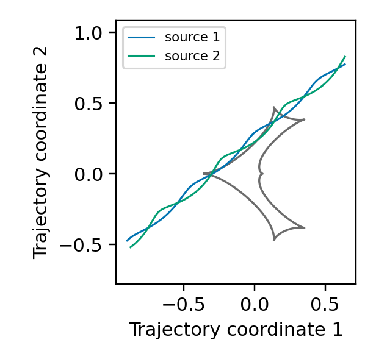</p>

### Parallax + trajectory-offset Kepler-velocity xallarap

```python
parameters = {'s': 0.9, 'q': 0.1, 't0': 7499.4, 'u0': 0.19, 'tE': 30.0, 'alpha': 0.7, 'piEN': 0.03, 'piEE': -0.02, 'g1': 0.011, 'g2': -0.005, 'g3': 0.005, 'lom_szs': 0.2, 'lom_ar': 1.4, 'xi_1': 0.006, 'xi_2': -0.003, 'w1': 0.004, 'w2': 0.35, 'w3': 0.08, 'xa_szs': 0.2, 'xa_ar': 1.4, 'rho1': 0.004, 'rho2': 0.003, 'flux_ratio': 0.4, 'source_mass_ratio': 0.7, 't0_2': 7500.857142857, 'u0_2': 0.214285714}
curve = lcbinint.LightCurve(options=options, model=lcbinint.Model(lens='binary', source='binary', parallax=True, sky=sky, t_ref=7500.0, xallarap='kepler_velocity', source_orbit_coordinates='trajectory_offset'))
components = curve.binary_source_components(times, parameters)
magnification = components.total
trajectory1 = components.source1.trajectory
trajectory2 = components.source2.trajectory
caustics = curve.caustics(parameters)
```

```python
plt.figure(figsize=(3.8, 2.4))
plt.plot(times, components.source1.magnification, color="#0173B2", alpha=0.45, label="source 1")
plt.plot(times, components.source2.magnification, color="#029E73", alpha=0.45, label="source 2")
plt.plot(times, magnification, color="black", label="total")
plt.legend(loc="upper left", fontsize=7)
plt.xlabel("Time"); plt.ylabel("Magnification")
plt.show()
```

```python
plt.figure(figsize=(2.8, 2.7))
for x, y in zip(caustics.x, caustics.y):
    plt.plot(x, y, color="#6C6C6C", lw=1.1)
plt.plot(trajectory1.x, trajectory1.y, color="#0173B2", label="source 1")
plt.plot(trajectory2.x, trajectory2.y, color="#029E73", label="source 2")
plt.legend(fontsize=7)
plt.xlabel("Trajectory coordinate 1"); plt.ylabel("Trajectory coordinate 2")
plt.axis("equal"); plt.show()
```

<p> </p>

### Parallax + circular lens orbit

```python
parameters = {'s': 0.9, 'q': 0.1, 't0': 7500.0, 'u0': 0.2, 'tE': 30.0, 'alpha': 0.7, 'piEN': 0.03, 'piEE': -0.02, 'g1': 0.011, 'g2': -0.005, 'g3': 0.005, 'lom_szs': 0.2, 'lom_ar': 1.4, 'rho1': 0.004, 'rho2': 0.003, 'flux_ratio': 0.4, 't0_2': 7501.2, 'u0_2': -0.06}
curve = lcbinint.LightCurve(options=options, model=lcbinint.Model(lens='binary', source='binary', parallax=True, sky=sky, t_ref=7500.0, orbital_motion='circular'))
components = curve.binary_source_components(times, parameters)
magnification = components.total
trajectory1 = components.source1.trajectory
trajectory2 = components.source2.trajectory
caustics = curve.caustics(7500.0, parameters)
```

```python
plt.figure(figsize=(3.8, 2.4))
plt.plot(times, components.source1.magnification, color="#0173B2", alpha=0.45, label="source 1")
plt.plot(times, components.source2.magnification, color="#029E73", alpha=0.45, label="source 2")
plt.plot(times, magnification, color="black", label="total")
plt.legend(loc="upper left", fontsize=7)
plt.xlabel("Time"); plt.ylabel("Magnification")
plt.show()
```

```python
plt.figure(figsize=(2.8, 2.7))
for x, y in zip(caustics.x, caustics.y):
    plt.plot(x, y, color="#6C6C6C", lw=1.1)
plt.plot(trajectory1.x, trajectory1.y, color="#0173B2", label="source 1")
plt.plot(trajectory2.x, trajectory2.y, color="#029E73", label="source 2")
plt.legend(fontsize=7)
plt.xlabel("Trajectory coordinate 1"); plt.ylabel("Trajectory coordinate 2")
plt.axis("equal"); plt.show()
```

<p> </p>

### Parallax + circular lens orbit + circular-elements xallarap

```python
parameters = {'s': 0.9, 'q': 0.1, 't0': 7500.0, 'u0': 0.2, 'tE': 30.0, 'alpha': 0.7, 'piEN': 0.03, 'piEE': -0.02, 'g1': 0.011, 'g2': -0.005, 'g3': 0.005, 'lom_szs': 0.2, 'lom_ar': 1.4, 'xi_1': 0.006, 'xi_2': -0.003, 'period_xa': 12.0, 'inc_xa': 0.6, 'rho1': 0.004, 'rho2': 0.003, 'flux_ratio': 0.4, 'source_mass_ratio': 0.7}
curve = lcbinint.LightCurve(options=options, model=lcbinint.Model(lens='binary', source='binary', parallax=True, sky=sky, t_ref=7500.0, orbital_motion='circular', xallarap='circular_elements'))
components = curve.binary_source_components(times, parameters)
magnification = components.total
trajectory1 = components.source1.trajectory
trajectory2 = components.source2.trajectory
caustics = curve.caustics(7500.0, parameters)
```

```python
plt.figure(figsize=(3.8, 2.4))
plt.plot(times, components.source1.magnification, color="#0173B2", alpha=0.45, label="source 1")
plt.plot(times, components.source2.magnification, color="#029E73", alpha=0.45, label="source 2")
plt.plot(times, magnification, color="black", label="total")
plt.legend(loc="upper left", fontsize=7)
plt.xlabel("Time"); plt.ylabel("Magnification")
plt.show()
```

```python
plt.figure(figsize=(2.8, 2.7))
for x, y in zip(caustics.x, caustics.y):
    plt.plot(x, y, color="#6C6C6C", lw=1.1)
plt.plot(trajectory1.x, trajectory1.y, color="#0173B2", label="source 1")
plt.plot(trajectory2.x, trajectory2.y, color="#029E73", label="source 2")
plt.legend(fontsize=7)
plt.xlabel("Trajectory coordinate 1"); plt.ylabel("Trajectory coordinate 2")
plt.axis("equal"); plt.show()
```

<p>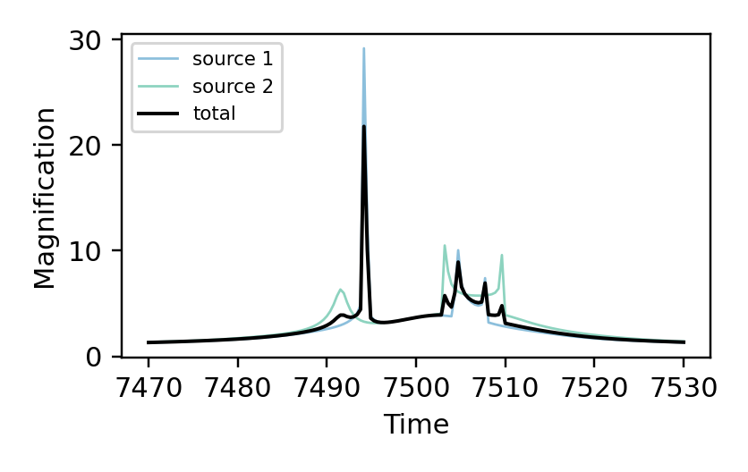 </p>

### Parallax + circular lens orbit + Kepler-elements xallarap

```python
parameters = {'s': 0.9, 'q': 0.1, 't0': 7500.0, 'u0': 0.2, 'tE': 30.0, 'alpha': 0.7, 'piEN': 0.03, 'piEE': -0.02, 'g1': 0.011, 'g2': -0.005, 'g3': 0.005, 'lom_szs': 0.2, 'lom_ar': 1.4, 'xi_1': 0.006, 'xi_2': -0.003, 'period_xa': 12.0, 'inc_xa': 0.6, 'ecc_xa': 0.2, 'peri_xa': 0.4, 'rho1': 0.004, 'rho2': 0.003, 'flux_ratio': 0.4, 'source_mass_ratio': 0.7}
curve = lcbinint.LightCurve(options=options, model=lcbinint.Model(lens='binary', source='binary', parallax=True, sky=sky, t_ref=7500.0, orbital_motion='circular', xallarap='orbital_elements'))
components = curve.binary_source_components(times, parameters)
magnification = components.total
trajectory1 = components.source1.trajectory
trajectory2 = components.source2.trajectory
caustics = curve.caustics(7500.0, parameters)
```

```python
plt.figure(figsize=(3.8, 2.4))
plt.plot(times, components.source1.magnification, color="#0173B2", alpha=0.45, label="source 1")
plt.plot(times, components.source2.magnification, color="#029E73", alpha=0.45, label="source 2")
plt.plot(times, magnification, color="black", label="total")
plt.legend(loc="upper left", fontsize=7)
plt.xlabel("Time"); plt.ylabel("Magnification")
plt.show()
```

```python
plt.figure(figsize=(2.8, 2.7))
for x, y in zip(caustics.x, caustics.y):
    plt.plot(x, y, color="#6C6C6C", lw=1.1)
plt.plot(trajectory1.x, trajectory1.y, color="#0173B2", label="source 1")
plt.plot(trajectory2.x, trajectory2.y, color="#029E73", label="source 2")
plt.legend(fontsize=7)
plt.xlabel("Trajectory coordinate 1"); plt.ylabel("Trajectory coordinate 2")
plt.axis("equal"); plt.show()
```

<p> </p>

### Parallax + circular lens orbit + direct circular-velocity xallarap

```python
parameters = {'s': 0.9, 'q': 0.1, 't0': 7500.0, 'u0': 0.2, 'tE': 30.0, 'alpha': 0.7, 'piEN': 0.03, 'piEE': -0.02, 'g1': 0.011, 'g2': -0.005, 'g3': 0.005, 'lom_szs': 0.2, 'lom_ar': 1.4, 'xi_1': 0.006, 'xi_2': -0.003, 'w1': 0.004, 'w2': 0.35, 'w3': 0.08, 'rho1': 0.004, 'rho2': 0.003, 'flux_ratio': 0.4, 'source_mass_ratio': 0.7}
curve = lcbinint.LightCurve(options=options, model=lcbinint.Model(lens='binary', source='binary', parallax=True, sky=sky, t_ref=7500.0, orbital_motion='circular', xallarap='circular_velocity', source_orbit_coordinates='xallarap'))
components = curve.binary_source_components(times, parameters)
magnification = components.total
trajectory1 = components.source1.trajectory
trajectory2 = components.source2.trajectory
caustics = curve.caustics(7500.0, parameters)
```

```python
plt.figure(figsize=(3.8, 2.4))
plt.plot(times, components.source1.magnification, color="#0173B2", alpha=0.45, label="source 1")
plt.plot(times, components.source2.magnification, color="#029E73", alpha=0.45, label="source 2")
plt.plot(times, magnification, color="black", label="total")
plt.legend(loc="upper left", fontsize=7)
plt.xlabel("Time"); plt.ylabel("Magnification")
plt.show()
```

```python
plt.figure(figsize=(2.8, 2.7))
for x, y in zip(caustics.x, caustics.y):
    plt.plot(x, y, color="#6C6C6C", lw=1.1)
plt.plot(trajectory1.x, trajectory1.y, color="#0173B2", label="source 1")
plt.plot(trajectory2.x, trajectory2.y, color="#029E73", label="source 2")
plt.legend(fontsize=7)
plt.xlabel("Trajectory coordinate 1"); plt.ylabel("Trajectory coordinate 2")
plt.axis("equal"); plt.show()
```

<p>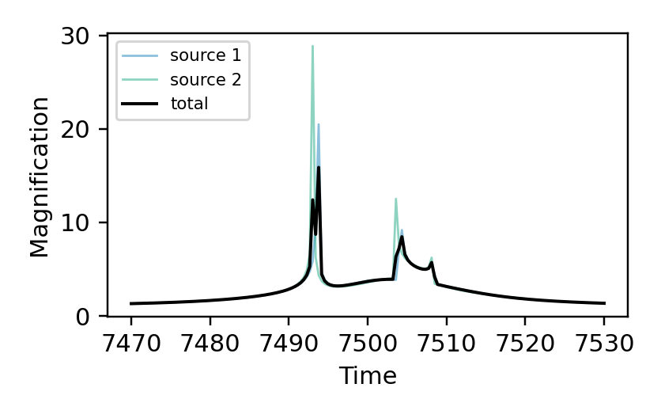 </p>

### Parallax + circular lens orbit + direct Kepler-velocity xallarap

```python
parameters = {'s': 0.9, 'q': 0.1, 't0': 7500.0, 'u0': 0.2, 'tE': 30.0, 'alpha': 0.7, 'piEN': 0.03, 'piEE': -0.02, 'g1': 0.011, 'g2': -0.005, 'g3': 0.005, 'lom_szs': 0.2, 'lom_ar': 1.4, 'xi_1': 0.006, 'xi_2': -0.003, 'w1': 0.004, 'w2': 0.35, 'w3': 0.08, 'xa_szs': 0.2, 'xa_ar': 1.4, 'rho1': 0.004, 'rho2': 0.003, 'flux_ratio': 0.4, 'source_mass_ratio': 0.7}
curve = lcbinint.LightCurve(options=options, model=lcbinint.Model(lens='binary', source='binary', parallax=True, sky=sky, t_ref=7500.0, orbital_motion='circular', xallarap='kepler_velocity', source_orbit_coordinates='xallarap'))
components = curve.binary_source_components(times, parameters)
magnification = components.total
trajectory1 = components.source1.trajectory
trajectory2 = components.source2.trajectory
caustics = curve.caustics(7500.0, parameters)
```

```python
plt.figure(figsize=(3.8, 2.4))
plt.plot(times, components.source1.magnification, color="#0173B2", alpha=0.45, label="source 1")
plt.plot(times, components.source2.magnification, color="#029E73", alpha=0.45, label="source 2")
plt.plot(times, magnification, color="black", label="total")
plt.legend(loc="upper left", fontsize=7)
plt.xlabel("Time"); plt.ylabel("Magnification")
plt.show()
```

```python
plt.figure(figsize=(2.8, 2.7))
for x, y in zip(caustics.x, caustics.y):
    plt.plot(x, y, color="#6C6C6C", lw=1.1)
plt.plot(trajectory1.x, trajectory1.y, color="#0173B2", label="source 1")
plt.plot(trajectory2.x, trajectory2.y, color="#029E73", label="source 2")
plt.legend(fontsize=7)
plt.xlabel("Trajectory coordinate 1"); plt.ylabel("Trajectory coordinate 2")
plt.axis("equal"); plt.show()
```

<p>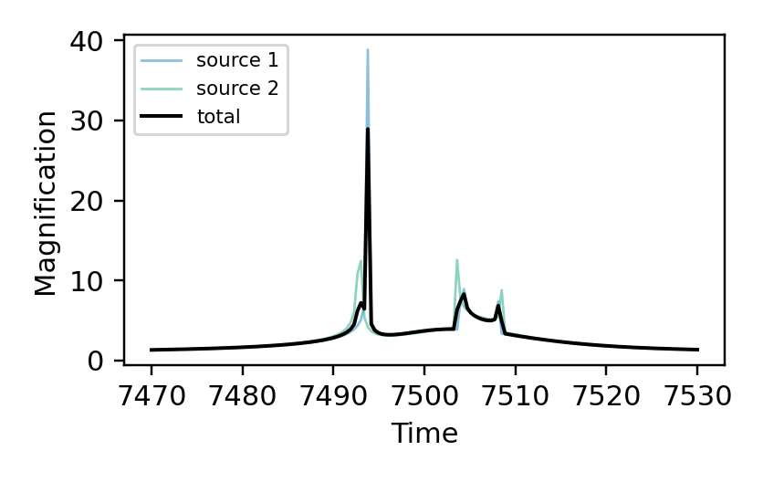 </p>

### Parallax + circular lens orbit + trajectory-offset circular-velocity xallarap

```python
parameters = {'s': 0.9, 'q': 0.1, 't0': 7499.4, 'u0': 0.19, 'tE': 30.0, 'alpha': 0.7, 'piEN': 0.03, 'piEE': -0.02, 'g1': 0.011, 'g2': -0.005, 'g3': 0.005, 'lom_szs': 0.2, 'lom_ar': 1.4, 'xi_1': 0.006, 'xi_2': -0.003, 'w1': 0.004, 'w2': 0.35, 'w3': 0.08, 'rho1': 0.004, 'rho2': 0.003, 'flux_ratio': 0.4, 'source_mass_ratio': 0.7, 't0_2': 7500.857142857, 'u0_2': 0.214285714}
curve = lcbinint.LightCurve(options=options, model=lcbinint.Model(lens='binary', source='binary', parallax=True, sky=sky, t_ref=7500.0, orbital_motion='circular', xallarap='circular_velocity', source_orbit_coordinates='trajectory_offset'))
components = curve.binary_source_components(times, parameters)
magnification = components.total
trajectory1 = components.source1.trajectory
trajectory2 = components.source2.trajectory
caustics = curve.caustics(7500.0, parameters)
```

```python
plt.figure(figsize=(3.8, 2.4))
plt.plot(times, components.source1.magnification, color="#0173B2", alpha=0.45, label="source 1")
plt.plot(times, components.source2.magnification, color="#029E73", alpha=0.45, label="source 2")
plt.plot(times, magnification, color="black", label="total")
plt.legend(loc="upper left", fontsize=7)
plt.xlabel("Time"); plt.ylabel("Magnification")
plt.show()
```

```python
plt.figure(figsize=(2.8, 2.7))
for x, y in zip(caustics.x, caustics.y):
    plt.plot(x, y, color="#6C6C6C", lw=1.1)
plt.plot(trajectory1.x, trajectory1.y, color="#0173B2", label="source 1")
plt.plot(trajectory2.x, trajectory2.y, color="#029E73", label="source 2")
plt.legend(fontsize=7)
plt.xlabel("Trajectory coordinate 1"); plt.ylabel("Trajectory coordinate 2")
plt.axis("equal"); plt.show()
```

<p>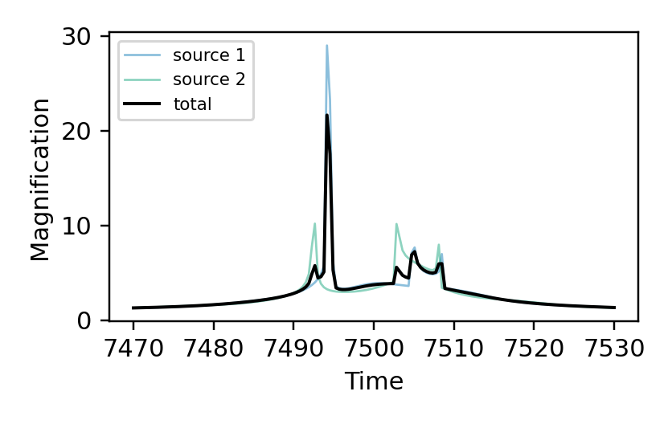 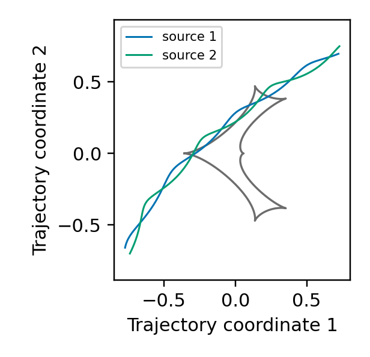</p>

### Parallax + circular lens orbit + trajectory-offset Kepler-velocity xallarap

```python
parameters = {'s': 0.9, 'q': 0.1, 't0': 7499.4, 'u0': 0.19, 'tE': 30.0, 'alpha': 0.7, 'piEN': 0.03, 'piEE': -0.02, 'g1': 0.011, 'g2': -0.005, 'g3': 0.005, 'lom_szs': 0.2, 'lom_ar': 1.4, 'xi_1': 0.006, 'xi_2': -0.003, 'w1': 0.004, 'w2': 0.35, 'w3': 0.08, 'xa_szs': 0.2, 'xa_ar': 1.4, 'rho1': 0.004, 'rho2': 0.003, 'flux_ratio': 0.4, 'source_mass_ratio': 0.7, 't0_2': 7500.857142857, 'u0_2': 0.214285714}
curve = lcbinint.LightCurve(options=options, model=lcbinint.Model(lens='binary', source='binary', parallax=True, sky=sky, t_ref=7500.0, orbital_motion='circular', xallarap='kepler_velocity', source_orbit_coordinates='trajectory_offset'))
components = curve.binary_source_components(times, parameters)
magnification = components.total
trajectory1 = components.source1.trajectory
trajectory2 = components.source2.trajectory
caustics = curve.caustics(7500.0, parameters)
```

```python
plt.figure(figsize=(3.8, 2.4))
plt.plot(times, components.source1.magnification, color="#0173B2", alpha=0.45, label="source 1")
plt.plot(times, components.source2.magnification, color="#029E73", alpha=0.45, label="source 2")
plt.plot(times, magnification, color="black", label="total")
plt.legend(loc="upper left", fontsize=7)
plt.xlabel("Time"); plt.ylabel("Magnification")
plt.show()
```

```python
plt.figure(figsize=(2.8, 2.7))
for x, y in zip(caustics.x, caustics.y):
    plt.plot(x, y, color="#6C6C6C", lw=1.1)
plt.plot(trajectory1.x, trajectory1.y, color="#0173B2", label="source 1")
plt.plot(trajectory2.x, trajectory2.y, color="#029E73", label="source 2")
plt.legend(fontsize=7)
plt.xlabel("Trajectory coordinate 1"); plt.ylabel("Trajectory coordinate 2")
plt.axis("equal"); plt.show()
```

<p> 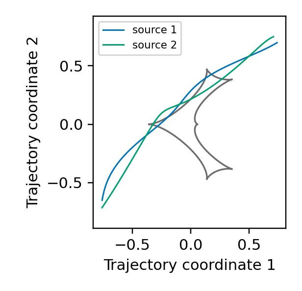</p>

### Parallax + Kepler lens orbit

```python
parameters = {'s': 0.9, 'q': 0.1, 't0': 7500.0, 'u0': 0.2, 'tE': 30.0, 'alpha': 0.7, 'piEN': 0.03, 'piEE': -0.02, 'g1': 0.011, 'g2': -0.005, 'g3': 0.005, 'lom_szs': 0.2, 'lom_ar': 1.4, 'rho1': 0.004, 'rho2': 0.003, 'flux_ratio': 0.4, 't0_2': 7501.2, 'u0_2': -0.06}
curve = lcbinint.LightCurve(options=options, model=lcbinint.Model(lens='binary', source='binary', parallax=True, sky=sky, t_ref=7500.0, orbital_motion='kepler'))
components = curve.binary_source_components(times, parameters)
magnification = components.total
trajectory1 = components.source1.trajectory
trajectory2 = components.source2.trajectory
caustics = curve.caustics(7500.0, parameters)
```

```python
plt.figure(figsize=(3.8, 2.4))
plt.plot(times, components.source1.magnification, color="#0173B2", alpha=0.45, label="source 1")
plt.plot(times, components.source2.magnification, color="#029E73", alpha=0.45, label="source 2")
plt.plot(times, magnification, color="black", label="total")
plt.legend(loc="upper left", fontsize=7)
plt.xlabel("Time"); plt.ylabel("Magnification")
plt.show()
```

```python
plt.figure(figsize=(2.8, 2.7))
for x, y in zip(caustics.x, caustics.y):
    plt.plot(x, y, color="#6C6C6C", lw=1.1)
plt.plot(trajectory1.x, trajectory1.y, color="#0173B2", label="source 1")
plt.plot(trajectory2.x, trajectory2.y, color="#029E73", label="source 2")
plt.legend(fontsize=7)
plt.xlabel("Trajectory coordinate 1"); plt.ylabel("Trajectory coordinate 2")
plt.axis("equal"); plt.show()
```

<p>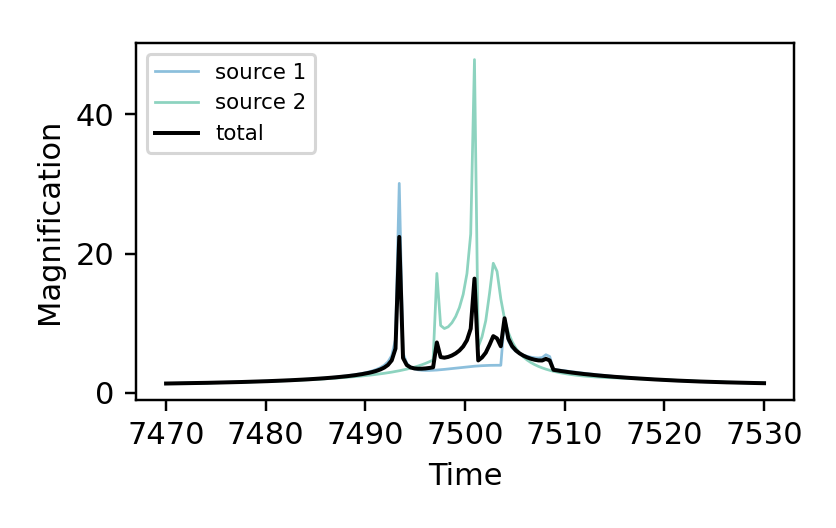 </p>

### Parallax + Kepler lens orbit + circular-elements xallarap

```python
parameters = {'s': 0.9, 'q': 0.1, 't0': 7500.0, 'u0': 0.2, 'tE': 30.0, 'alpha': 0.7, 'piEN': 0.03, 'piEE': -0.02, 'g1': 0.011, 'g2': -0.005, 'g3': 0.005, 'lom_szs': 0.2, 'lom_ar': 1.4, 'xi_1': 0.006, 'xi_2': -0.003, 'period_xa': 12.0, 'inc_xa': 0.6, 'rho1': 0.004, 'rho2': 0.003, 'flux_ratio': 0.4, 'source_mass_ratio': 0.7}
curve = lcbinint.LightCurve(options=options, model=lcbinint.Model(lens='binary', source='binary', parallax=True, sky=sky, t_ref=7500.0, orbital_motion='kepler', xallarap='circular_elements'))
components = curve.binary_source_components(times, parameters)
magnification = components.total
trajectory1 = components.source1.trajectory
trajectory2 = components.source2.trajectory
caustics = curve.caustics(7500.0, parameters)
```

```python
plt.figure(figsize=(3.8, 2.4))
plt.plot(times, components.source1.magnification, color="#0173B2", alpha=0.45, label="source 1")
plt.plot(times, components.source2.magnification, color="#029E73", alpha=0.45, label="source 2")
plt.plot(times, magnification, color="black", label="total")
plt.legend(loc="upper left", fontsize=7)
plt.xlabel("Time"); plt.ylabel("Magnification")
plt.show()
```

```python
plt.figure(figsize=(2.8, 2.7))
for x, y in zip(caustics.x, caustics.y):
    plt.plot(x, y, color="#6C6C6C", lw=1.1)
plt.plot(trajectory1.x, trajectory1.y, color="#0173B2", label="source 1")
plt.plot(trajectory2.x, trajectory2.y, color="#029E73", label="source 2")
plt.legend(fontsize=7)
plt.xlabel("Trajectory coordinate 1"); plt.ylabel("Trajectory coordinate 2")
plt.axis("equal"); plt.show()
```

<p>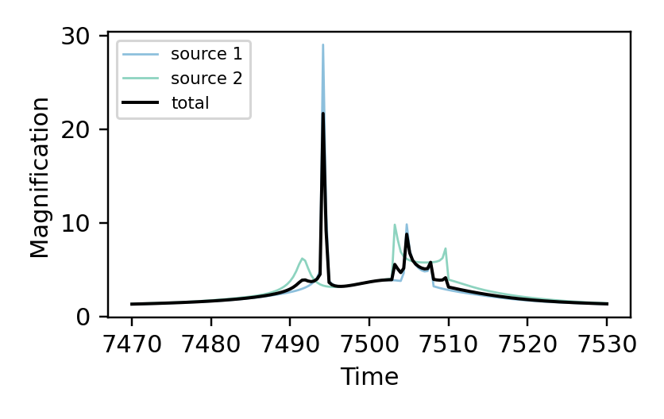 </p>

### Parallax + Kepler lens orbit + Kepler-elements xallarap

```python
parameters = {'s': 0.9, 'q': 0.1, 't0': 7500.0, 'u0': 0.2, 'tE': 30.0, 'alpha': 0.7, 'piEN': 0.03, 'piEE': -0.02, 'g1': 0.011, 'g2': -0.005, 'g3': 0.005, 'lom_szs': 0.2, 'lom_ar': 1.4, 'xi_1': 0.006, 'xi_2': -0.003, 'period_xa': 12.0, 'inc_xa': 0.6, 'ecc_xa': 0.2, 'peri_xa': 0.4, 'rho1': 0.004, 'rho2': 0.003, 'flux_ratio': 0.4, 'source_mass_ratio': 0.7}
curve = lcbinint.LightCurve(options=options, model=lcbinint.Model(lens='binary', source='binary', parallax=True, sky=sky, t_ref=7500.0, orbital_motion='kepler', xallarap='orbital_elements'))
components = curve.binary_source_components(times, parameters)
magnification = components.total
trajectory1 = components.source1.trajectory
trajectory2 = components.source2.trajectory
caustics = curve.caustics(7500.0, parameters)
```

```python
plt.figure(figsize=(3.8, 2.4))
plt.plot(times, components.source1.magnification, color="#0173B2", alpha=0.45, label="source 1")
plt.plot(times, components.source2.magnification, color="#029E73", alpha=0.45, label="source 2")
plt.plot(times, magnification, color="black", label="total")
plt.legend(loc="upper left", fontsize=7)
plt.xlabel("Time"); plt.ylabel("Magnification")
plt.show()
```

```python
plt.figure(figsize=(2.8, 2.7))
for x, y in zip(caustics.x, caustics.y):
    plt.plot(x, y, color="#6C6C6C", lw=1.1)
plt.plot(trajectory1.x, trajectory1.y, color="#0173B2", label="source 1")
plt.plot(trajectory2.x, trajectory2.y, color="#029E73", label="source 2")
plt.legend(fontsize=7)
plt.xlabel("Trajectory coordinate 1"); plt.ylabel("Trajectory coordinate 2")
plt.axis("equal"); plt.show()
```

<p> 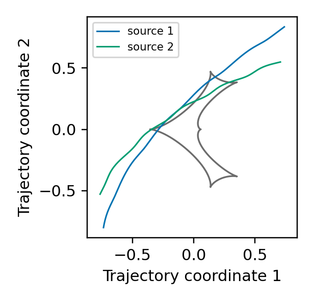</p>

### Parallax + Kepler lens orbit + direct circular-velocity xallarap

```python
parameters = {'s': 0.9, 'q': 0.1, 't0': 7500.0, 'u0': 0.2, 'tE': 30.0, 'alpha': 0.7, 'piEN': 0.03, 'piEE': -0.02, 'g1': 0.011, 'g2': -0.005, 'g3': 0.005, 'lom_szs': 0.2, 'lom_ar': 1.4, 'xi_1': 0.006, 'xi_2': -0.003, 'w1': 0.004, 'w2': 0.35, 'w3': 0.08, 'rho1': 0.004, 'rho2': 0.003, 'flux_ratio': 0.4, 'source_mass_ratio': 0.7}
curve = lcbinint.LightCurve(options=options, model=lcbinint.Model(lens='binary', source='binary', parallax=True, sky=sky, t_ref=7500.0, orbital_motion='kepler', xallarap='circular_velocity', source_orbit_coordinates='xallarap'))
components = curve.binary_source_components(times, parameters)
magnification = components.total
trajectory1 = components.source1.trajectory
trajectory2 = components.source2.trajectory
caustics = curve.caustics(7500.0, parameters)
```

```python
plt.figure(figsize=(3.8, 2.4))
plt.plot(times, components.source1.magnification, color="#0173B2", alpha=0.45, label="source 1")
plt.plot(times, components.source2.magnification, color="#029E73", alpha=0.45, label="source 2")
plt.plot(times, magnification, color="black", label="total")
plt.legend(loc="upper left", fontsize=7)
plt.xlabel("Time"); plt.ylabel("Magnification")
plt.show()
```

```python
plt.figure(figsize=(2.8, 2.7))
for x, y in zip(caustics.x, caustics.y):
    plt.plot(x, y, color="#6C6C6C", lw=1.1)
plt.plot(trajectory1.x, trajectory1.y, color="#0173B2", label="source 1")
plt.plot(trajectory2.x, trajectory2.y, color="#029E73", label="source 2")
plt.legend(fontsize=7)
plt.xlabel("Trajectory coordinate 1"); plt.ylabel("Trajectory coordinate 2")
plt.axis("equal"); plt.show()
```

<p> 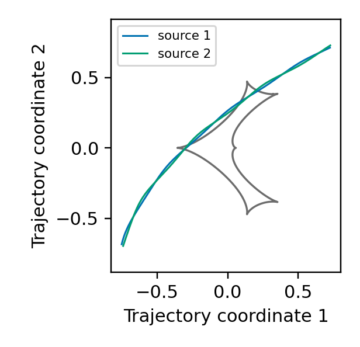</p>

### Parallax + Kepler lens orbit + direct Kepler-velocity xallarap

```python
parameters = {'s': 0.9, 'q': 0.1, 't0': 7500.0, 'u0': 0.2, 'tE': 30.0, 'alpha': 0.7, 'piEN': 0.03, 'piEE': -0.02, 'g1': 0.011, 'g2': -0.005, 'g3': 0.005, 'lom_szs': 0.2, 'lom_ar': 1.4, 'xi_1': 0.006, 'xi_2': -0.003, 'w1': 0.004, 'w2': 0.35, 'w3': 0.08, 'xa_szs': 0.2, 'xa_ar': 1.4, 'rho1': 0.004, 'rho2': 0.003, 'flux_ratio': 0.4, 'source_mass_ratio': 0.7}
curve = lcbinint.LightCurve(options=options, model=lcbinint.Model(lens='binary', source='binary', parallax=True, sky=sky, t_ref=7500.0, orbital_motion='kepler', xallarap='kepler_velocity', source_orbit_coordinates='xallarap'))
components = curve.binary_source_components(times, parameters)
magnification = components.total
trajectory1 = components.source1.trajectory
trajectory2 = components.source2.trajectory
caustics = curve.caustics(7500.0, parameters)
```

```python
plt.figure(figsize=(3.8, 2.4))
plt.plot(times, components.source1.magnification, color="#0173B2", alpha=0.45, label="source 1")
plt.plot(times, components.source2.magnification, color="#029E73", alpha=0.45, label="source 2")
plt.plot(times, magnification, color="black", label="total")
plt.legend(loc="upper left", fontsize=7)
plt.xlabel("Time"); plt.ylabel("Magnification")
plt.show()
```

```python
plt.figure(figsize=(2.8, 2.7))
for x, y in zip(caustics.x, caustics.y):
    plt.plot(x, y, color="#6C6C6C", lw=1.1)
plt.plot(trajectory1.x, trajectory1.y, color="#0173B2", label="source 1")
plt.plot(trajectory2.x, trajectory2.y, color="#029E73", label="source 2")
plt.legend(fontsize=7)
plt.xlabel("Trajectory coordinate 1"); plt.ylabel("Trajectory coordinate 2")
plt.axis("equal"); plt.show()
```

<p> </p>

### Parallax + Kepler lens orbit + trajectory-offset circular-velocity xallarap

```python
parameters = {'s': 0.9, 'q': 0.1, 't0': 7499.4, 'u0': 0.19, 'tE': 30.0, 'alpha': 0.7, 'piEN': 0.03, 'piEE': -0.02, 'g1': 0.011, 'g2': -0.005, 'g3': 0.005, 'lom_szs': 0.2, 'lom_ar': 1.4, 'xi_1': 0.006, 'xi_2': -0.003, 'w1': 0.004, 'w2': 0.35, 'w3': 0.08, 'rho1': 0.004, 'rho2': 0.003, 'flux_ratio': 0.4, 'source_mass_ratio': 0.7, 't0_2': 7500.857142857, 'u0_2': 0.214285714}
curve = lcbinint.LightCurve(options=options, model=lcbinint.Model(lens='binary', source='binary', parallax=True, sky=sky, t_ref=7500.0, orbital_motion='kepler', xallarap='circular_velocity', source_orbit_coordinates='trajectory_offset'))
components = curve.binary_source_components(times, parameters)
magnification = components.total
trajectory1 = components.source1.trajectory
trajectory2 = components.source2.trajectory
caustics = curve.caustics(7500.0, parameters)
```

```python
plt.figure(figsize=(3.8, 2.4))
plt.plot(times, components.source1.magnification, color="#0173B2", alpha=0.45, label="source 1")
plt.plot(times, components.source2.magnification, color="#029E73", alpha=0.45, label="source 2")
plt.plot(times, magnification, color="black", label="total")
plt.legend(loc="upper left", fontsize=7)
plt.xlabel("Time"); plt.ylabel("Magnification")
plt.show()
```

```python
plt.figure(figsize=(2.8, 2.7))
for x, y in zip(caustics.x, caustics.y):
    plt.plot(x, y, color="#6C6C6C", lw=1.1)
plt.plot(trajectory1.x, trajectory1.y, color="#0173B2", label="source 1")
plt.plot(trajectory2.x, trajectory2.y, color="#029E73", label="source 2")
plt.legend(fontsize=7)
plt.xlabel("Trajectory coordinate 1"); plt.ylabel("Trajectory coordinate 2")
plt.axis("equal"); plt.show()
```

<p> 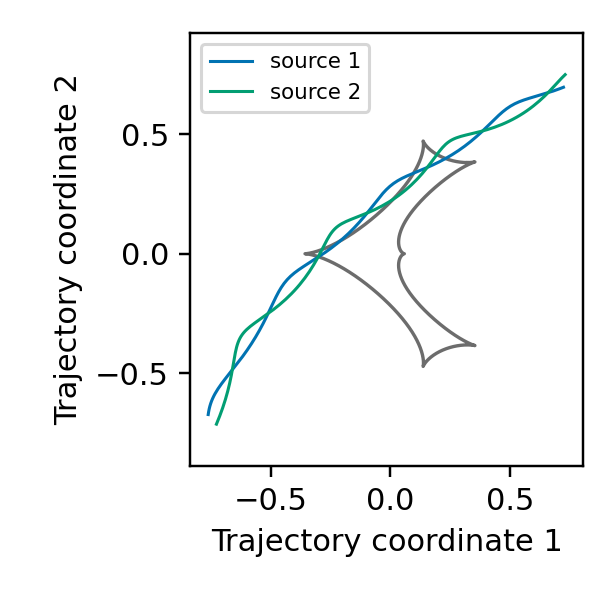</p>

### Parallax + Kepler lens orbit + trajectory-offset Kepler-velocity xallarap

```python
parameters = {'s': 0.9, 'q': 0.1, 't0': 7499.4, 'u0': 0.19, 'tE': 30.0, 'alpha': 0.7, 'piEN': 0.03, 'piEE': -0.02, 'g1': 0.011, 'g2': -0.005, 'g3': 0.005, 'lom_szs': 0.2, 'lom_ar': 1.4, 'xi_1': 0.006, 'xi_2': -0.003, 'w1': 0.004, 'w2': 0.35, 'w3': 0.08, 'xa_szs': 0.2, 'xa_ar': 1.4, 'rho1': 0.004, 'rho2': 0.003, 'flux_ratio': 0.4, 'source_mass_ratio': 0.7, 't0_2': 7500.857142857, 'u0_2': 0.214285714}
curve = lcbinint.LightCurve(options=options, model=lcbinint.Model(lens='binary', source='binary', parallax=True, sky=sky, t_ref=7500.0, orbital_motion='kepler', xallarap='kepler_velocity', source_orbit_coordinates='trajectory_offset'))
components = curve.binary_source_components(times, parameters)
magnification = components.total
trajectory1 = components.source1.trajectory
trajectory2 = components.source2.trajectory
caustics = curve.caustics(7500.0, parameters)
```

```python
plt.figure(figsize=(3.8, 2.4))
plt.plot(times, components.source1.magnification, color="#0173B2", alpha=0.45, label="source 1")
plt.plot(times, components.source2.magnification, color="#029E73", alpha=0.45, label="source 2")
plt.plot(times, magnification, color="black", label="total")
plt.legend(loc="upper left", fontsize=7)
plt.xlabel("Time"); plt.ylabel("Magnification")
plt.show()
```

```python
plt.figure(figsize=(2.8, 2.7))
for x, y in zip(caustics.x, caustics.y):
    plt.plot(x, y, color="#6C6C6C", lw=1.1)
plt.plot(trajectory1.x, trajectory1.y, color="#0173B2", label="source 1")
plt.plot(trajectory2.x, trajectory2.y, color="#029E73", label="source 2")
plt.legend(fontsize=7)
plt.xlabel("Trajectory coordinate 1"); plt.ylabel("Trajectory coordinate 2")
plt.axis("equal"); plt.show()
```

<p>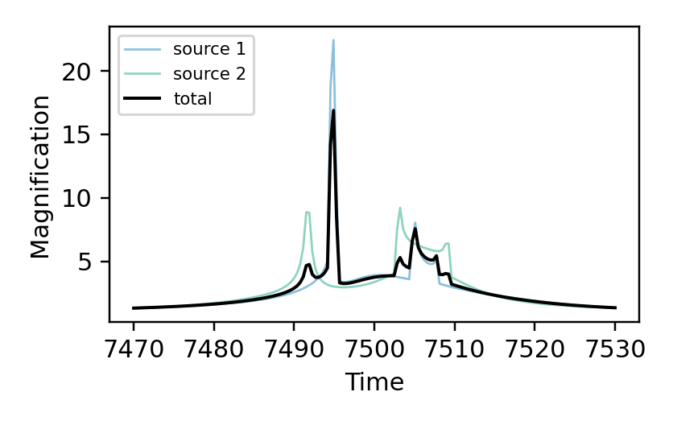 </p>

## Triple lens, single source

### Parallax

```python
parameters = {'s': 0.9, 'q': 0.1, 't0': 7500.0, 'u0': 0.2, 'tE': 30.0, 'alpha': 0.7, 'piEN': 0.03, 'piEE': -0.02, 'g1': 0.011, 'g2': -0.005, 'g3': 0.005, 'lom_szs': 0.2, 'lom_ar': 1.4, 'sep2': 1.3, 'q2': 0.01, 'ang': 0.5, 'rho': 0.004}
curve = lcbinint.LightCurve(options=options, model=lcbinint.Model(lens='triple', source='single', parallax=True, sky=sky, t_ref=7500.0))
magnification = curve(times, parameters)
trajectory = curve.source_trajectory(times, parameters)
caustics = curve.caustics(parameters)
```

```python
plt.figure(figsize=(3.8, 2.4))
plt.plot(times, magnification, color="#0173B2")
plt.xlabel("Time"); plt.ylabel("Magnification")
plt.show()
```

```python
plt.figure(figsize=(2.8, 2.7))
for x, y in zip(caustics.x, caustics.y):
    plt.plot(x, y, color="#6C6C6C", lw=1.1)
plt.plot(trajectory.x, trajectory.y, color="#0173B2")
plt.xlabel("Trajectory coordinate 1"); plt.ylabel("Trajectory coordinate 2")
plt.axis("equal"); plt.show()
```

<p>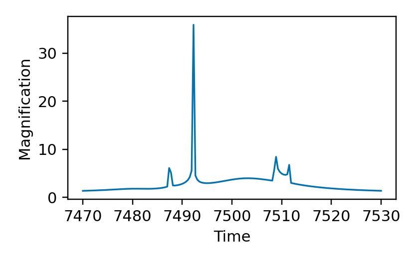 </p>

### Parallax + circular-elements xallarap

```python
parameters = {'s': 0.9, 'q': 0.1, 't0': 7500.0, 'u0': 0.2, 'tE': 30.0, 'alpha': 0.7, 'piEN': 0.03, 'piEE': -0.02, 'g1': 0.011, 'g2': -0.005, 'g3': 0.005, 'lom_szs': 0.2, 'lom_ar': 1.4, 'sep2': 1.3, 'q2': 0.01, 'ang': 0.5, 'xi_1': 0.006, 'xi_2': -0.003, 'period_xa': 12.0, 'inc_xa': 0.6, 'rho': 0.004}
curve = lcbinint.LightCurve(options=options, model=lcbinint.Model(lens='triple', source='single', parallax=True, sky=sky, t_ref=7500.0, xallarap='circular_elements'))
magnification = curve(times, parameters)
trajectory = curve.source_trajectory(times, parameters)
caustics = curve.caustics(parameters)
```

```python
plt.figure(figsize=(3.8, 2.4))
plt.plot(times, magnification, color="#0173B2")
plt.xlabel("Time"); plt.ylabel("Magnification")
plt.show()
```

```python
plt.figure(figsize=(2.8, 2.7))
for x, y in zip(caustics.x, caustics.y):
    plt.plot(x, y, color="#6C6C6C", lw=1.1)
plt.plot(trajectory.x, trajectory.y, color="#0173B2")
plt.xlabel("Trajectory coordinate 1"); plt.ylabel("Trajectory coordinate 2")
plt.axis("equal"); plt.show()
```

<p>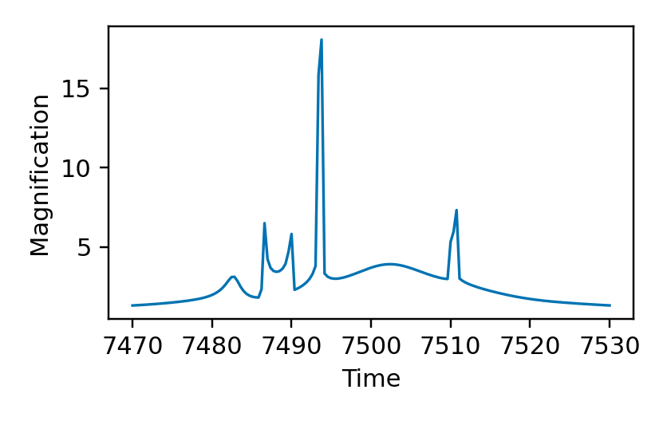 </p>

### Parallax + Kepler-elements xallarap

```python
parameters = {'s': 0.9, 'q': 0.1, 't0': 7500.0, 'u0': 0.2, 'tE': 30.0, 'alpha': 0.7, 'piEN': 0.03, 'piEE': -0.02, 'g1': 0.011, 'g2': -0.005, 'g3': 0.005, 'lom_szs': 0.2, 'lom_ar': 1.4, 'sep2': 1.3, 'q2': 0.01, 'ang': 0.5, 'xi_1': 0.006, 'xi_2': -0.003, 'period_xa': 12.0, 'inc_xa': 0.6, 'ecc_xa': 0.2, 'peri_xa': 0.4, 'rho': 0.004}
curve = lcbinint.LightCurve(options=options, model=lcbinint.Model(lens='triple', source='single', parallax=True, sky=sky, t_ref=7500.0, xallarap='orbital_elements'))
magnification = curve(times, parameters)
trajectory = curve.source_trajectory(times, parameters)
caustics = curve.caustics(parameters)
```

```python
plt.figure(figsize=(3.8, 2.4))
plt.plot(times, magnification, color="#0173B2")
plt.xlabel("Time"); plt.ylabel("Magnification")
plt.show()
```

```python
plt.figure(figsize=(2.8, 2.7))
for x, y in zip(caustics.x, caustics.y):
    plt.plot(x, y, color="#6C6C6C", lw=1.1)
plt.plot(trajectory.x, trajectory.y, color="#0173B2")
plt.xlabel("Trajectory coordinate 1"); plt.ylabel("Trajectory coordinate 2")
plt.axis("equal"); plt.show()
```

<p> </p>

### Parallax + direct circular-velocity xallarap

```python
parameters = {'s': 0.9, 'q': 0.1, 't0': 7500.0, 'u0': 0.2, 'tE': 30.0, 'alpha': 0.7, 'piEN': 0.03, 'piEE': -0.02, 'g1': 0.011, 'g2': -0.005, 'g3': 0.005, 'lom_szs': 0.2, 'lom_ar': 1.4, 'sep2': 1.3, 'q2': 0.01, 'ang': 0.5, 'xi_1': 0.006, 'xi_2': -0.003, 'w1': 0.004, 'w2': 0.35, 'w3': 0.08, 'rho': 0.004}
curve = lcbinint.LightCurve(options=options, model=lcbinint.Model(lens='triple', source='single', parallax=True, sky=sky, t_ref=7500.0, xallarap='circular_velocity'))
magnification = curve(times, parameters)
trajectory = curve.source_trajectory(times, parameters)
caustics = curve.caustics(parameters)
```

```python
plt.figure(figsize=(3.8, 2.4))
plt.plot(times, magnification, color="#0173B2")
plt.xlabel("Time"); plt.ylabel("Magnification")
plt.show()
```

```python
plt.figure(figsize=(2.8, 2.7))
for x, y in zip(caustics.x, caustics.y):
    plt.plot(x, y, color="#6C6C6C", lw=1.1)
plt.plot(trajectory.x, trajectory.y, color="#0173B2")
plt.xlabel("Trajectory coordinate 1"); plt.ylabel("Trajectory coordinate 2")
plt.axis("equal"); plt.show()
```

<p> </p>

### Parallax + direct Kepler-velocity xallarap

```python
parameters = {'s': 0.9, 'q': 0.1, 't0': 7500.0, 'u0': 0.2, 'tE': 30.0, 'alpha': 0.7, 'piEN': 0.03, 'piEE': -0.02, 'g1': 0.011, 'g2': -0.005, 'g3': 0.005, 'lom_szs': 0.2, 'lom_ar': 1.4, 'sep2': 1.3, 'q2': 0.01, 'ang': 0.5, 'xi_1': 0.006, 'xi_2': -0.003, 'w1': 0.004, 'w2': 0.35, 'w3': 0.08, 'xa_szs': 0.2, 'xa_ar': 1.4, 'rho': 0.004}
curve = lcbinint.LightCurve(options=options, model=lcbinint.Model(lens='triple', source='single', parallax=True, sky=sky, t_ref=7500.0, xallarap='kepler_velocity'))
magnification = curve(times, parameters)
trajectory = curve.source_trajectory(times, parameters)
caustics = curve.caustics(parameters)
```

```python
plt.figure(figsize=(3.8, 2.4))
plt.plot(times, magnification, color="#0173B2")
plt.xlabel("Time"); plt.ylabel("Magnification")
plt.show()
```

```python
plt.figure(figsize=(2.8, 2.7))
for x, y in zip(caustics.x, caustics.y):
    plt.plot(x, y, color="#6C6C6C", lw=1.1)
plt.plot(trajectory.x, trajectory.y, color="#0173B2")
plt.xlabel("Trajectory coordinate 1"); plt.ylabel("Trajectory coordinate 2")
plt.axis("equal"); plt.show()
```

<p>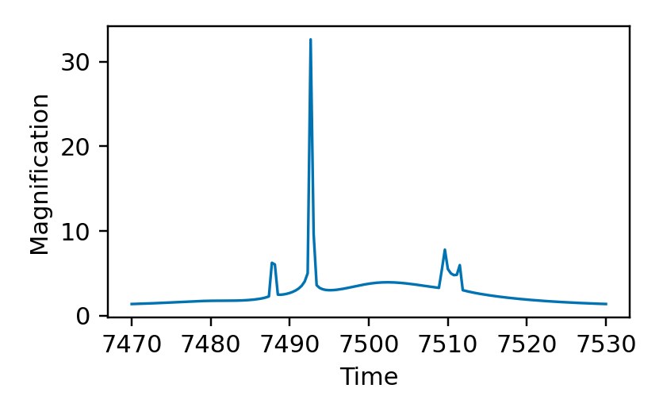 </p>

## Triple lens, binary source

### Parallax

```python
parameters = {'s': 0.9, 'q': 0.1, 't0': 7500.0, 'u0': 0.2, 'tE': 30.0, 'alpha': 0.7, 'piEN': 0.03, 'piEE': -0.02, 'g1': 0.011, 'g2': -0.005, 'g3': 0.005, 'lom_szs': 0.2, 'lom_ar': 1.4, 'sep2': 1.3, 'q2': 0.01, 'ang': 0.5, 'rho1': 0.004, 'rho2': 0.003, 'flux_ratio': 0.4, 't0_2': 7501.2, 'u0_2': -0.06}
curve = lcbinint.LightCurve(options=options, model=lcbinint.Model(lens='triple', source='binary', parallax=True, sky=sky, t_ref=7500.0))
components = curve.binary_source_components(times, parameters)
magnification = components.total
trajectory1 = components.source1.trajectory
trajectory2 = components.source2.trajectory
caustics = curve.caustics(parameters)
```

```python
plt.figure(figsize=(3.8, 2.4))
plt.plot(times, components.source1.magnification, color="#0173B2", alpha=0.45, label="source 1")
plt.plot(times, components.source2.magnification, color="#029E73", alpha=0.45, label="source 2")
plt.plot(times, magnification, color="black", label="total")
plt.legend(loc="upper left", fontsize=7)
plt.xlabel("Time"); plt.ylabel("Magnification")
plt.show()
```

```python
plt.figure(figsize=(2.8, 2.7))
for x, y in zip(caustics.x, caustics.y):
    plt.plot(x, y, color="#6C6C6C", lw=1.1)
plt.plot(trajectory1.x, trajectory1.y, color="#0173B2", label="source 1")
plt.plot(trajectory2.x, trajectory2.y, color="#029E73", label="source 2")
plt.legend(fontsize=7)
plt.xlabel("Trajectory coordinate 1"); plt.ylabel("Trajectory coordinate 2")
plt.axis("equal"); plt.show()
```

<p> </p>

### Parallax + circular-elements xallarap

```python
parameters = {'s': 0.9, 'q': 0.1, 't0': 7500.0, 'u0': 0.2, 'tE': 30.0, 'alpha': 0.7, 'piEN': 0.03, 'piEE': -0.02, 'g1': 0.011, 'g2': -0.005, 'g3': 0.005, 'lom_szs': 0.2, 'lom_ar': 1.4, 'sep2': 1.3, 'q2': 0.01, 'ang': 0.5, 'xi_1': 0.006, 'xi_2': -0.003, 'period_xa': 12.0, 'inc_xa': 0.6, 'rho1': 0.004, 'rho2': 0.003, 'flux_ratio': 0.4, 'source_mass_ratio': 0.7}
curve = lcbinint.LightCurve(options=options, model=lcbinint.Model(lens='triple', source='binary', parallax=True, sky=sky, t_ref=7500.0, xallarap='circular_elements'))
components = curve.binary_source_components(times, parameters)
magnification = components.total
trajectory1 = components.source1.trajectory
trajectory2 = components.source2.trajectory
caustics = curve.caustics(parameters)
```

```python
plt.figure(figsize=(3.8, 2.4))
plt.plot(times, components.source1.magnification, color="#0173B2", alpha=0.45, label="source 1")
plt.plot(times, components.source2.magnification, color="#029E73", alpha=0.45, label="source 2")
plt.plot(times, magnification, color="black", label="total")
plt.legend(loc="upper left", fontsize=7)
plt.xlabel("Time"); plt.ylabel("Magnification")
plt.show()
```

```python
plt.figure(figsize=(2.8, 2.7))
for x, y in zip(caustics.x, caustics.y):
    plt.plot(x, y, color="#6C6C6C", lw=1.1)
plt.plot(trajectory1.x, trajectory1.y, color="#0173B2", label="source 1")
plt.plot(trajectory2.x, trajectory2.y, color="#029E73", label="source 2")
plt.legend(fontsize=7)
plt.xlabel("Trajectory coordinate 1"); plt.ylabel("Trajectory coordinate 2")
plt.axis("equal"); plt.show()
```

<p>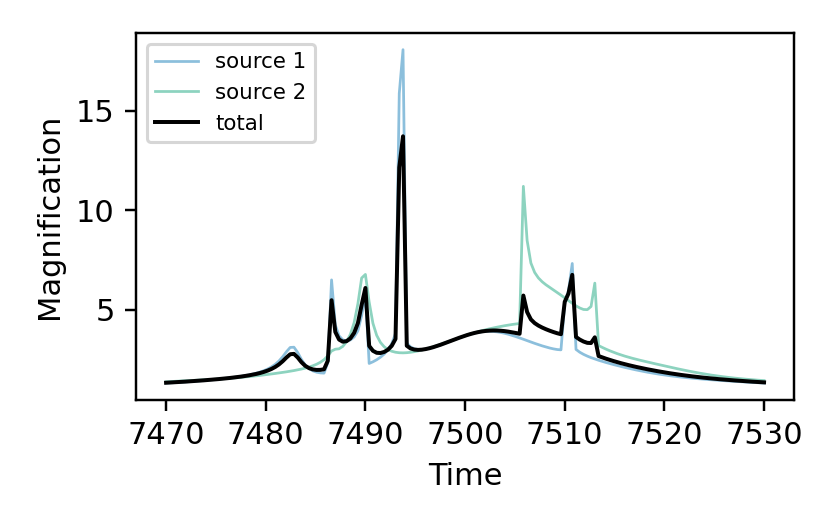 </p>

### Parallax + Kepler-elements xallarap

```python
parameters = {'s': 0.9, 'q': 0.1, 't0': 7500.0, 'u0': 0.2, 'tE': 30.0, 'alpha': 0.7, 'piEN': 0.03, 'piEE': -0.02, 'g1': 0.011, 'g2': -0.005, 'g3': 0.005, 'lom_szs': 0.2, 'lom_ar': 1.4, 'sep2': 1.3, 'q2': 0.01, 'ang': 0.5, 'xi_1': 0.006, 'xi_2': -0.003, 'period_xa': 12.0, 'inc_xa': 0.6, 'ecc_xa': 0.2, 'peri_xa': 0.4, 'rho1': 0.004, 'rho2': 0.003, 'flux_ratio': 0.4, 'source_mass_ratio': 0.7}
curve = lcbinint.LightCurve(options=options, model=lcbinint.Model(lens='triple', source='binary', parallax=True, sky=sky, t_ref=7500.0, xallarap='orbital_elements'))
components = curve.binary_source_components(times, parameters)
magnification = components.total
trajectory1 = components.source1.trajectory
trajectory2 = components.source2.trajectory
caustics = curve.caustics(parameters)
```

```python
plt.figure(figsize=(3.8, 2.4))
plt.plot(times, components.source1.magnification, color="#0173B2", alpha=0.45, label="source 1")
plt.plot(times, components.source2.magnification, color="#029E73", alpha=0.45, label="source 2")
plt.plot(times, magnification, color="black", label="total")
plt.legend(loc="upper left", fontsize=7)
plt.xlabel("Time"); plt.ylabel("Magnification")
plt.show()
```

```python
plt.figure(figsize=(2.8, 2.7))
for x, y in zip(caustics.x, caustics.y):
    plt.plot(x, y, color="#6C6C6C", lw=1.1)
plt.plot(trajectory1.x, trajectory1.y, color="#0173B2", label="source 1")
plt.plot(trajectory2.x, trajectory2.y, color="#029E73", label="source 2")
plt.legend(fontsize=7)
plt.xlabel("Trajectory coordinate 1"); plt.ylabel("Trajectory coordinate 2")
plt.axis("equal"); plt.show()
```

<p> </p>

### Parallax + direct circular-velocity xallarap

```python
parameters = {'s': 0.9, 'q': 0.1, 't0': 7500.0, 'u0': 0.2, 'tE': 30.0, 'alpha': 0.7, 'piEN': 0.03, 'piEE': -0.02, 'g1': 0.011, 'g2': -0.005, 'g3': 0.005, 'lom_szs': 0.2, 'lom_ar': 1.4, 'sep2': 1.3, 'q2': 0.01, 'ang': 0.5, 'xi_1': 0.006, 'xi_2': -0.003, 'w1': 0.004, 'w2': 0.35, 'w3': 0.08, 'rho1': 0.004, 'rho2': 0.003, 'flux_ratio': 0.4, 'source_mass_ratio': 0.7}
curve = lcbinint.LightCurve(options=options, model=lcbinint.Model(lens='triple', source='binary', parallax=True, sky=sky, t_ref=7500.0, xallarap='circular_velocity', source_orbit_coordinates='xallarap'))
components = curve.binary_source_components(times, parameters)
magnification = components.total
trajectory1 = components.source1.trajectory
trajectory2 = components.source2.trajectory
caustics = curve.caustics(parameters)
```

```python
plt.figure(figsize=(3.8, 2.4))
plt.plot(times, components.source1.magnification, color="#0173B2", alpha=0.45, label="source 1")
plt.plot(times, components.source2.magnification, color="#029E73", alpha=0.45, label="source 2")
plt.plot(times, magnification, color="black", label="total")
plt.legend(loc="upper left", fontsize=7)
plt.xlabel("Time"); plt.ylabel("Magnification")
plt.show()
```

```python
plt.figure(figsize=(2.8, 2.7))
for x, y in zip(caustics.x, caustics.y):
    plt.plot(x, y, color="#6C6C6C", lw=1.1)
plt.plot(trajectory1.x, trajectory1.y, color="#0173B2", label="source 1")
plt.plot(trajectory2.x, trajectory2.y, color="#029E73", label="source 2")
plt.legend(fontsize=7)
plt.xlabel("Trajectory coordinate 1"); plt.ylabel("Trajectory coordinate 2")
plt.axis("equal"); plt.show()
```

<p> 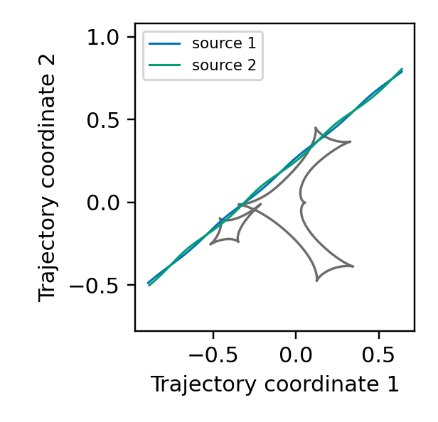</p>

### Parallax + direct Kepler-velocity xallarap

```python
parameters = {'s': 0.9, 'q': 0.1, 't0': 7500.0, 'u0': 0.2, 'tE': 30.0, 'alpha': 0.7, 'piEN': 0.03, 'piEE': -0.02, 'g1': 0.011, 'g2': -0.005, 'g3': 0.005, 'lom_szs': 0.2, 'lom_ar': 1.4, 'sep2': 1.3, 'q2': 0.01, 'ang': 0.5, 'xi_1': 0.006, 'xi_2': -0.003, 'w1': 0.004, 'w2': 0.35, 'w3': 0.08, 'xa_szs': 0.2, 'xa_ar': 1.4, 'rho1': 0.004, 'rho2': 0.003, 'flux_ratio': 0.4, 'source_mass_ratio': 0.7}
curve = lcbinint.LightCurve(options=options, model=lcbinint.Model(lens='triple', source='binary', parallax=True, sky=sky, t_ref=7500.0, xallarap='kepler_velocity', source_orbit_coordinates='xallarap'))
components = curve.binary_source_components(times, parameters)
magnification = components.total
trajectory1 = components.source1.trajectory
trajectory2 = components.source2.trajectory
caustics = curve.caustics(parameters)
```

```python
plt.figure(figsize=(3.8, 2.4))
plt.plot(times, components.source1.magnification, color="#0173B2", alpha=0.45, label="source 1")
plt.plot(times, components.source2.magnification, color="#029E73", alpha=0.45, label="source 2")
plt.plot(times, magnification, color="black", label="total")
plt.legend(loc="upper left", fontsize=7)
plt.xlabel("Time"); plt.ylabel("Magnification")
plt.show()
```

```python
plt.figure(figsize=(2.8, 2.7))
for x, y in zip(caustics.x, caustics.y):
    plt.plot(x, y, color="#6C6C6C", lw=1.1)
plt.plot(trajectory1.x, trajectory1.y, color="#0173B2", label="source 1")
plt.plot(trajectory2.x, trajectory2.y, color="#029E73", label="source 2")
plt.legend(fontsize=7)
plt.xlabel("Trajectory coordinate 1"); plt.ylabel("Trajectory coordinate 2")
plt.axis("equal"); plt.show()
```

<p>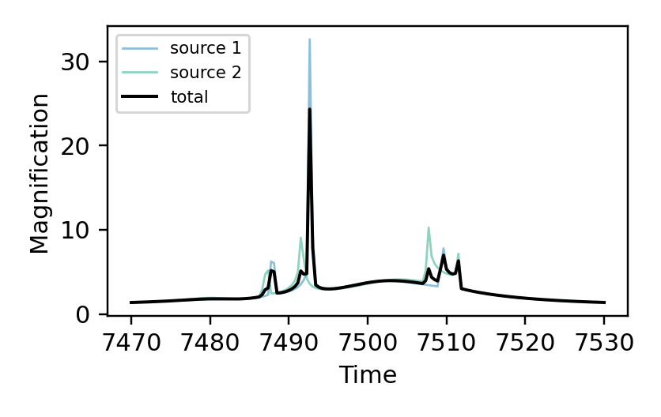 </p>

### Parallax + trajectory-offset circular-velocity xallarap

```python
parameters = {'s': 0.9, 'q': 0.1, 't0': 7499.4, 'u0': 0.19, 'tE': 30.0, 'alpha': 0.7, 'piEN': 0.03, 'piEE': -0.02, 'g1': 0.011, 'g2': -0.005, 'g3': 0.005, 'lom_szs': 0.2, 'lom_ar': 1.4, 'sep2': 1.3, 'q2': 0.01, 'ang': 0.5, 'xi_1': 0.006, 'xi_2': -0.003, 'w1': 0.004, 'w2': 0.35, 'w3': 0.08, 'rho1': 0.004, 'rho2': 0.003, 'flux_ratio': 0.4, 'source_mass_ratio': 0.7, 't0_2': 7500.857142857, 'u0_2': 0.214285714}
curve = lcbinint.LightCurve(options=options, model=lcbinint.Model(lens='triple', source='binary', parallax=True, sky=sky, t_ref=7500.0, xallarap='circular_velocity', source_orbit_coordinates='trajectory_offset'))
components = curve.binary_source_components(times, parameters)
magnification = components.total
trajectory1 = components.source1.trajectory
trajectory2 = components.source2.trajectory
caustics = curve.caustics(parameters)
```

```python
plt.figure(figsize=(3.8, 2.4))
plt.plot(times, components.source1.magnification, color="#0173B2", alpha=0.45, label="source 1")
plt.plot(times, components.source2.magnification, color="#029E73", alpha=0.45, label="source 2")
plt.plot(times, magnification, color="black", label="total")
plt.legend(loc="upper left", fontsize=7)
plt.xlabel("Time"); plt.ylabel("Magnification")
plt.show()
```

```python
plt.figure(figsize=(2.8, 2.7))
for x, y in zip(caustics.x, caustics.y):
    plt.plot(x, y, color="#6C6C6C", lw=1.1)
plt.plot(trajectory1.x, trajectory1.y, color="#0173B2", label="source 1")
plt.plot(trajectory2.x, trajectory2.y, color="#029E73", label="source 2")
plt.legend(fontsize=7)
plt.xlabel("Trajectory coordinate 1"); plt.ylabel("Trajectory coordinate 2")
plt.axis("equal"); plt.show()
```

<p> </p>

### Parallax + trajectory-offset Kepler-velocity xallarap

```python
parameters = {'s': 0.9, 'q': 0.1, 't0': 7499.4, 'u0': 0.19, 'tE': 30.0, 'alpha': 0.7, 'piEN': 0.03, 'piEE': -0.02, 'g1': 0.011, 'g2': -0.005, 'g3': 0.005, 'lom_szs': 0.2, 'lom_ar': 1.4, 'sep2': 1.3, 'q2': 0.01, 'ang': 0.5, 'xi_1': 0.006, 'xi_2': -0.003, 'w1': 0.004, 'w2': 0.35, 'w3': 0.08, 'xa_szs': 0.2, 'xa_ar': 1.4, 'rho1': 0.004, 'rho2': 0.003, 'flux_ratio': 0.4, 'source_mass_ratio': 0.7, 't0_2': 7500.857142857, 'u0_2': 0.214285714}
curve = lcbinint.LightCurve(options=options, model=lcbinint.Model(lens='triple', source='binary', parallax=True, sky=sky, t_ref=7500.0, xallarap='kepler_velocity', source_orbit_coordinates='trajectory_offset'))
components = curve.binary_source_components(times, parameters)
magnification = components.total
trajectory1 = components.source1.trajectory
trajectory2 = components.source2.trajectory
caustics = curve.caustics(parameters)
```

```python
plt.figure(figsize=(3.8, 2.4))
plt.plot(times, components.source1.magnification, color="#0173B2", alpha=0.45, label="source 1")
plt.plot(times, components.source2.magnification, color="#029E73", alpha=0.45, label="source 2")
plt.plot(times, magnification, color="black", label="total")
plt.legend(loc="upper left", fontsize=7)
plt.xlabel("Time"); plt.ylabel("Magnification")
plt.show()
```

```python
plt.figure(figsize=(2.8, 2.7))
for x, y in zip(caustics.x, caustics.y):
    plt.plot(x, y, color="#6C6C6C", lw=1.1)
plt.plot(trajectory1.x, trajectory1.y, color="#0173B2", label="source 1")
plt.plot(trajectory2.x, trajectory2.y, color="#029E73", label="source 2")
plt.legend(fontsize=7)
plt.xlabel("Trajectory coordinate 1"); plt.ylabel("Trajectory coordinate 2")
plt.axis("equal"); plt.show()
```

<p> </p>

[Previous: Combining higher-order effects](CombinedEffects.md) · [Documentation home](readme.md)
