[Previous: Combining higher-order effects](CombinedEffects.md) · [Documentation home](readme.md)

# Higher-order combination catalogue

All examples use the same binary lens, epochs, and sky position. Each section
shows the complete model configuration; `curve(times, parameters)` evaluates
the light curve, `source_trajectory` returns the displayed track, and
`caustics` returns the displayed caustics.

```python
import numpy as np
import matplotlib.pyplot as plt
import lcbinint

times = np.linspace(7470.0, 7530.0, 300)
sky = lcbinint.obs.SkyCoord("17:59:02.3", "-29:04:15.2")
options = lcbinint.Options(coordinates="vbm", tol=1e-3, reltol=1e-3)
base = {
    "s": 0.9, "q": 0.1, "t0": 7500.0, "u0": 0.20,
    "tE": 30.0, "alpha": 0.7,
    "piEN": 0.03, "piEE": -0.02,
    "g1": 0.011, "g2": -0.005, "g3": 0.005,
    "xi_1": 0.02, "xi_2": -0.01,
    "w1": 0.004, "w2": 0.35, "w3": 0.08,
}
```

After a single-source configuration, plot its returned quantities as follows:

```python
plt.figure(figsize=(4.2, 2.7))
plt.plot(times, magnification, color="#0173B2")
plt.xlabel("Time")
plt.ylabel("Magnification")
plt.show()

plt.figure(figsize=(3.4, 3.2))
for x, y in zip(caustics.x, caustics.y):
    plt.plot(x, y, color="#6C6C6C", lw=1.1)
plt.plot(trajectory.x, trajectory.y, color="#0173B2")
plt.xlabel("Trajectory coordinate 1")
plt.ylabel("Trajectory coordinate 2")
plt.axis("equal")
plt.show()
```

For binary-source configurations, replace the trajectory line with the two
component tracks returned by `binary_source_components`:

```python
plt.figure(figsize=(4.2, 2.7))
plt.plot(times, magnification, color="black", lw=1.4)
plt.xlabel("Time")
plt.ylabel("Magnification")
plt.show()

plt.figure(figsize=(3.4, 3.2))
for x, y in zip(caustics.x, caustics.y):
    plt.plot(x, y, color="#6C6C6C", lw=1.1)
plt.plot(components.source1.trajectory.x, components.source1.trajectory.y,
         color="#0173B2", label="source 1")
plt.plot(components.source2.trajectory.x, components.source2.trajectory.y,
         color="#029E73", label="source 2")
plt.xlabel("Trajectory coordinate 1")
plt.ylabel("Trajectory coordinate 2")
plt.axis("equal")
plt.legend(fontsize=7)
plt.show()
```

## Parallax + lens orbit

```python
parameters = dict(base, rho=0.0)
curve = lcbinint.LightCurve(options=options, model=lcbinint.Model(
    parallax=True, orbital_motion="circular", sky=sky, t_ref=7500.0,
))
magnification = curve(times, parameters)
trajectory = curve.source_trajectory(times, parameters)
caustics = curve.caustics(7500.0, parameters)
```

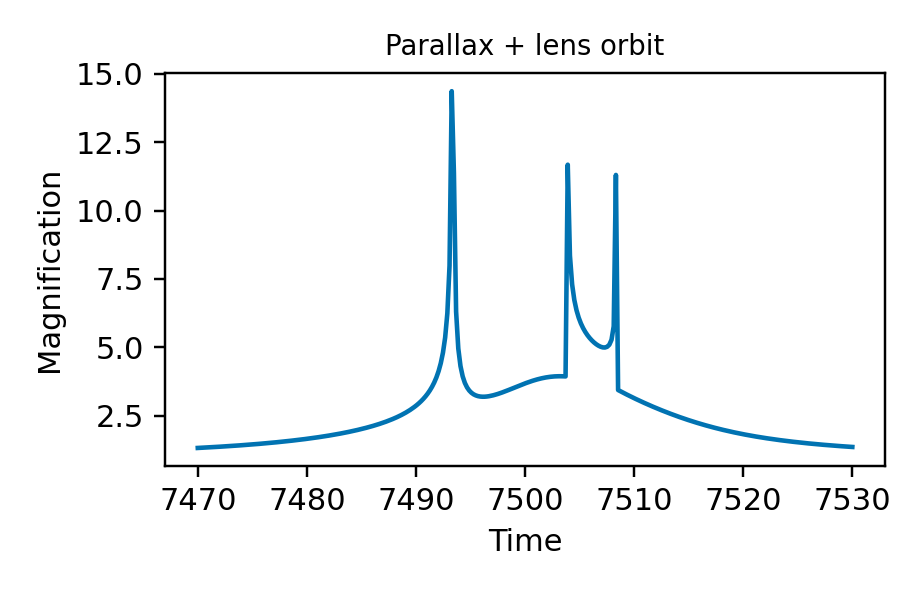


## Parallax + xallarap

```python
parameters = dict(base, rho=0.004)
curve = lcbinint.LightCurve(options=options, model=lcbinint.Model(
    parallax=True, xallarap="circular_velocity", sky=sky, t_ref=7500.0,
))
magnification = curve(times, parameters)
trajectory = curve.source_trajectory(times, parameters)
caustics = curve.caustics(parameters)
```

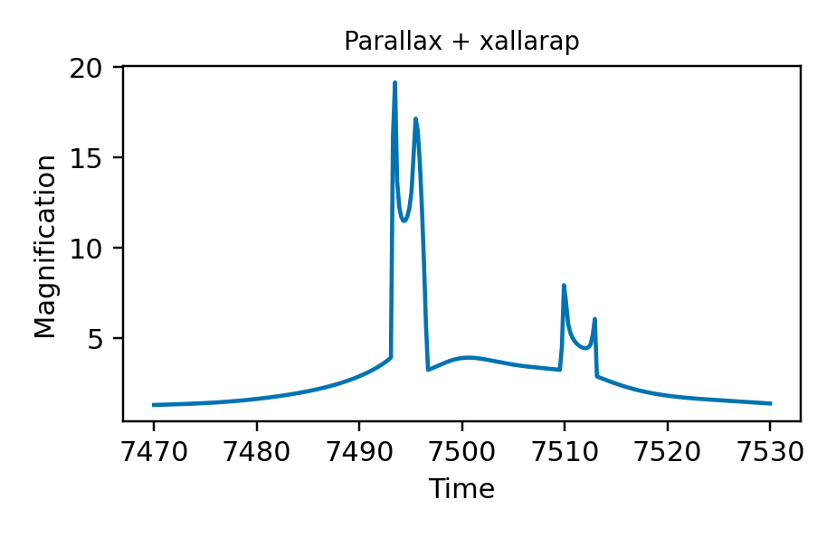
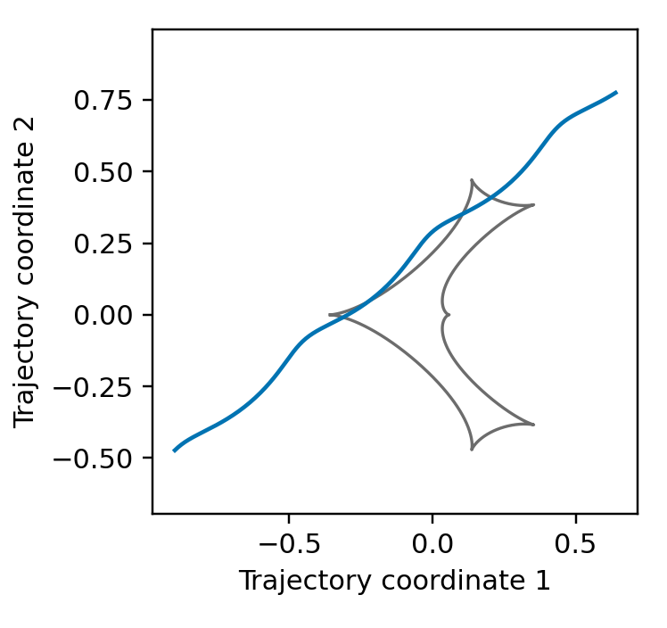

## Lens orbit + xallarap

```python
parameters = dict(base, rho=0.0)
curve = lcbinint.LightCurve(options=options, model=lcbinint.Model(
    orbital_motion="circular", xallarap="circular_velocity", t_ref=7500.0,
))
magnification = curve(times, parameters)
trajectory = curve.source_trajectory(times, parameters)
caustics = curve.caustics(7500.0, parameters)
```

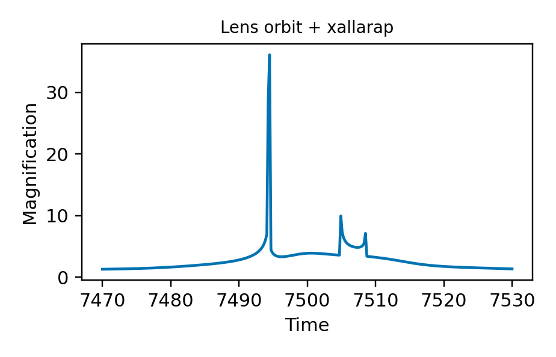


## Parallax + lens orbit + xallarap

```python
parameters = dict(base, rho=0.0)
curve = lcbinint.LightCurve(options=options, model=lcbinint.Model(
    parallax=True, orbital_motion="circular", xallarap="circular_velocity",
    sky=sky, t_ref=7500.0,
))
magnification = curve(times, parameters)
trajectory = curve.source_trajectory(times, parameters)
caustics = curve.caustics(7500.0, parameters)
```

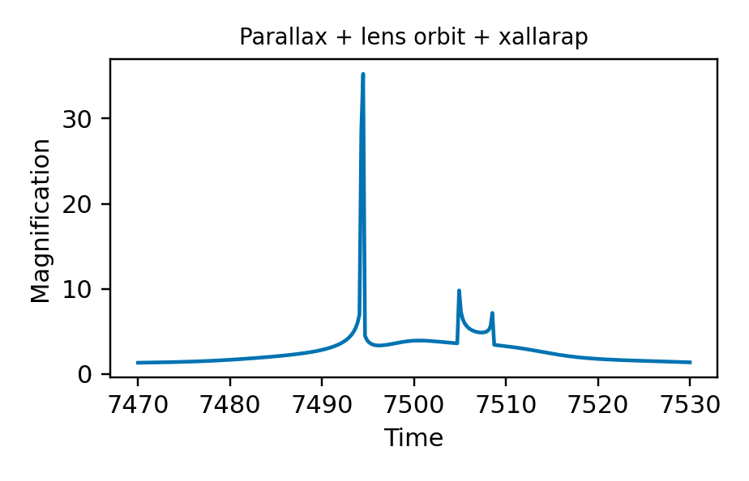


## Binary source + parallax

```python
parameters = dict(base, rho1=0.004, rho2=0.003, flux_ratio=0.4,
                  t0_2=7501.2, u0_2=-0.06)
for key in ("xi_1", "xi_2", "w1", "w2", "w3"):
    parameters.pop(key)
curve = lcbinint.LightCurve(options=options, model=lcbinint.Model(
    source="binary", parallax=True, sky=sky, t_ref=7500.0,
))
components = curve.binary_source_components(times, parameters)
magnification = components.total
caustics = curve.caustics(parameters)
```

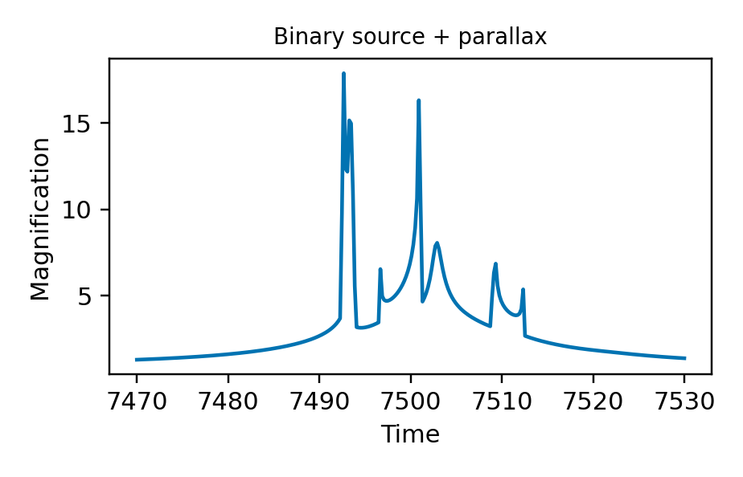
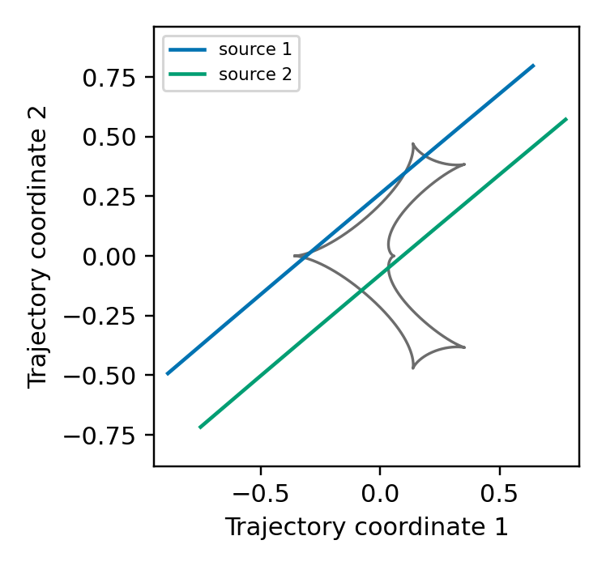

## Binary source + lens orbit

```python
parameters = dict(base, rho1=0.0, rho2=0.0, flux_ratio=0.4,
                  t0_2=7501.2, u0_2=-0.06)
for key in ("xi_1", "xi_2", "w1", "w2", "w3"):
    parameters.pop(key)
curve = lcbinint.LightCurve(options=options, model=lcbinint.Model(
    source="binary", orbital_motion="circular", t_ref=7500.0,
))
components = curve.binary_source_components(times, parameters)
magnification = components.total
caustics = curve.caustics(7500.0, parameters)
```

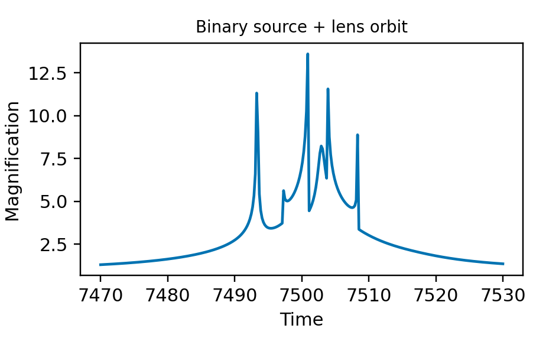
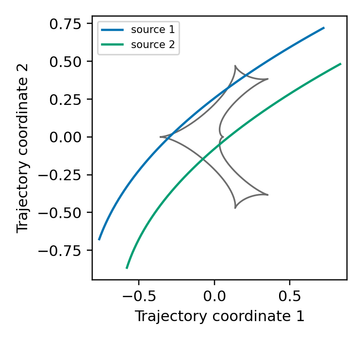

## Binary source + parallax + lens orbit

```python
parameters = dict(base, rho1=0.0, rho2=0.0, flux_ratio=0.4,
                  t0_2=7501.2, u0_2=-0.06)
for key in ("xi_1", "xi_2", "w1", "w2", "w3"):
    parameters.pop(key)
curve = lcbinint.LightCurve(options=options, model=lcbinint.Model(
    source="binary", parallax=True, orbital_motion="circular",
    sky=sky, t_ref=7500.0,
))
components = curve.binary_source_components(times, parameters)
magnification = components.total
caustics = curve.caustics(7500.0, parameters)
```

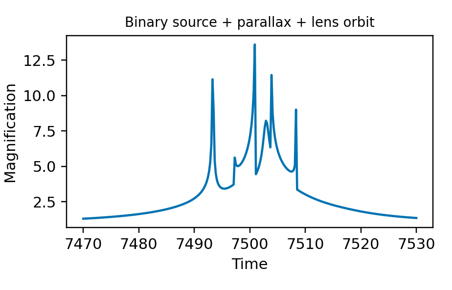
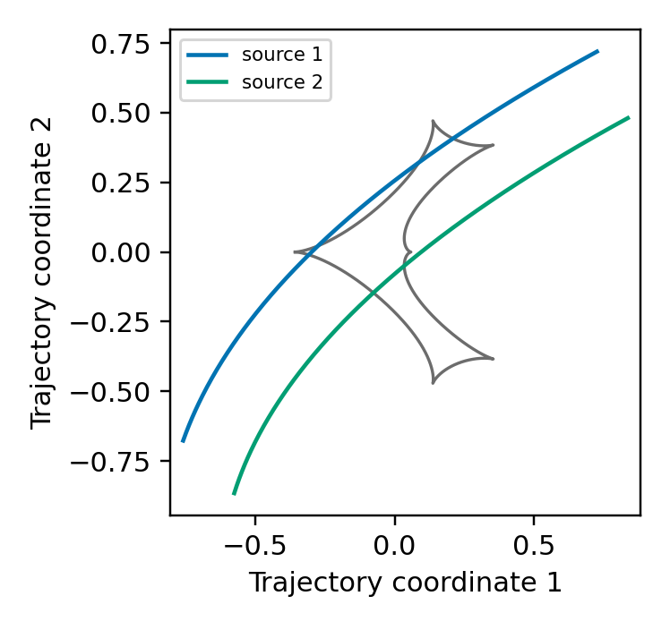

## Binary source + parallax + xallarap

```python
parameters = dict(base, rho1=0.004, rho2=0.003, flux_ratio=0.4,
                  source_mass_ratio=0.7)
curve = lcbinint.LightCurve(options=options, model=lcbinint.Model(
    source="binary", parallax=True, xallarap="circular_velocity",
    source_orbit_coordinates="xallarap", sky=sky, t_ref=7500.0,
))
components = curve.binary_source_components(times, parameters)
magnification = components.total
caustics = curve.caustics(parameters)
```

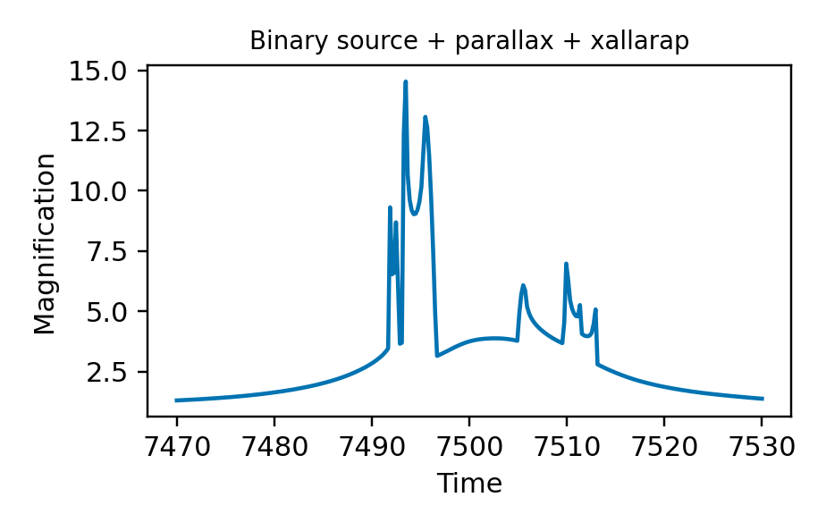
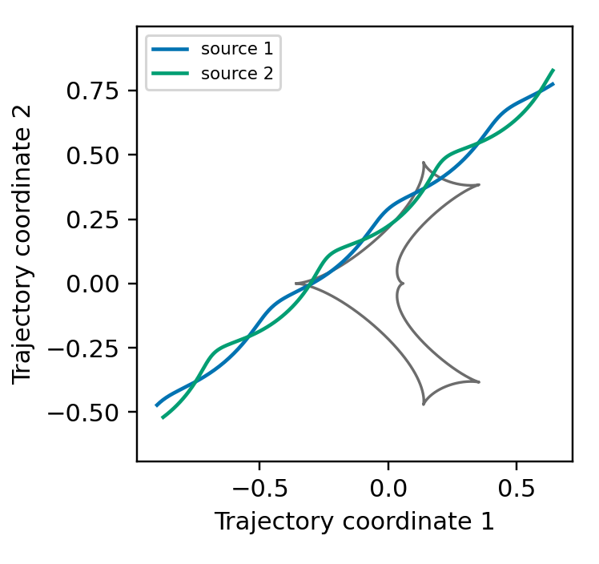

## Binary source + lens orbit + xallarap

```python
parameters = dict(base, rho1=0.0, rho2=0.0, flux_ratio=0.4,
                  source_mass_ratio=0.7)
curve = lcbinint.LightCurve(options=options, model=lcbinint.Model(
    source="binary", orbital_motion="circular", xallarap="circular_velocity",
    source_orbit_coordinates="xallarap", t_ref=7500.0,
))
components = curve.binary_source_components(times, parameters)
magnification = components.total
caustics = curve.caustics(7500.0, parameters)
```

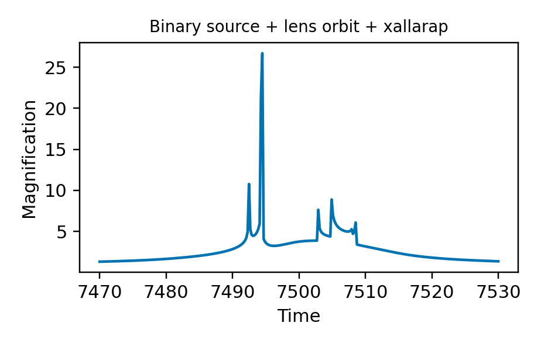
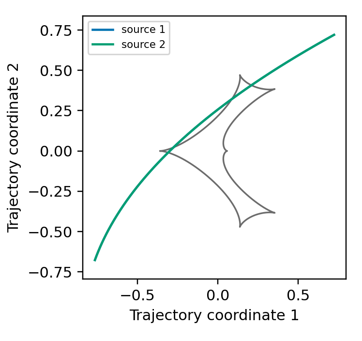

## Binary source + parallax + lens orbit + xallarap

```python
parameters = dict(base, rho1=0.0, rho2=0.0, flux_ratio=0.4,
                  source_mass_ratio=0.7)
curve = lcbinint.LightCurve(options=options, model=lcbinint.Model(
    source="binary", parallax=True, orbital_motion="circular",
    xallarap="circular_velocity", source_orbit_coordinates="xallarap",
    sky=sky, t_ref=7500.0,
))
components = curve.binary_source_components(times, parameters)
magnification = components.total
caustics = curve.caustics(7500.0, parameters)
```

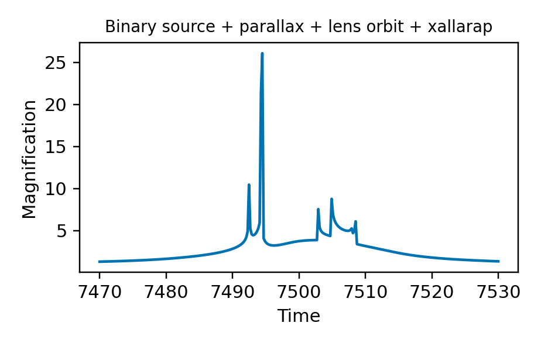
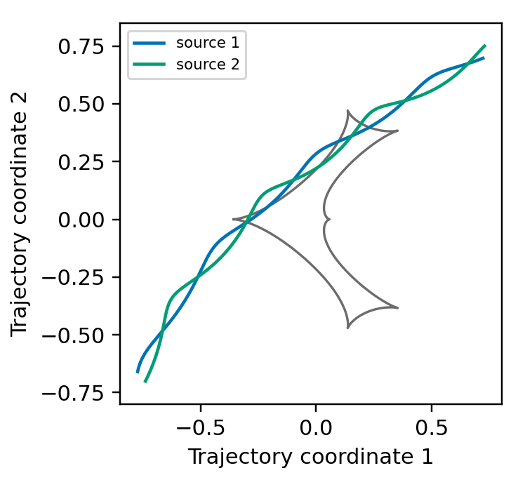

[Previous: Combining higher-order effects](CombinedEffects.md) · [Documentation home](readme.md)
