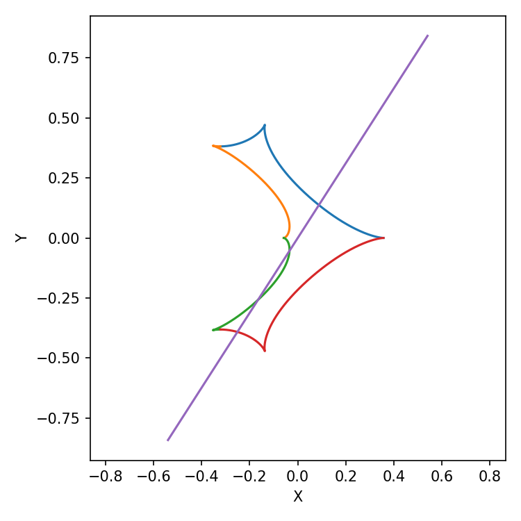
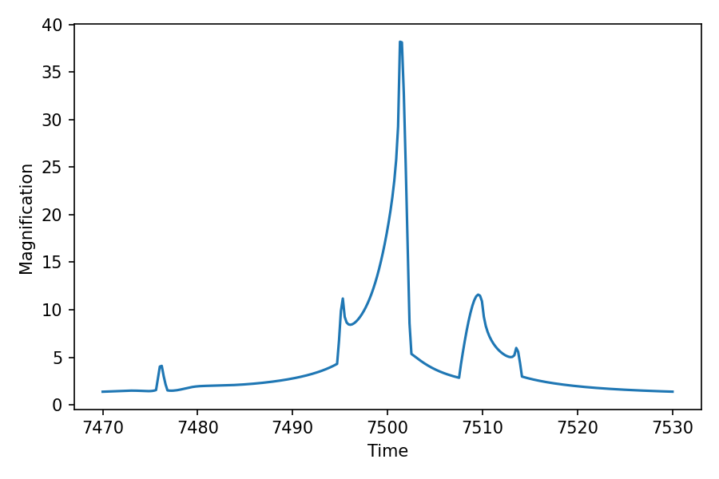
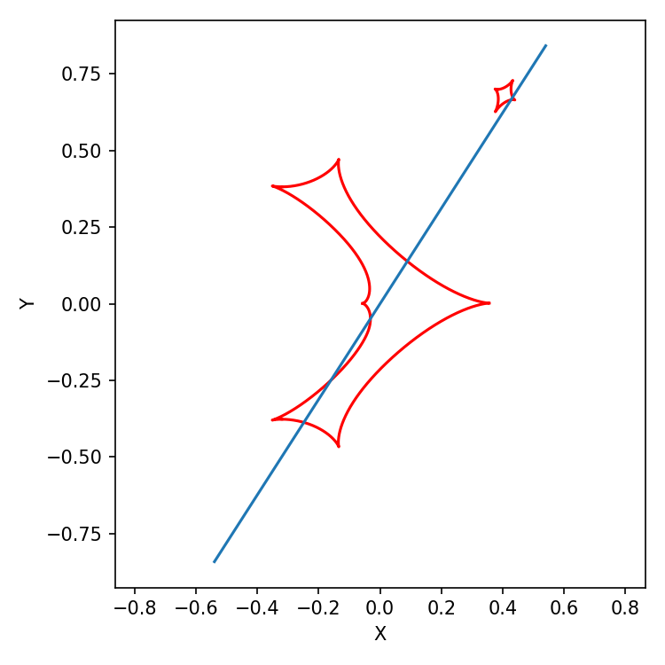

[Back to documentation](readme.md)

# Light Curve Functions

## Binary Lens light curve

The values below are used unchanged throughout the calculation.

```python
import numpy as np
import matplotlib.pyplot as plt
import lcbinint

s = 0.9
q = 0.1
u0 = 0.0
alpha = 1.0
rho = 0.01
tE = 30.0
t0 = 7500

params = {
    "s": s, "q": q, "u0": u0, "alpha": alpha,
    "rho": rho, "tE": tE, "t0": t0,
}
t = np.linspace(t0 - tE, t0 + tE, 300)

curve = lcbinint.LightCurve(options=lcbinint.Options(tol=1e-3, reltol=1e-3))
magnifications = curve(t, params)
trajectory = curve.source_trajectory(t, params)
```

Plot only the light curve:

```python
plt.figure()
plt.plot(t, magnifications)
plt.xlabel("Time")
plt.ylabel("Magnification")
plt.show()
```


Calculate and plot the caustics and source trajectory separately:

```python
caustics = curve.caustics(params)

plt.figure(figsize=(5, 5))
for x, y in zip(caustics.x, caustics.y):
    plt.plot(-np.asarray(x), -np.asarray(y))
plt.plot(-np.asarray(trajectory.x), -np.asarray(trajectory.y))
plt.xlabel("X")
plt.ylabel("Y")
plt.axis("equal")
plt.show()
```



## Triple Lens light curve

```python
s = 0.9
q = 0.1
u0 = 0.0
alpha = 1.0
rho = 0.01
tE = 30.0
t0 = 7500
s13 = 1.5
q3 = 0.003
psi = 1.0

params = {
    "s": s, "q": q, "u0": u0, "alpha": alpha,
    "rho": rho, "tE": tE, "t0": t0,
    "sep2": s13, "q2": q3, "ang": psi,
}
t = np.linspace(t0 - tE, t0 + tE, 300)

curve = lcbinint.LightCurve(
    lens="triple",
    options=lcbinint.Options(tol=1e-3, reltol=1e-3),
)
magnifications = curve(t, params)
trajectory = curve.source_trajectory(t, params)
```

Plot only the light curve:

```python
plt.figure()
plt.plot(t, magnifications)
plt.xlabel("Time")
plt.ylabel("Magnification")
plt.show()
```



Calculate and plot the caustics and source trajectory separately:

```python
caustics = curve.caustics(params)

plt.figure(figsize=(5, 5))
for x, y in zip(caustics.x, caustics.y):
    plt.plot(-np.asarray(x), -np.asarray(y), "r")
plt.plot(-np.asarray(trajectory.x), -np.asarray(trajectory.y))
plt.xlabel("X")
plt.ylabel("Y")
plt.axis("equal")
plt.show()
```



[Go to Parallax](Parallax.md)
