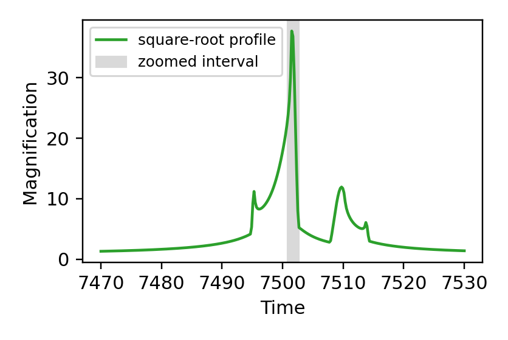

[Previous: Critical curves and caustics](CriticalCurvesAndCaustics.md) · [Documentation home](readme.md) · [Next: Accuracy control](AccuracyControl.md)

# Limb darkening

> VBMicrolensing correspondence: [LimbDarkening.md](https://github.com/valboz/VBMicrolensing/blob/main/docs/python/LimbDarkening.md). The linear coefficient `0.51` and square-root coefficients `0.51, 0.3` are retained.

Limb darkening is a property of a light-curve calculation, so configure it when
creating `LightCurve`. It is not a per-call argument. The event below crosses a
binary-lens caustic; the full light curve gives the event context, and the
following zoom makes the profile-dependent part visible.

## Configure `LightCurve`

```python
import numpy as np
import matplotlib.pyplot as plt
import lcbinint

params = {
    "s": 0.9, "q": 0.1, "u0": 0.0, "alpha": 1.0,
    "rho": 0.01, "tE": 30.0, "t0": 7500.0,
}
t = np.linspace(params["t0"] - params["tE"], params["t0"] + params["tE"], 300)
zoom_t = np.linspace(7500.8, 7502.6, 500)
options = lcbinint.Options(tol=1e-3, reltol=1e-3)

uniform_curve = lcbinint.LightCurve(
    options=options,
    limb_darkening=lcbinint.LimbDarkening.none(),
)
linear_curve = lcbinint.LightCurve(
    options=options,
    limb_darkening=lcbinint.LimbDarkening.linear(0.51),
)
square_root_curve = lcbinint.LightCurve(
    options=options,
    limb_darkening=lcbinint.LimbDarkening.square_root(0.51, 0.3),
)
```

`none()` is a uniform source. `linear(u)` uses the linear coefficient `u`.
`square_root(c, d)` uses the native two-coefficient profile
`I(μ) = 1 - c(1-μ) - d(1-√μ)`.

First, calculate the complete caustic-crossing event. The shaded interval is
the part enlarged below.

```python
full_magnification = square_root_curve(t, params)

plt.figure(figsize=(3.8, 2.55))
plt.plot(t, full_magnification, color="tab:green", label="square-root profile")
plt.axvspan(7500.8, 7502.6, color="0.85", zorder=0, label="zoomed interval")
plt.xlabel("Time")
plt.ylabel("Magnification")
plt.legend(fontsize=8)
plt.show()
```



Now evaluate the three configured profiles only across the caustic-crossing
interval:

```python
uniform = uniform_curve(zoom_t, params)
linear = linear_curve(zoom_t, params)
square_root = square_root_curve(zoom_t, params)

plt.figure(figsize=(5.5, 3.2))
plt.plot(zoom_t, uniform, label="uniform")
plt.plot(zoom_t, linear, label="linear: 0.51")
plt.plot(zoom_t, square_root, label="square root: 0.51, 0.3")
plt.xlabel("Time")
plt.ylabel("Magnification")
plt.legend(loc="center left", bbox_to_anchor=(1.02, 0.5), fontsize=8)
plt.show()
```


Quadratic, logarithmic, user-defined, and simultaneous multi-band profiles are
not native profiles in the current `lcbinint` Python API. The historical
`LimbDarkening.quadratic(c, d)` compatibility alias maps to the same two
coefficients as `square_root(c, d)`; use the explicit name in new code.

[Previous: Critical curves and caustics](CriticalCurvesAndCaustics.md) · [Documentation home](readme.md) · [Next: Accuracy control](AccuracyControl.md)
