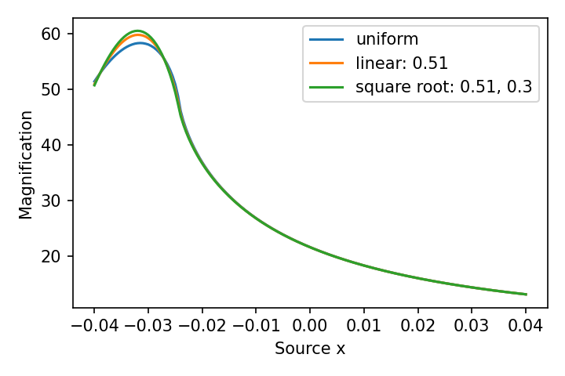

[Previous: Critical curves and caustics](CriticalCurvesAndCaustics.md) · [Documentation home](readme.md) · [Next: Accuracy control](AccuracyControl.md)

# Limb darkening

> VBMicrolensing correspondence: [LimbDarkening.md](https://github.com/valboz/VBMicrolensing/blob/main/docs/python/LimbDarkening.md). The coefficients and source/lens position are retained.

## Linear limb darkening

```python
import lcbinint

s = 0.8
q = 0.1
y1 = 0.01
y2 = 0.01
rho = 0.01
a1 = 0.51

mag = lcbinint.binary_ray_shooting(
    y1, y2, s=s, q=q, rho=rho,
    limb_darkening=lcbinint.LimbDarkening.linear(a1),
)
print("Magnification with limb-darkened source =", mag)
```

## Square-root limb darkening

```python
a1 = 0.51
a2 = 0.3

mag = lcbinint.binary_ray_shooting(
    y1, y2, s=s, q=q, rho=rho,
    limb_darkening=lcbinint.LimbDarkening.square_root(a1, a2),
)
print("Magnification with square-root limb-darkened source =", mag)
```

The single-position values above are easier to interpret when the source is
moved across the same binary lens:

```python
import numpy as np
import matplotlib.pyplot as plt

x = np.linspace(-0.04, 0.04, 161)
uniform = np.array([
    lcbinint.binary_ray_shooting(xi, y2, s=s, q=q, rho=rho)
    for xi in x
])
linear = np.array([
    lcbinint.binary_ray_shooting(
        xi, y2, s=s, q=q, rho=rho,
        limb_darkening=lcbinint.LimbDarkening.linear(0.51),
    )
    for xi in x
])
square_root = np.array([
    lcbinint.binary_ray_shooting(
        xi, y2, s=s, q=q, rho=rho,
        limb_darkening=lcbinint.LimbDarkening.square_root(0.51, 0.3),
    )
    for xi in x
])

plt.plot(x, uniform, label="uniform")
plt.plot(x, linear, label="linear: 0.51")
plt.plot(x, square_root, label="square root: 0.51, 0.3")
plt.xlabel("Source x")
plt.ylabel("Magnification")
plt.legend()
plt.show()
```



Quadratic, logarithmic, user-defined, and simultaneous multi-band profiles are
not native profiles in the current `lcbinint` Python API. The historical
`LimbDarkening.quadratic(c, d)` compatibility alias maps to the same two
coefficients as `square_root(c, d)`; use the explicit name in new code.

[Previous: Critical curves and caustics](CriticalCurvesAndCaustics.md) · [Documentation home](readme.md) · [Next: Accuracy control](AccuracyControl.md)
