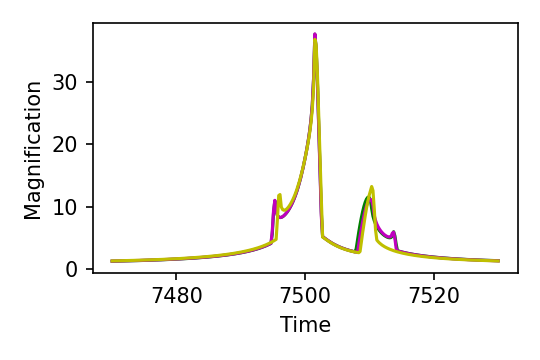
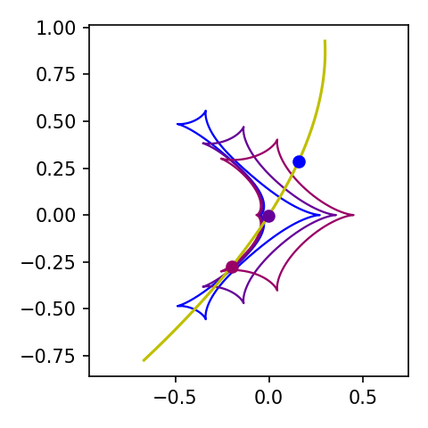

[Previous: Parallax](Parallax.md) · [Documentation home](readme.md) · [Next: Binary sources](BinarySources.md)

# Orbital motion

> VBMicrolensing correspondence: [OrbitalMotion.md](https://github.com/valboz/VBMicrolensing/blob/main/docs/python/OrbitalMotion.md). The circular-orbit example uses the same `gamma1`, `gamma2`, and `gamma3` values.

## Circular orbital motion

```python
import numpy as np
import matplotlib.pyplot as plt
import lcbinint

s = 0.9
q = 0.1
u0 = 0.0
alpha = 1.0
rho = 0.01
tE = 30.0
t0 = 7500
piEN = 0.3
piEE = -0.2
gamma1 = 0.011
gamma2 = -0.005
gamma3 = 0.005

params = {
    "s": s, "q": q, "u0": u0, "alpha": alpha,
    "rho": rho, "tE": tE, "t0": t0,
    "piEN": piEN, "piEE": piEE,
    "g1": gamma1, "g2": gamma2, "g3": gamma3,
}
t = np.linspace(t0 - tE, t0 + tE, 300)
sky = lcbinint.obs.SkyCoord("17:59:02.3", "-29:04:15.2")
options = lcbinint.Options(tol=1e-3, reltol=1e-3)

static_curve = lcbinint.LightCurve(options=options)
parallax_curve = lcbinint.LightCurve(
    model=lcbinint.Model(parallax=True, sky=sky, t_ref=t0),
    options=options,
)
orbital_curve = lcbinint.LightCurve(
    model=lcbinint.Model(
        parallax=True,
        orbital_motion="circular",
        sky=sky,
        t_ref=t0,
    ),
    options=options,
)

magnifications = static_curve(t, params)
magnifications_parallax = parallax_curve(t, params)
magnifications_orbital = orbital_curve(t, params)
trajectory_orbital = orbital_curve.source_trajectory(t, params)
```

Plot the three light curves:

```python
plt.figure(figsize=(3.6, 2.4))
plt.plot(t, magnifications, "g")
plt.plot(t, magnifications_parallax, "m")
plt.plot(t, magnifications_orbital, "y")
plt.xlabel("Time")
plt.ylabel("Magnification")
plt.show()
```



Plot caustics at the same three array indices used in the example:

```python
caustic_indices = [100, 150, 200]
colors = [(0, 0, 1, 1), (0.4, 0, 0.6, 1), (0.6, 0, 0.4, 1)]

plt.figure(figsize=(3.2, 3.2))
for index, color in zip(caustic_indices, colors):
    caustics = orbital_curve.caustics(float(t[index]), params)
    for x, y in zip(caustics.x, caustics.y):
        plt.plot(-np.asarray(x), -np.asarray(y), color=color, lw=1.1)

source_x = -np.asarray(trajectory_orbital.x)
source_y = -np.asarray(trajectory_orbital.y)
plt.plot(source_x, source_y, "y")
for index, color in zip(caustic_indices, colors):
    plt.plot([source_x[index]], [source_y[index]], color=color, marker="o")
plt.axis("equal")
plt.show()
```



The current `lcbinint` triple-lens model does not expose triple-lens orbital
caustics, so that example is not substituted with a static geometry.

[Previous: Parallax](Parallax.md) · [Documentation home](readme.md) · [Next: Binary sources](BinarySources.md)
