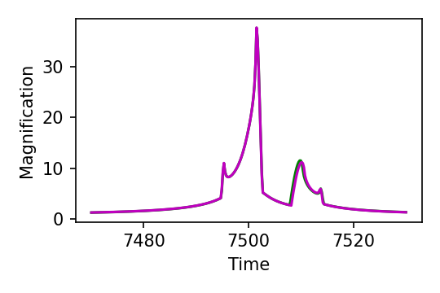
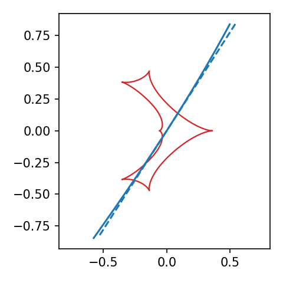
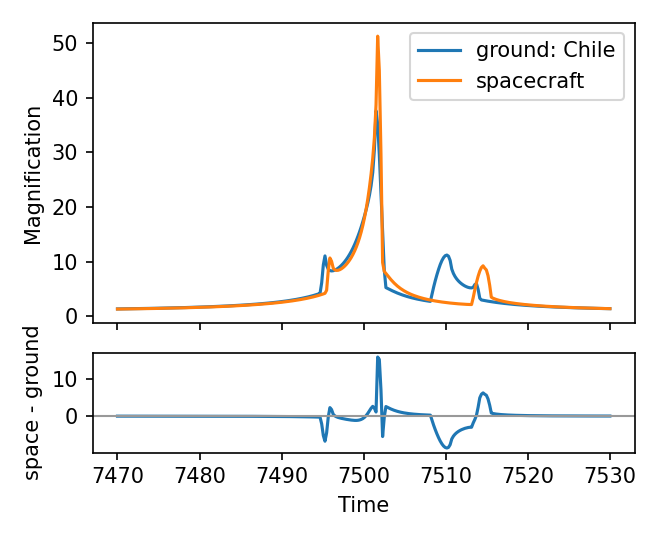
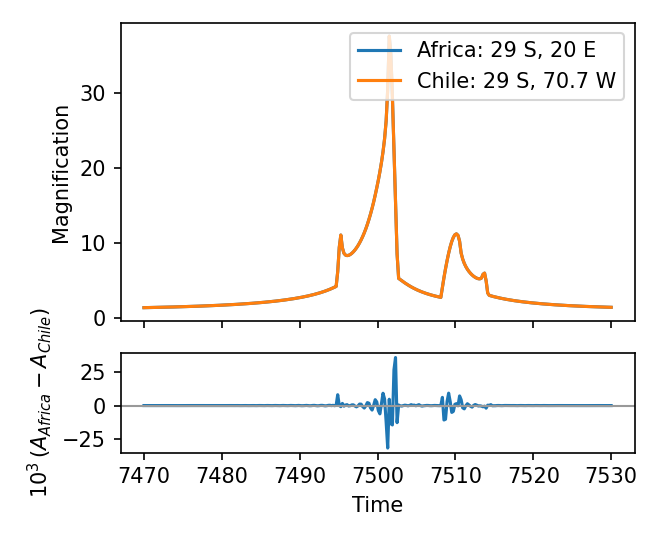

[Previous: Coordinates and conventions](Coordinates.md) · [Documentation home](readme.md) · [Next: Orbital motion](OrbitalMotion.md)

# Parallax

> VBMicrolensing correspondence: [Parallax.md](https://github.com/valboz/VBMicrolensing/blob/main/docs/python/Parallax.md). Target coordinates, parallax components, and example epochs are kept aligned.

## Target coordinates

```python
sky = lcbinint.obs.SkyCoord("17:59:02.3", "-29:04:15.2")
```

## Light curve functions with parallax

```python
import numpy as np
import matplotlib.pyplot as plt
import lcbinint

s = 0.9
q = 0.1
u0 = 0.0
alpha = 1.0
rho = 0.01
tE = 30.0
t0 = 7500
piEN = 0.3
piEE = -0.2

params = {
    "s": s, "q": q, "u0": u0, "alpha": alpha,
    "rho": rho, "tE": tE, "t0": t0,
    "piEN": piEN, "piEE": piEE,
}
t = np.linspace(t0 - tE, t0 + tE, 300)

options = lcbinint.Options(tol=1e-3, reltol=1e-3)
static_curve = lcbinint.LightCurve(options=options)
parallax_curve = lcbinint.LightCurve(
    model=lcbinint.Model(parallax=True, sky=sky, t_ref=t0),
    options=options,
)

magnifications = static_curve(t, params)
magnifications_parallax = parallax_curve(t, params)
trajectory = static_curve.source_trajectory(t, params)
trajectory_parallax = parallax_curve.source_trajectory(t, params)
```

Plot the static and parallax light curves:

```python
plt.figure(figsize=(3.6, 2.4))
plt.plot(t, magnifications, "g")
plt.plot(t, magnifications_parallax, "m")
plt.xlabel("Time")
plt.ylabel("Magnification")
plt.show()
```



Plot the caustics and trajectories in a separate block:

```python
caustics = static_curve.caustics(params)

plt.figure(figsize=(3.2, 3.2))
for x, y in zip(caustics.x, caustics.y):
    plt.plot(-np.asarray(x), -np.asarray(y), color="tab:red", lw=1.1)
plt.plot(
    -np.asarray(trajectory.x), -np.asarray(trajectory.y),
    color="tab:blue", linestyle="--",
)
plt.plot(
    -np.asarray(trajectory_parallax.x), -np.asarray(trajectory_parallax.y),
    color="tab:blue",
)
plt.axis("equal")
plt.show()
```



## Satellite Parallax

For a space observatory, pass a table with `(JD, RA_deg, Dec_deg, distance_AU)`
columns to its own site while reusing the same physical model. The small table
below is an illustrative ephemeris that keeps this example self-contained;
replace it with the observatory ephemeris for a real event.

```python
satellite_phase = np.linspace(-1.0, 1.0, len(t))
satellite_table = np.column_stack([
    2450000.0 + t,
    270.0 + 12.0 * satellite_phase,
    -20.0 + 4.0 * np.sin(np.pi * satellite_phase),
    0.55 + 0.05 * satellite_phase,
])
satellite_model = lcbinint.Model(
    parallax=True,
    terrestrial=True,
    sky=sky,
    t_ref=t0,
)
ground_curve = lcbinint.LightCurve(
    model=satellite_model,
    site=lcbinint.obs.Site("ground", -29.0, -70.7),
    options=options,
)
space_curve = lcbinint.LightCurve(
    model=satellite_model,
    site=lcbinint.obs.Site("space", satellite_table),
    options=options,
)
magnifications_ground = ground_curve(t, params)
magnifications_satellite = space_curve(t, params)
```

Plot the Earth and spacecraft observations together, then isolate the
spacecraft contribution in a difference panel:

```python
fig, (curve_ax, difference_ax) = plt.subplots(
    2, 1, sharex=True, figsize=(4.4, 3.6),
    gridspec_kw={"height_ratios": [3, 1]},
)
curve_ax.plot(t, magnifications_ground, label="ground: Chile")
curve_ax.plot(t, magnifications_satellite, label="spacecraft")
curve_ax.set_ylabel("Magnification")
curve_ax.legend()
difference_ax.plot(t, magnifications_satellite - magnifications_ground)
difference_ax.axhline(0.0, color="0.6", linewidth=1)
difference_ax.set(xlabel="Time", ylabel="space - ground")
fig.tight_layout()
plt.show()
```



## Terrestrial parallax

```python
terrestrial_model = lcbinint.Model(
    parallax=True,
    terrestrial=True,
    sky=sky,
    t_ref=t0,
)
africa = lcbinint.LightCurve(
    model=terrestrial_model,
    site=lcbinint.obs.Site("ground", -29.0, 20.0),
    options=options,
)
chile = lcbinint.LightCurve(
    model=terrestrial_model,
    site=lcbinint.obs.Site("ground", -29.0, -70.7),
    options=options,
)
magnifications_africa = africa(t, params)
magnifications_chile = chile(t, params)
```

The terrestrial signal is much smaller than the annual or satellite signal,
so show the two observatories together and magnify their difference in a lower
panel:

```python
fig, (curve_ax, difference_ax) = plt.subplots(
    2, 1, sharex=True, figsize=(4.4, 3.6),
    gridspec_kw={"height_ratios": [3, 1]},
)
curve_ax.plot(t, magnifications_africa, label="Africa: 29 S, 20 E")
curve_ax.plot(t, magnifications_chile, label="Chile: 29 S, 70.7 W")
curve_ax.set_ylabel("Magnification")
curve_ax.legend()
difference_ax.plot(t, 1e3 * (magnifications_africa - magnifications_chile))
difference_ax.axhline(0.0, color="0.6", linewidth=1)
difference_ax.set(xlabel="Time", ylabel=r"$10^3\,(A_{Africa}-A_{Chile})$")
fig.tight_layout()
plt.show()
```



[Previous: Coordinates and conventions](Coordinates.md) · [Documentation home](readme.md) · [Next: Orbital motion](OrbitalMotion.md)
