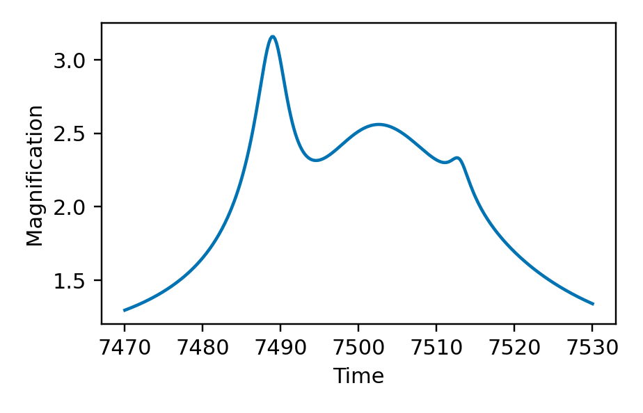
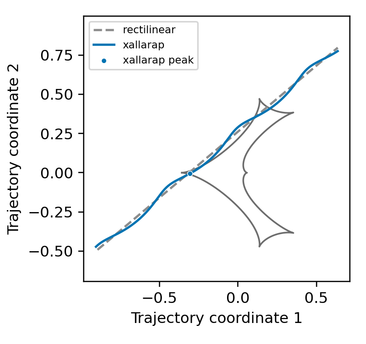

[Previous: Binary sources](BinarySources.md) · [Documentation home](readme.md) · [Next: Binary source + xallarap](BinarySourceXallarap.md)

# Xallarap

Xallarap adds orbital motion to a single source. Configure the orbit on
`LightCurve` and pass the orbit state with the ordinary lens parameters.

| Mode | Orbit parameters |
| --- | --- |
| `"circular_elements"` | `xi_1`, `xi_2`, `period_xa`, `inc_xa` |
| `"orbital_elements"` | `xi_1`, `xi_2`, `period_xa`, `ecc_xa`, `peri_xa`, `inc_xa` |
| `"circular_velocity"` | `xi_1`, `xi_2`, `w1`, `w2`, `w3` |
| `"kepler_velocity"` | `xi_1`, `xi_2`, `w1`, `w2`, `w3`, `xa_szs`, `xa_ar` |

## Circular velocity

This example is the source-1 trajectory from the
[binary-source + xallarap](BinarySourceXallarap.md) example, evaluated as a
single source. The gray curve is the rectilinear case with the same lens and
event parameters.

```python
import numpy as np
import matplotlib.pyplot as plt
import lcbinint

times = np.linspace(7470.0, 7530.0, 300)
parameters = {
    "s": 0.9, "q": 0.1, "alpha": 0.7, "tE": 30.0,
    "t0": 7500.0, "u0": 0.20, "rho": 0.004,
    "xi_1": 0.02, "xi_2": -0.01,
    "w1": 0.004, "w2": 0.35, "w3": 0.08,
}
static_curve = lcbinint.LightCurve()
curve = lcbinint.LightCurve(xallarap="circular_velocity", t_ref=7500.0)
rectilinear_parameters = dict(parameters)
for key in ("xi_1", "xi_2", "w1", "w2", "w3"):
    rectilinear_parameters.pop(key)

static_magnification = static_curve(times, rectilinear_parameters)
magnification = curve(times, parameters)
```

```python
plt.figure(figsize=(4.2, 2.7))
plt.plot(times, static_magnification, color="0.55", ls="--", label="rectilinear")
plt.plot(times, magnification, color="#0173B2", label="xallarap")
plt.xlabel("Time")
plt.ylabel("Magnification")
plt.legend(loc="upper left", fontsize=8)
plt.show()
```



```python
trajectory = curve.source_trajectory(times, parameters)
static_trajectory = static_curve.source_trajectory(times, rectilinear_parameters)
caustics = static_curve.caustics(rectilinear_parameters)

plt.figure(figsize=(3.4, 3.2))
for x, y in zip(caustics.x, caustics.y):
    plt.plot(x, y, color="#6C6C6C", lw=1.1)
plt.plot(static_trajectory.x, static_trajectory.y, color="0.55", ls="--", label="rectilinear")
plt.plot(trajectory.x, trajectory.y, color="#0173B2", label="xallarap")
plt.xlabel("Trajectory coordinate 1")
plt.ylabel("Trajectory coordinate 2")
plt.axis("equal")
plt.legend(fontsize=7)
plt.show()
```



For the element parameterizations, replace `xallarap="circular_velocity"`
with the corresponding mode and supply the parameters listed in the table.

[Previous: Binary sources](BinarySources.md) · [Documentation home](readme.md) · [Next: Binary source + xallarap](BinarySourceXallarap.md)
