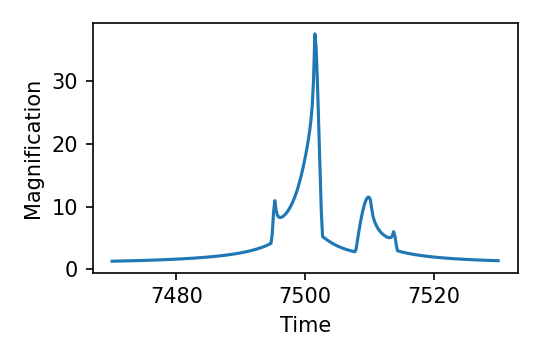

# <span style="color:red">`lcbinint`</span>

# Documentation

> Corresponding VBMicrolensing page: [Python documentation home](https://github.com/valboz/VBMicrolensing/blob/main/docs/python/readme.md). This guide keeps the same worked-example progression and translates each calculation to the `lcbinint` API.

This guide describes the supported Python workflows through examples that can
be copied directly into a program. Calculation and visualization are kept in
separate code blocks so each result is easy to inspect.

## Quick start

```python
import numpy as np
import lcbinint

s = 0.9       # Separation between the lenses
q = 0.1       # Mass ratio
u0 = 0.0      # Impact parameter with respect to center of mass
alpha = 1.0   # Angle of the source trajectory
rho = 0.01    # Source radius
tE = 30.0     # Einstein time in days
t0 = 7500     # Time of closest approach to center of mass

params = {
    "s": s, "q": q, "u0": u0, "alpha": alpha,
    "rho": rho, "tE": tE, "t0": t0,
}
t = np.linspace(t0 - tE, t0 + tE, 300)

curve = lcbinint.LightCurve(options=lcbinint.Options(tol=1e-3, reltol=1e-3))
magnifications = curve(t, params)
trajectory = curve.source_trajectory(t, params)
```

Plot the light curve in its own block:

```python
import matplotlib.pyplot as plt

plt.plot(t, magnifications)
plt.xlabel("Time")
plt.ylabel("Magnification")
plt.show()
```



## Contents

- [Binary lenses](BinaryLenses.md)
- [Light curves](LightCurves.md)
- [Critical curves and caustics](CriticalCurvesAndCaustics.md)
- [Limb darkening](LimbDarkening.md)
- [Accuracy control](AccuracyControl.md)
- [Coordinates](Coordinates.md)
- [Parallax](Parallax.md)
- [Orbital motion](OrbitalMotion.md)
- [Binary sources](BinarySources.md)
- [Xallarap](Xallarap.md)
- [Binary source + xallarap](BinarySourceXallarap.md)
- [Combining higher-order effects](CombinedEffects.md)

`lcbinint` currently supports binary and triple lenses. Single-lens-only and
arbitrary four-or-more-lens examples are not represented by a different model.
