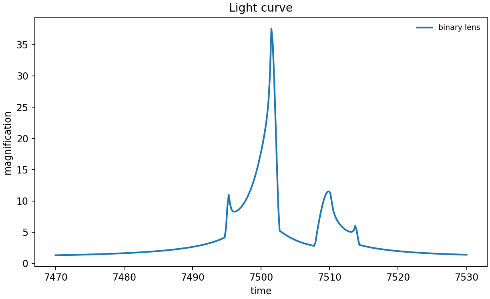
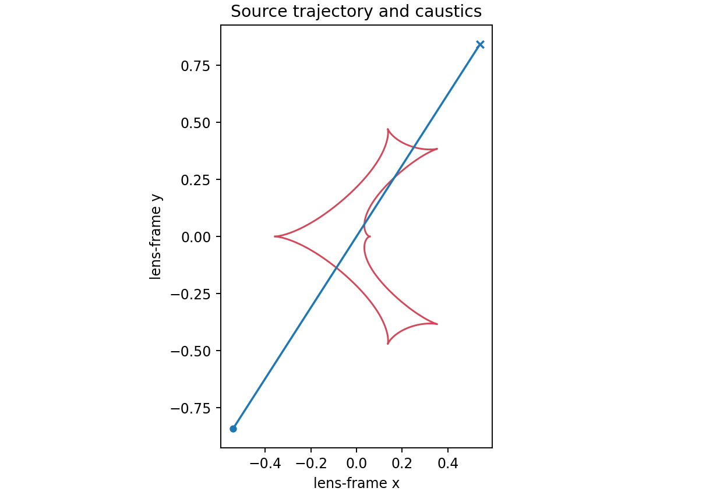

# 1. Binary lens: the baseline event

This reproduces the binary-lens quick-start configuration in the
VBMicrolensing documentation: `s=0.9`, `q=0.1`, `u0=0`, `alpha=1`,
`rho=0.01`, `tE=30`, and `t0=7500`. lcbinint takes direct named values rather
than VBM's positional array containing logarithms.

```python
times = np.linspace(7470.0, 7530.0, 300)
params = dict(t0=7500.0, tE=30.0, u0=0.0, alpha=1.0,
              s=0.9, q=0.1, rho=0.01)
options = lcbinint.Options(coordinates="vbm", nbin="auto", caustic_bins=600)
model = lcbinint.Model(lens="binary", source="single")
curve = lcbinint.LightCurve(options=options, model=model)
```





Run the complete example with:

```sh
PYTHONPATH=build python example/tutorials/binary_lens.py
```

The script uses the VBM example's finite source (`rho=0.01`) so its
caustic-crossing peak remains visible in a sampled plot. Select limb darkening if needed, and
inspect `curve.info(...).finite_source_converged` when setting an explicit
accuracy budget.

---

**Course navigation:** [Tutorial home](../README.md) · [Next: Parallax →](02-parallax.md)
