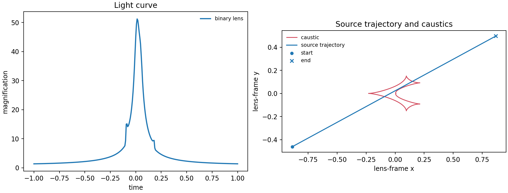

# 1. Binary lens: the baseline event

Begin with a reusable `LightCurve`, a time array, and the rectilinear binary
lens parameters. The right panel places that same source trajectory on the
binary caustics, so the bright peak has a geometric explanation.

```python
times = np.linspace(-1.0, 1.0, 301)
params = dict(t0=0.0, tE=1.0, u0=0.02, alpha=0.5,
              s=0.95, q=0.01, rho=0.0)
curve = lcbinint.LightCurve(options=lcbinint.Options(caustic_bins=600))
```



Run the complete example with:

```sh
PYTHONPATH=build python example/tutorials/binary_lens.py
```

The script uses a small finite source (`rho=0.005`) so its caustic-crossing
peak remains visible in a sampled plot. Select limb darkening if needed, and
inspect `curve.info(...).finite_source_converged` when setting an explicit
accuracy budget.

[Back to tutorial gallery](../effects-and-examples.md)
