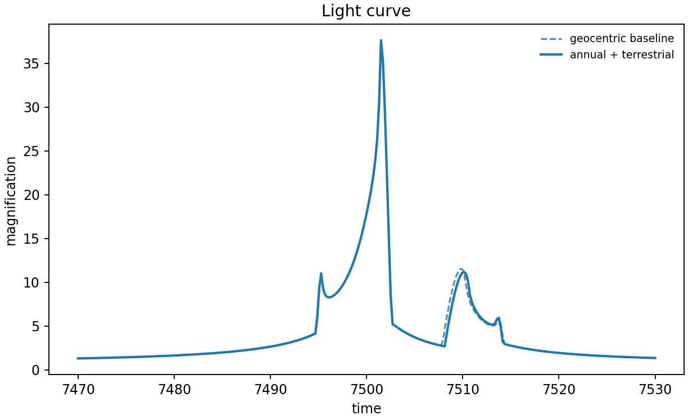
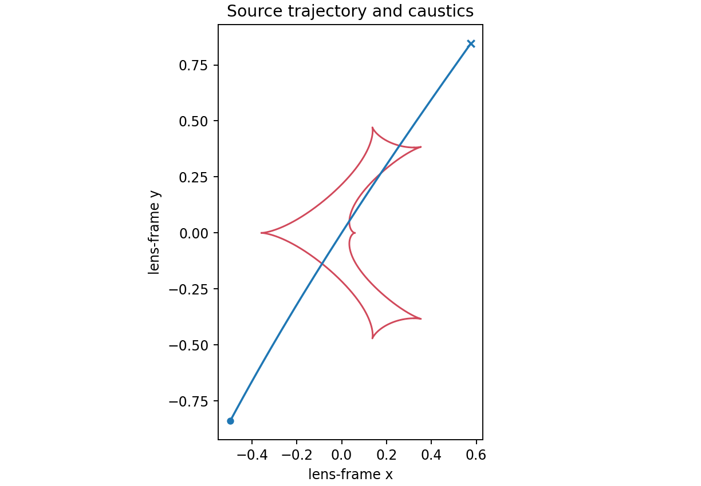

# 2. Parallax: annual and terrestrial observer motion

Parallax belongs to the physical `Model`, not merely to the parameter mapping.
This uses the VBM orbital/parallax example's `piEN=0.3`, `piEE=-0.2` and sky
position, then adds an explicit ground observatory for the lcbinint terrestrial
term.

```python
import numpy as np
import matplotlib.pyplot as plt
import lcbinint

t_ref = 7500.0
times = np.linspace(7470.0, 7530.0, 300)
params = dict(t0=t_ref, tE=30.0, u0=0.0, alpha=1.0,
              s=0.9, q=0.1, rho=0.01, piEN=0.3, piEE=-0.2)
options = lcbinint.Options(coordinates="vbm", nbin="auto", caustic_bins=600)

baseline_model = lcbinint.Model(lens="binary", source="single")
baseline = lcbinint.LightCurve(options=options, model=baseline_model)
model = lcbinint.Model(
    parallax=True, terrestrial=True,
    sky=lcbinint.obs.SkyCoord("17:59:02.3", "-29:04:15.2"), t_ref=t_ref,
)
ground = lcbinint.LightCurve(
    options=options, model=model,
    site=lcbinint.obs.Site("ground", -29.0, 70.7),
)

baseline_mag = baseline(times, params)
ground_mag = ground(times, params)
trajectory = ground.source_trajectory(times, params)
caustics = ground.caustics(params)

# Notebook cell 1: compare light curves.
fig, ax = plt.subplots(figsize=(7, 4))
ax.plot(times, baseline_mag, "--", color="0.45", label="geocentric")
ax.plot(times, ground_mag, color="C0", label="annual + terrestrial")
ax.set(xlabel="time", ylabel="magnification", title="Parallax light curve")
ax.legend(frameon=False)
fig.tight_layout()
fig.savefig("parallax-light-curve.png", dpi=170)

# Notebook cell 2: transformed trajectory and caustics.
fig, ax = plt.subplots(figsize=(7, 5))
for x, y in zip(caustics.x, caustics.y):
    ax.plot(x, y, color="C3", lw=1.2)
ax.plot(trajectory.x, trajectory.y, color="C0", lw=1.5)
ax.set(xlabel="lens-frame x", ylabel="lens-frame y",
       title="Parallax trajectory and caustics")
ax.set_aspect("equal", adjustable="box")
fig.tight_layout()
fig.savefig("parallax-geometry.png", dpi=170)
```





```sh
PYTHONPATH=build python example/tutorials/parallax.py
```

`piEN` and `piEE` do not activate parallax on their own. Annual parallax also
needs `sky` and `t_ref`; terrestrial parallax additionally needs `terrestrial=True`
and a ground `Site`. For a satellite, create a second curve with the same
model and `obs.Site("space", table)`.

The block is self-contained; it creates both plotted files directly.

---

**Course navigation:** [← Previous: Binary lens](01-binary-lens.md) · [Tutorial home](../README.md) · [Next: Lens orbital motion →](03-orbital-motion.md)
