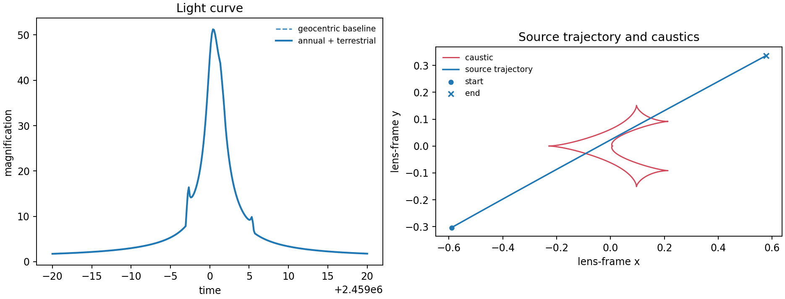

# 2. Parallax: annual and terrestrial observer motion

Parallax belongs to the physical `Model`, not merely to the parameter mapping.
This example compares the geocentric light curve with one using annual and
terrestrial parallax from an explicit ground observatory.

```python
model = lcbinint.Model(
    parallax=True, terrestrial=True,
    sky=lcbinint.obs.SkyCoord(270.0, -30.0), t_ref=2459000.0,
)
ground = lcbinint.LightCurve(
    model=model,
    site=lcbinint.obs.Site("ground", -29.0, 70.7),
)
params.update(piEN=0.15, piEE=-0.08)
```



```sh
PYTHONPATH=build python example/tutorials/parallax.py
```

`piEN` and `piEE` do not activate parallax on their own. Annual parallax also
needs `sky` and `t_ref`; terrestrial parallax additionally needs `terrestrial=True`
and a ground `Site`. For a satellite, create a second curve with the same
model and `obs.Site("space", table)`.

[Back to tutorial gallery](../effects-and-examples.md)
