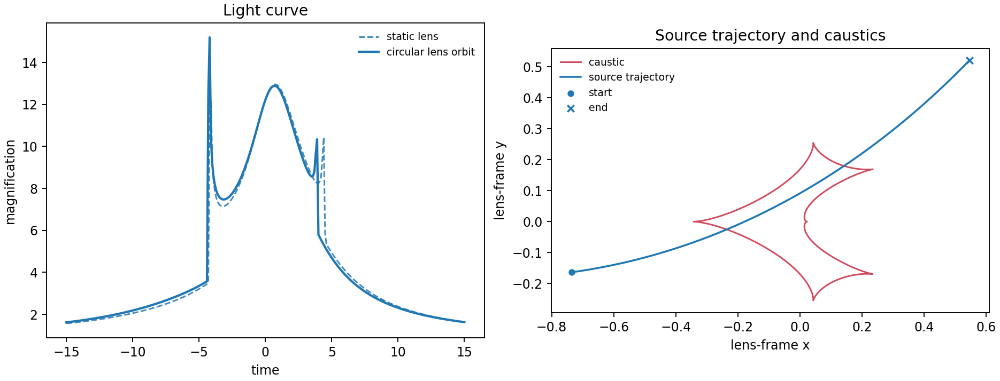

# 3. Lens orbital motion: evolve the caustics

Lens orbital motion makes the projected separation and orientation time
dependent. The figure shows a circular-orbit light curve against the static
case; the geometry panel draws caustics at the reference epoch.

```python
orbit = lcbinint.LightCurve(
    model=lcbinint.Model(orbital_motion="circular", t_ref=0.0)
)
params.update(g1=0.004, g2=0.011, g3=0.006)
```



```sh
PYTHONPATH=build python example/tutorials/orbital_motion.py
```

For Keplerian motion, use `orbital_motion="kepler"` and include `lom_szs` and
`lom_ar`. Geometry helpers require an epoch when orbital motion is active:
`curve.caustics(time, params)` and `curve.separation(time, params)`.

[Back to tutorial gallery](../effects-and-examples.md)
