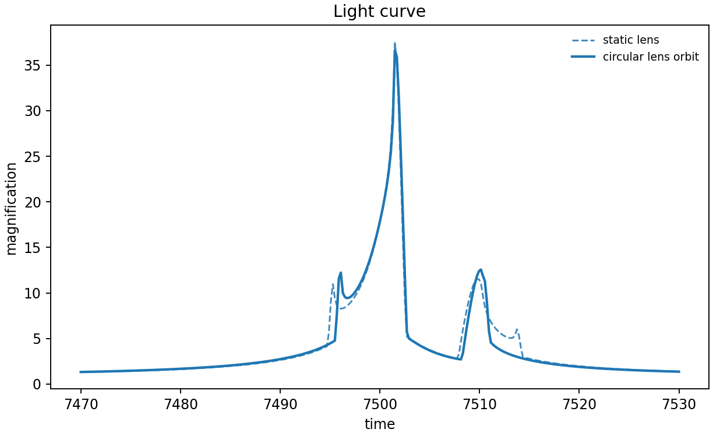
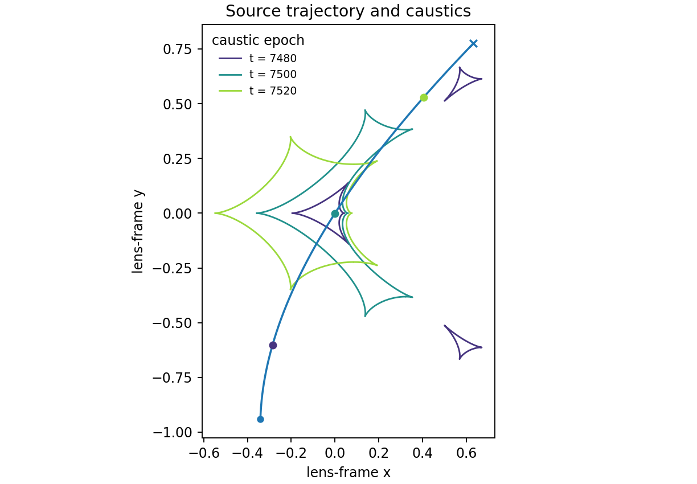

# 3. Lens orbital motion: evolve the caustics

Lens orbital motion makes the projected separation and orientation time
dependent. This reproduces VBM's circular-orbit example with `s=0.9`, `q=0.1`,
`u0=0`, `alpha=1`, `rho=0.01`, `tE=30`, `t0=7500`, and velocity components
`g1=0.011`, `g2=-0.005`, `g3=0.005`. The example compares static and orbiting
light curves, then overlays caustics at three epochs using matching source
position markers.

```python
options = lcbinint.Options(coordinates="vbm", nbin="auto", caustic_bins=600)
static_model = lcbinint.Model(lens="binary", source="single")
orbit_model = lcbinint.Model(
    lens="binary", source="single", orbital_motion="circular", t_ref=7500.0,
)
static = lcbinint.LightCurve(options=options, model=static_model)
orbit = lcbinint.LightCurve(options=options, model=orbit_model)

params = dict(
    t0=7500.0, tE=30.0, u0=0.0, alpha=1.0, s=0.9, q=0.1,
    rho=0.01, g1=0.011, g2=-0.005, g3=0.005,
)
```





```sh
PYTHONPATH=build python example/tutorials/orbital_motion.py
```

The complete script explicitly creates `options`, `static_model`, and
`orbit_model` before either `LightCurve`, then uses
`curve.caustics(epoch, params)` for the three caustic snapshots. Copy it as a whole from
[`example/tutorials/orbital_motion.py`](../../example/tutorials/orbital_motion.py).

For Keplerian motion, use `orbital_motion="kepler"` and include `lom_szs` and
`lom_ar`.

---

**Course navigation:** [← Previous: Parallax](02-parallax.md) · [Tutorial home](../README.md) · [Next: Xallarap →](04-xallarap.md)
