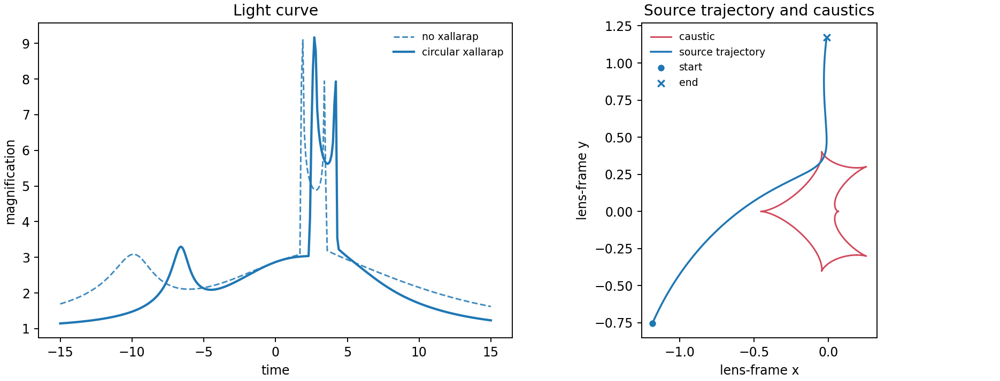

# 4. Xallarap: source orbital motion

Xallarap moves the source rather than the lens. This circular-elements example
places the perturbed light curve and source trajectory against the no-xallarap
baseline.

```python
xallarap = lcbinint.LightCurve(xallarap="circular_elements")
params.update(
    xi_1=0.25, xi_2=-0.1,
    period_xa=35.0, inc_xa=1.1,
)
```



```sh
PYTHONPATH=build python example/tutorials/xallarap.py
```

The other supported parameterizations are `orbital_elements`,
`circular_velocity`, and `kepler_velocity`. Use exactly the parameter set for
the selected mode; see the [Python API reference](../python-api.md).

[Back to tutorial gallery](../effects-and-examples.md)
