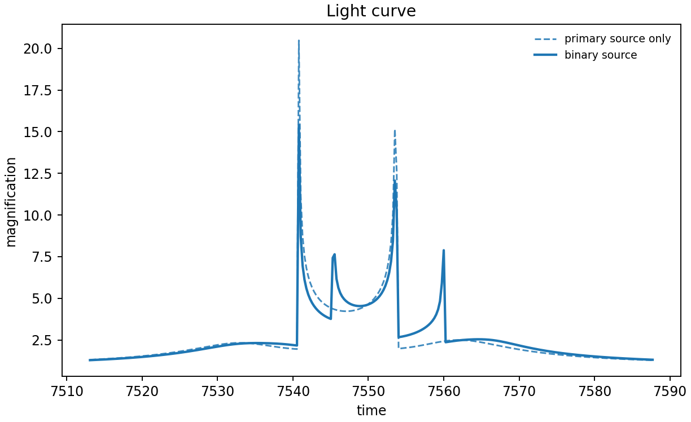
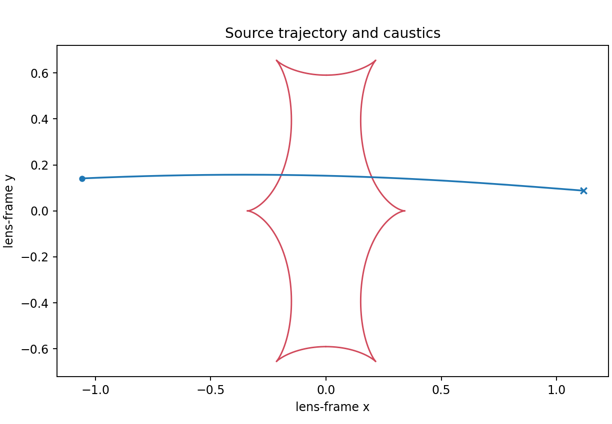

# 5. Binary source: combine two source trajectories

A binary source is the flux-weighted superposition of two source trajectories.
This reproduces the VBM `BinSourceExtLightCurveXallarap` example: `tE=37.3`,
`FR=0.4`, `u01=0.1`, `u02=0.05`, `t01=7550.4`, `t02=7555.8`, `rho=0.004`,
parallax `(0.03, -0.02)`, and source-orbit velocity `(w1, w2, w3)`.
In lcbinint, VBM's `FR` is named `q_source`.

```python
import numpy as np
import matplotlib.pyplot as plt
import lcbinint

times = np.linspace(7550.4 - 37.3, 7550.4 + 37.3, 300)
params = dict(
    t0=7550.4, tE=37.3, u0=0.1, alpha=0.0, s=1.0, q=1.0, rho=0.004,
    t0_2=7555.8, u0_2=0.05, q_source=0.4,
    piEN=0.03, piEE=-0.02, xi_1=0.1, xi_2=0.05,
    w1=0.021, w2=-0.02, w3=0.03,
)
options = lcbinint.Options(coordinates="vbm", nbin="auto", caustic_bins=600)
model = lcbinint.Model(lens="binary", source="binary", xallarap="circular_velocity")
curve = lcbinint.LightCurve(options=options, model=model)

magnification = curve(times, params)
trajectory = curve.source_trajectory(times, {k: v for k, v in params.items()
                                               if k not in {"q_source", "t0_2", "u0_2"}})
caustics = curve.caustics({k: v for k, v in params.items()
                            if k not in {"q_source", "t0_2", "u0_2"}})

fig, ax = plt.subplots(figsize=(7, 4))
ax.plot(times, magnification, color="C0")
ax.set(xlabel="time", ylabel="magnification", title="Binary source with xallarap")
fig.tight_layout()
fig.savefig("binary-source-light-curve.png", dpi=170)

fig, ax = plt.subplots(figsize=(7, 5))
for x, y in zip(caustics.x, caustics.y):
    ax.plot(x, y, color="C3", lw=1.2)
ax.plot(trajectory.x, trajectory.y, color="C0", lw=1.5)
ax.set(xlabel="lens-frame x", ylabel="lens-frame y", title="Primary trajectory and caustics")
ax.set_aspect("equal", adjustable="box")
fig.tight_layout()
fig.savefig("binary-source-geometry.png", dpi=170)
```





```sh
PYTHONPATH=build python example/tutorials/binary_source.py
```

The code block is self-contained. The geometry panel intentionally shows the
primary trajectory; `LightCurve.source_trajectory()` returns one trajectory,
whereas the magnification above is the two-source flux-weighted result.

---

**Course navigation:** [← Previous: Xallarap](04-xallarap.md) · [Tutorial home](../README.md) · [Next: Triple lens →](06-triple-lens.md)
