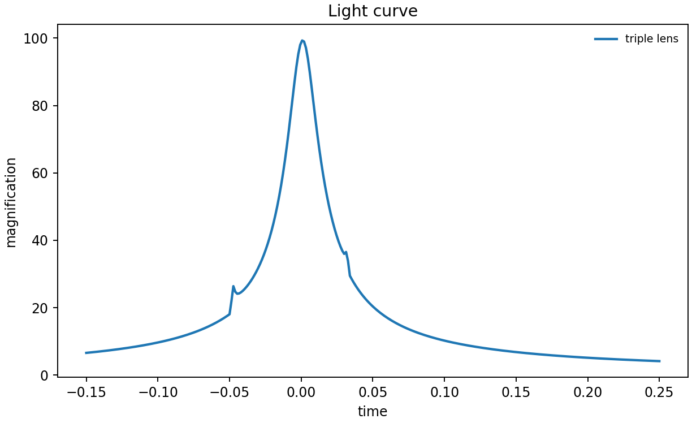
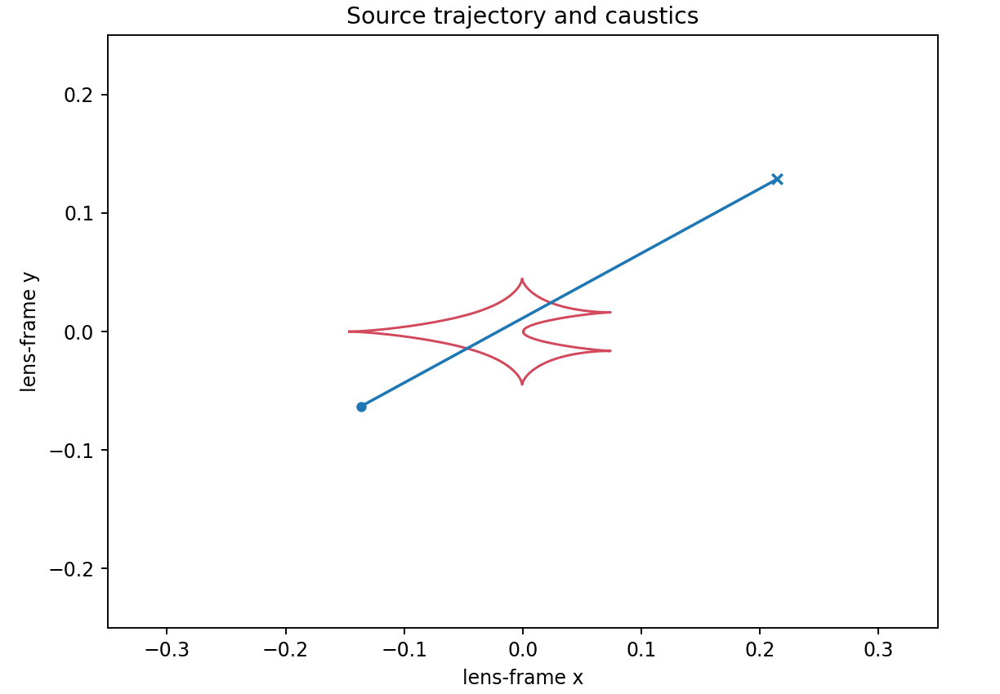

# 6. Triple lens: add a second companion

Triple-lens mode is explicitly selected and requires a positive `q2` for each
evaluation. The right panel focuses on the caustic neighbourhood crossed by
the source, making it easier to relate a high-magnification feature to its
companion.

```python
triple = lcbinint.LightCurve(lens="triple")
params.update(q2=1e-4, sep2=0.5, ang=1.2)
```





```sh
PYTHONPATH=build python example/tutorials/triple_lens.py
```

`s`, `q` describe the original binary pair; `sep2`, `q2`, and `ang` describe
the additional companion. The tutorial uses `rho=0.001` to exercise the
finite-source path. Use `LightCurve.info()` to inspect the selected method and
convergence status when setting an explicit accuracy budget.

---

**Course navigation:** [← Previous: Binary source](05-binary-source.md) · [Tutorial home](../README.md) · [Next: Putting it together →](07-putting-it-together.md)
